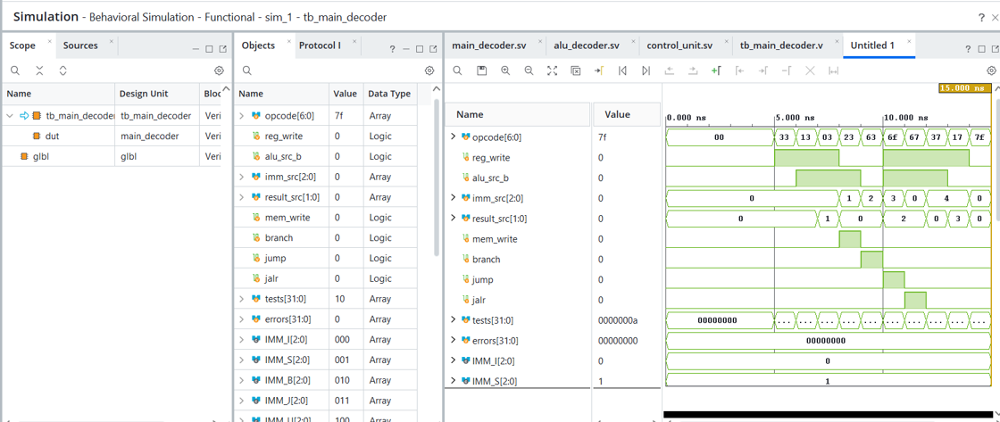
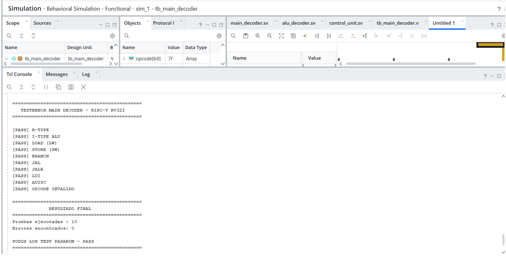
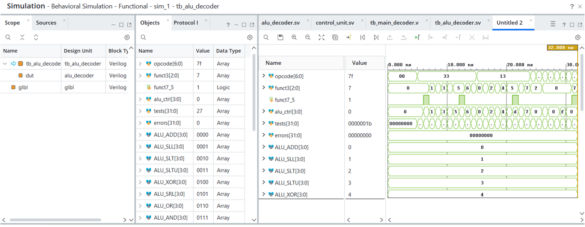
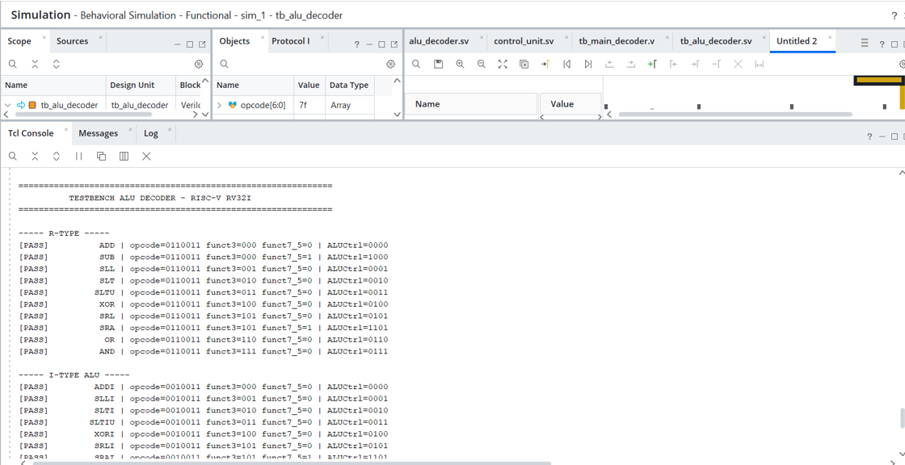
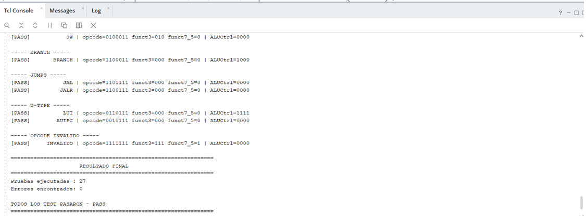
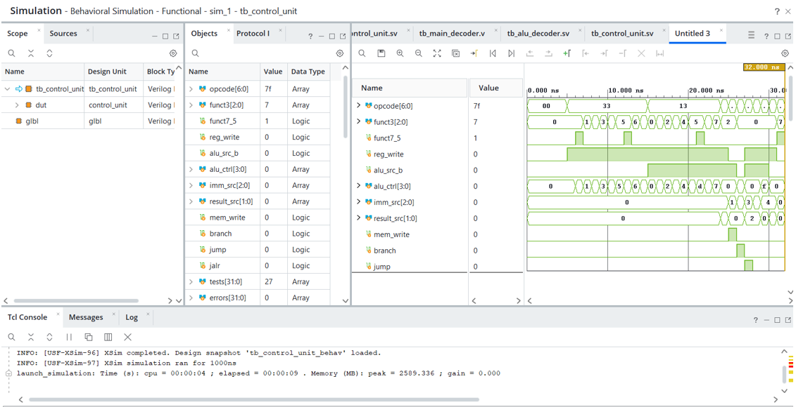
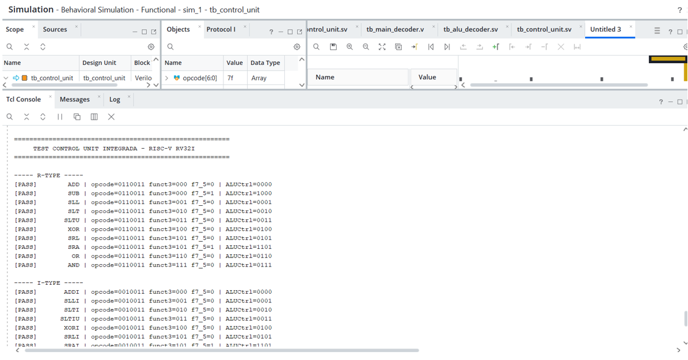
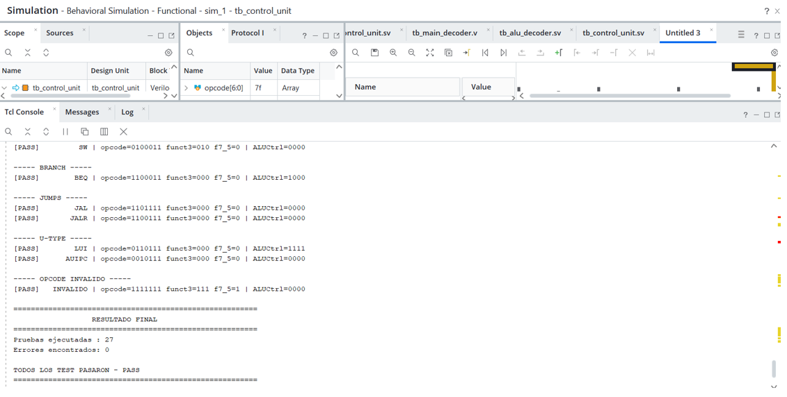

# Unidad de Control RISC-V RV32I

## Documentación de las señales de control

La unidad de control del procesador RISC-V RV32I se encarga de decodificar los campos principales de la instrucción y generar las señales necesarias para controlar el datapath.

La implementación se divide en tres módulos principales:

- `main_decoder.sv`: decodifica el `opcode` y genera las señales generales de control.
- `alu_decoder.sv`: utiliza `opcode`, `funct3` y `funct7[5]` para seleccionar la operación correspondiente de la ALU.
- `control_unit.sv`: integra ambos decodificadores y constituye la interfaz principal de la unidad de control.

---

## Entradas de la unidad de control

| Señal | Ancho | Descripción |
|---|---:|---|
| `opcode` | 7 bits | Campo `opcode` de la instrucción. Permite identificar el tipo general de instrucción que debe ejecutarse. |
| `funct3` | 3 bits | Campo utilizado para distinguir operaciones que comparten el mismo `opcode`, como operaciones aritméticas, lógicas, desplazamientos y branches. |
| `funct7_5` | 1 bit | Corresponde al bit 5 del campo `funct7`. Se utiliza principalmente para distinguir `ADD/SUB` y `SRL/SRA`. |

---

## Salidas de la unidad de control

| Señal | Ancho | Función |
|---|---:|---|
| `reg_write` | 1 bit | Habilita la escritura de un resultado en el Register File. |
| `alu_src_b` | 1 bit | Selecciona el segundo operando de la ALU entre `rs2` y un inmediato. |
| `alu_ctrl` | 4 bits | Indica la operación que debe ejecutar la ALU. |
| `imm_src` | 3 bits | Selecciona el formato del inmediato que debe generar el datapath. |
| `result_src` | 2 bits | Selecciona la fuente del dato que será escrito en el Register File. |
| `mem_write` | 1 bit | Habilita la escritura en la memoria de datos, utilizada principalmente por `sw`. |
| `branch` | 1 bit | Indica que la instrucción actual corresponde a un salto condicional. |
| `jump` | 1 bit | Indica un salto incondicional mediante `jal`. |
| `jalr` | 1 bit | Indica un salto indirecto mediante `jalr`. |

---

## Señal `reg_write`

La señal `reg_write` controla la escritura en el Register File.

Cuando:

```text
reg_write = 1
```

el resultado seleccionado puede almacenarse en el registro destino `rd`.

Se activa para instrucciones que producen un resultado destinado al Register File:

- Instrucciones R-type.
- Instrucciones ALU inmediatas.
- `lw`.
- `jal`.
- `jalr`.
- `lui`.
- `auipc`.

Para instrucciones como `sw` y branches, `reg_write` permanece desactivada.

---

## Señal `alu_src_b`

La señal `alu_src_b` selecciona el segundo operando utilizado por la ALU.

```text
alu_src_b = 0 -> segundo operando proveniente de rs2
alu_src_b = 1 -> segundo operando proveniente del inmediato
```

Una instrucción R-type utiliza `rs1` y `rs2`, mientras que una instrucción como `addi` utiliza `rs1` y un inmediato.

---

## Señal `alu_ctrl`

`alu_ctrl` determina la operación que debe ejecutar la ALU.

| `alu_ctrl` | Operación |
|---|---|
| `0000` | ADD |
| `0001` | SLL |
| `0010` | SLT |
| `0011` | SLTU |
| `0100` | XOR |
| `0101` | SRL |
| `0110` | OR |
| `0111` | AND |
| `1000` | SUB |
| `1101` | SRA |
| `1111` | PASS_B |

El valor se obtiene mediante la combinación de:

```text
opcode + funct3 + funct7[5]
```

Ejemplo para `ADD`:

```text
opcode    = 0110011
funct3    = 000
funct7[5] = 0
alu_ctrl  = 0000
```

Ejemplo para `SUB`:

```text
opcode    = 0110011
funct3    = 000
funct7[5] = 1
alu_ctrl  = 1000
```

De manera similar, `funct7[5]` permite distinguir `SRL` de `SRA`.

---

## Señal `imm_src`

La señal `imm_src` determina el formato del inmediato que debe generar el datapath.

| `imm_src` | Formato |
|---|---|
| `000` | I-type |
| `001` | S-type |
| `010` | B-type |
| `011` | J-type |
| `100` | U-type |

Ejemplos:

```text
lw   -> IMM_I
sw   -> IMM_S
beq  -> IMM_B
jal  -> IMM_J
lui  -> IMM_U
```

---

## Señal `result_src`

`result_src` selecciona qué dato será escrito en el Register File.

| `result_src` | Fuente |
|---|---|
| `00` | Resultado de la ALU |
| `01` | Dato leído de memoria |
| `10` | PC + 4 |
| `11` | PC + inmediato |

Ejemplos:

```text
ADD   -> resultado de ALU
LW    -> dato leído de memoria
JAL   -> PC + 4
JALR  -> PC + 4
AUIPC -> PC + inmediato
```

---

## Señal `mem_write`

La señal `mem_write` habilita la escritura en la memoria de datos.

Para una instrucción:

```asm
sw x5, 8(x2)
```

se activa:

```text
mem_write = 1
```

Para las demás instrucciones soportadas permanece desactivada.

En `lw`, la memoria es utilizada para lectura:

```text
mem_write  = 0
result_src = RES_MEM
```

El dato leído se selecciona posteriormente para escribirse en el Register File.

---

## Control de branches

La unidad de control identifica las instrucciones de branch mediante el `opcode` correspondiente y activa:

```text
branch = 1
```

La evaluación específica de la condición se realiza en el `branch_unit` del datapath utilizando `funct3` y los valores de `rs1` y `rs2`.

| `funct3` | Instrucción | Condición |
|---|---|---|
| `000` | BEQ | `rs1 == rs2` |
| `001` | BNE | `rs1 != rs2` |
| `100` | BLT | `rs1 < rs2` con signo |
| `101` | BGE | `rs1 >= rs2` con signo |
| `110` | BLTU | `rs1 < rs2` sin signo |
| `111` | BGEU | `rs1 >= rs2` sin signo |

La decisión final del salto combina la identificación realizada por la unidad de control con el resultado de la comparación realizada por el datapath. De esta manera se evita duplicar la lógica de comparación dentro de la unidad de control.

---

## Control de `jal`

Cuando se detecta el `opcode` correspondiente a `jal`, la unidad de control genera:

```text
reg_write  = 1
imm_src    = IMM_J
result_src = RES_PC4
jump       = 1
```

El procesador utiliza un inmediato tipo J para calcular la dirección destino y almacena `PC + 4` en el registro `rd`.

---

## Control de `jalr`

Para `jalr` se generan:

```text
reg_write  = 1
alu_src_b  = 1
imm_src    = IMM_I
result_src = RES_PC4
jalr       = 1
```

El salto utiliza como base el contenido de un registro junto con un inmediato tipo I, mientras que `PC + 4` se escribe en el registro destino.

---

## Control de `lw` y `sw`

Para `lw`:

```text
reg_write  = 1
alu_src_b  = 1
imm_src    = IMM_I
result_src = RES_MEM
mem_write  = 0
```

La ALU calcula la dirección efectiva mediante:

```text
rs1 + inmediato
```

y el dato leído de memoria se escribe en el Register File.

Para `sw`:

```text
reg_write = 0
alu_src_b = 1
imm_src   = IMM_S
mem_write = 1
```

La ALU calcula igualmente la dirección efectiva, pero el dato proveniente de `rs2` se escribe en memoria.

---

## Instrucciones aritméticas, lógicas y desplazamientos

El `alu_decoder` permite seleccionar las operaciones requeridas por las instrucciones R-type e I-type.

Entre las operaciones implementadas se encuentran:

```text
ADD / ADDI
SUB
AND / ANDI
OR  / ORI
XOR / XORI
SLL / SLLI
SRL / SRLI
SRA / SRAI
SLT / SLTI
SLTU / SLTIU
```

Para distinguir determinadas operaciones se utilizan conjuntamente `funct3` y `funct7[5]`.

---

## Comportamiento ante instrucciones no válidas

Se definieron valores seguros por defecto para evitar escrituras o saltos no deseados cuando el `opcode` no corresponde a una instrucción soportada.

```text
reg_write  = 0
alu_src_b  = 0
imm_src    = IMM_I
result_src = RES_ALU
mem_write  = 0
branch     = 0
jump       = 0
jalr       = 0
alu_ctrl   = ALU_ADD
```

De esta forma, un `opcode` no reconocido no provoca escritura en memoria, escritura en registros ni modificación del flujo de ejecución mediante branch o jump.

---

## Validación

La unidad de control fue verificada mediante testbenches autoverificables.

Se implementaron pruebas independientes para:

- `main_decoder.sv`
- `alu_decoder.sv`
- `control_unit.sv`

Los testbenches generan automáticamente mensajes `PASS` o `FAIL` según los resultados obtenidos.

### Prueba del `main_decoder`

Se verificó la decodificación de:

- R-type.
- I-type.
- `lw`.
- `sw`.
- branches.
- `jal`.
- `jalr`.
- `lui`.
- `auipc`.
- opcode no válido.

Resultado obtenido:

```text
Pruebas ejecutadas : 10
Errores encontrados: 0

TODOS LOS TEST PASARON - PASS
```





### Prueba del `alu_decoder`

Se verificaron operaciones aritméticas, lógicas, comparaciones, desplazamientos, acceso a memoria y otras operaciones requeridas por el datapath.







### Prueba integrada de `control_unit`

Finalmente se verificó el funcionamiento conjunto de `main_decoder` y `alu_decoder`.

El testbench integrado comprobó 27 casos.

Resultado obtenido:

```text
Pruebas ejecutadas : 27
Errores encontrados: 0

TODOS LOS TEST PASARON - PASS
```







---

## Estructura de la unidad de control

```text
                    control_unit
                         |
              +----------+----------+
              |                     |
              v                     v
        main_decoder           alu_decoder
              |                     |
              |                     +---- alu_ctrl
              |
              +---- reg_write
              +---- alu_src_b
              +---- imm_src
              +---- result_src
              +---- mem_write
              +---- branch
              +---- jump
              +---- jalr
```

La separación entre ambos decodificadores permite mantener independiente la generación de señales generales de control de la selección específica de la operación de la ALU.

---

## Estado de validación

- `main_decoder.sv`: verificado mediante testbench autoverificable.
- `alu_decoder.sv`: verificado mediante testbench autoverificable.
- `control_unit.sv`: verificado mediante testbench integrado.
- Test integrado: 27 pruebas ejecutadas, 0 errores.
- Comportamiento seguro para opcodes no reconocidos: verificado.
- Integración final con el datapath: pendiente de realizar junto con el Issue #2.
