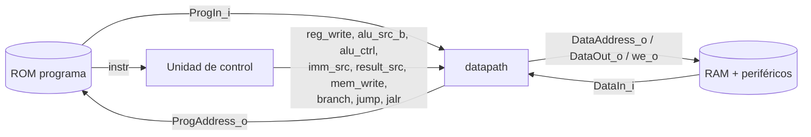
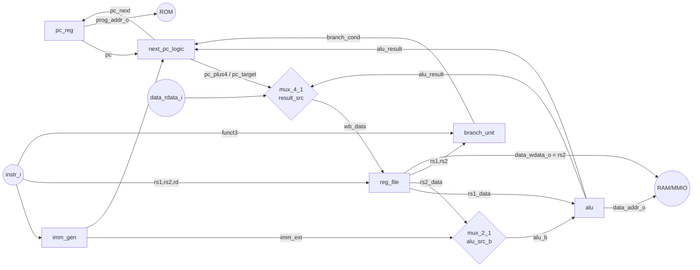

# Datapath del núcleo RV32I uniciclo

Proyecto 3 – EL3313 Taller de Diseño Digital (Batalla Naval sobre RISC-V)

Este documento describe el **datapath** del microprocesador: qué bloques lo forman, sus entradas y salidas, las señales internas principales y el **contrato de señales con la unidad de control**. También resume cómo se verificó.

---

## 1. Rol del datapath dentro del núcleo

El núcleo (`riscv_core`, Figura 2 del enunciado; va en `Core_RISCV/` en el PR de integración) se divide en dos bloques:

| Bloque | Responsabilidad |
|---|---|
| **datapath** (este documento) | PC, siguiente PC, Register File, generador de inmediatos, ALU, comparación de branches, multiplexores y buses hacia las memorias. |
| **unidad de control** (`Control_RISCV/`) | Decodifica `opcode/funct3/funct7` y genera las señales de control definidas en `riscv_pkg.sv`. |

Las memorias (ROM de programa, RAM de datos) y los periféricos **no** forman parte del datapath; se conectan por los buses del núcleo.



### Diagrama interno



---

## 2. Archivos

| Archivo | Contenido |
|---|---|
| `source/riscv_pkg.sv` | **Contrato** datapath ↔ control: codificaciones de `alu_ctrl`, `imm_src`, `result_src`, opcodes. |
| `source/datapath.sv` | Top del datapath (instancia todo lo siguiente). |
| `source/pc_reg.sv` | Program Counter con vector de reset. |
| `source/next_pc_logic.sv` | PC+4, PC+imm, destino de `jalr` y selección del siguiente PC. |
| `source/branch_unit.sv` | Evalúa la condición de `beq/bne/blt/bge/bltu/bgeu`. |
| `source/reg_file.sv` | Banco de 32×32 bits, x0 fijo en cero. |
| `source/alu.sv` | ALU de 32 bits. |
| `source/imm_gen.sv` | Generador de inmediatos I/S/B/J/U con extensión de signo. |
| `source/mux_2_1.sv`, `mux_4_1.sv`, `adder.sv` | Bloques genéricos. |
| `sim/tb_*.sv` | Testbenches autoverificables. |
| `sim/common/rv32i_enc_pkg.sv` | Funciones para escribir programas de prueba "en ensamblador" (solo simulación). |
| `sim/common/ref_control.sv` | Modelo de referencia del control (solo simulación). |
| `sim/common/rv32i_lockstep.svh` | Cuerpo común de `tb_datapath` y `tb_riscv_core`: memorias, ISS, programas y cobertura. |
| `scripts/run_tests.sh`, `scripts/lint.sh`, `scripts/rtl_files.f` | Correr todas las pruebas / lint. |

Orden de compilación: ver `scripts/rtl_files.f` (el paquete va primero). La unidad de control está en `Control_RISCV/` (branch `feature/control-riscv`). El núcleo integrado irá en `Core_RISCV/` en un PR aparte, cuando datapath y control estén en `main`.

---

## 3. Interfaz del módulo `datapath`

Parámetros: `WIDTH = 32`, `RST_VECTOR = 32'h0000_0000`.

Reset: **síncrono, activo en alto** (`rst_i`). Todo el datapath usa `posedge clk_i`.

| Señal | Dir. | Ancho | Conecta con | Descripción |
|---|---|---|---|---|
| `clk_i` | in | 1 | reloj del CPU | Flanco positivo. |
| `rst_i` | in | 1 | reset | Síncrono, activo en alto. PC ← 0, registros ← 0. |
| `prog_addr_o` | out | 32 | `ProgAddress_o` | PC actual. |
| `instr_i` | in | 32 | `ProgIn_i` | Instrucción leída de la ROM (**lectura combinacional**, mismo ciclo). |
| `data_addr_o` | out | 32 | `DataAddress_o` | Dirección efectiva = `rs1 + imm` (resultado de la ALU). |
| `data_wdata_o` | out | 32 | `DataOut_o` | Dato a escribir en `sw` (= `rs2`). |
| `data_we_o` | out | 1 | `we_o` | Escritura en memoria/periférico (= `mem_write_i`). |
| `data_rdata_i` | in | 32 | `DataIn_i` | Dato leído (RAM o periférico). **Debe estar disponible en el mismo ciclo** (lectura combinacional). |
| `reg_write_i` | in | 1 | control | Escribe `rd` en el siguiente flanco. |
| `alu_src_b_i` | in | 1 | control | 0: operando B = `rs2`; 1: operando B = inmediato. |
| `alu_ctrl_i` | in | 4 | control | Operación de la ALU (tabla 4.1). |
| `imm_src_i` | in | 3 | control | Formato del inmediato (tabla 4.2). |
| `result_src_i` | in | 2 | control | Fuente del write-back (tabla 4.3). |
| `mem_write_i` | in | 1 | control | La instrucción es `sw`. |
| `branch_i` | in | 1 | control | La instrucción es un branch condicional. |
| `jump_i` | in | 1 | control | La instrucción es `jal`. |
| `jalr_i` | in | 1 | control | La instrucción es `jalr`. |
| `branch_taken_o` | out | 1 | control / depuración | `branch_i` y la condición se cumplió. |
| `alu_zero_o` | out | 1 | depuración | Resultado de la ALU = 0. |

### 3.1 Señales internas principales

| Señal | Ancho | Origen → destino | Significado |
|---|---|---|---|
| `pc` | 32 | `pc_reg` → todo | PC de la instrucción en ejecución. |
| `pc_next` | 32 | `next_pc_logic` → `pc_reg` | PC del próximo ciclo. |
| `pc_plus4` | 32 | `next_pc_logic` → mux WB | Dirección de retorno de `jal/jalr`. |
| `pc_target` | 32 | `next_pc_logic` → mux WB | `PC + imm`: destino de branch/jal, resultado de `auipc`. |
| `rs1_addr`, `rs2_addr`, `rd_addr` | 5 | `instr[19:15]`, `instr[24:20]`, `instr[11:7]` | Direcciones del Register File. |
| `funct3` | 3 | `instr[14:12]` → `branch_unit` | Tipo de branch. |
| `rs1_data`, `rs2_data` | 32 | `reg_file` | Operandos leídos. |
| `imm_ext` | 32 | `imm_gen` | Inmediato ya extendido en signo. |
| `alu_b` | 32 | mux `alu_src_b` → ALU | Segundo operando de la ALU. |
| `alu_result` | 32 | ALU | Resultado / dirección efectiva / destino jalr. |
| `branch_cond` | 1 | `branch_unit` → `next_pc_logic` | Condición del branch cumplida. |
| `wb_data` | 32 | mux `result_src` → `reg_file` | Dato que se escribe en `rd`. |

---

## 4. Contrato con la unidad de control (`riscv_pkg.sv`)

### 4.1 `alu_ctrl[3:0]`

La codificación es `{funct7[5], funct3}` de RISC-V, así el decodificador de ALU es casi directo.

| `alu_ctrl` | Operación | Resultado |
|---|---|---|
| `0000` | ADD | `a + b` |
| `1000` | SUB | `a - b` |
| `0001` | SLL | `a << b[4:0]` |
| `0010` | SLT | `($signed(a) < $signed(b)) ? 1 : 0` |
| `0011` | SLTU | `(a < b) ? 1 : 0` |
| `0100` | XOR | `a ^ b` |
| `0101` | SRL | `a >> b[4:0]` (lógico) |
| `1101` | SRA | `a >>> b[4:0]` (aritmético) |
| `0110` | OR | `a \| b` |
| `0111` | AND | `a & b` |
| `1111` | PASS_B | `b` (para `lui`) |
| otros | — | `0` |

Regla para el control:
- Tipo R: `alu_ctrl = {instr[30], instr[14:12]}`
- Tipo I aritmético: `alu_ctrl = {1'b0, instr[14:12]}`, **excepto** `funct3 = 101` (srli/srai): `{instr[30], 3'b101}`
- `lw`, `sw`, `jalr`: `ALU_ADD`. `lui`: `ALU_PASS_B`.

> ⚠️ En `addi`, `slti`, etc. **no** se debe usar `instr[30]` para decidir: el bit 30 forma parte del inmediato. Solo en `srai` indica la variante aritmética.

### 4.2 `imm_src[2:0]`

| `imm_src` | Formato | Instrucciones | Inmediato |
|---|---|---|---|
| `000` | I | addi, slti, sltiu, xori, ori, andi, slli, srli, srai, lw, jalr | `{{20{i[31]}}, i[31:20]}` |
| `001` | S | sw | `{{20{i[31]}}, i[31:25], i[11:7]}` |
| `010` | B | beq, bne, blt, bge, bltu, bgeu | `{{19{i[31]}}, i[31], i[7], i[30:25], i[11:8], 0}` |
| `011` | J | jal | `{{11{i[31]}}, i[31], i[19:12], i[20], i[30:21], 0}` |
| `100` | U | lui, auipc | `{i[31:12], 12'b0}` |

### 4.3 `result_src[1:0]`

| `result_src` | Se escribe en `rd` | Instrucciones |
|---|---|---|
| `00` | `alu_result` | tipo R, tipo I, lui |
| `01` | `data_rdata_i` (DataIn) | lw |
| `10` | `PC + 4` | jal, jalr |
| `11` | `PC + imm` | auipc |

### 4.4 Selección del siguiente PC (se resuelve dentro del datapath)

| Condición (prioridad de arriba hacia abajo) | `pc_next` |
|---|---|
| `jalr_i = 1` | `(rs1 + imm) & ~1` |
| `jump_i = 1` o (`branch_i = 1` y condición cumplida) | `PC + imm` |
| resto | `PC + 4` |

El control **no** necesita conocer el resultado de la comparación: solo indica que la instrucción es un branch; el datapath decide si se toma.

### 4.5 Tabla de verdad esperada del control

| Instr. | opcode | reg_write | alu_src_b | alu_ctrl | imm_src | result_src | mem_write | branch | jump | jalr |
|---|---|---|---|---|---|---|---|---|---|---|
| tipo R | 0110011 | 1 | 0 | {f7[5],f3} | x | 00 | 0 | 0 | 0 | 0 |
| tipo I | 0010011 | 1 | 1 | {0,f3} / srai | 000 | 00 | 0 | 0 | 0 | 0 |
| lw | 0000011 | 1 | 1 | 0000 | 000 | 01 | 0 | 0 | 0 | 0 |
| sw | 0100011 | 0 | 1 | 0000 | 001 | x | 1 | 0 | 0 | 0 |
| branch | 1100011 | 0 | x | x | 010 | x | 0 | 1 | 0 | 0 |
| jal | 1101111 | 1 | x | x | 011 | 10 | 0 | 0 | 1 | 0 |
| jalr | 1100111 | 1 | 1 | 0000 | 000 | 10 | 0 | 0 | 0 | 1 |
| lui | 0110111 | 1 | 1 | 1111 | 100 | 00 | 0 | 0 | 0 | 0 |
| auipc | 0010111 | 1 | x | x | 100 | 11 | 0 | 0 | 0 | 0 |
| otro | — | 0 | 0 | 0000 | 000 | 00 | 0 | 0 | 0 | 0 |

`sim/common/ref_control.sv` implementa esta tabla y es el control de referencia de `tb_datapath`. La unidad de control real (`Control_RISCV/source/control_unit.sv`) genera las mismas señales en todo lo que importa; solo difiere en valores "no importa" (por ejemplo `alu_ctrl = SUB` en branches, que el datapath ignora porque la comparación la hace `branch_unit`). El núcleo integrado con ese control pasa el mismo programa en lockstep (`tb_riscv_core`).

**¿Por qué incluir `lui` y `auipc` si el enunciado no los lista?** Las pseudoinstrucciones del ensamblador los generan: `li` con constantes grandes → `lui + addi`, `la` y `call` → `auipc`. Sin ellos, direcciones como `0x0001_0040` (UART) o `0x0001_1000` (VGA) no se pueden cargar de forma cómoda. El costo en hardware es un código de ALU y una entrada de mux.

---

## 5. Submódulos

### 5.1 `pc_reg`
Registro de 32 bits. En `rst_i` carga `RESET_VECTOR` (0x0000_0000, vector de reset del enunciado). Sin enable: en un uniciclo el PC cambia en cada flanco.

### 5.2 `next_pc_logic`
Dos sumadores (`PC+4`, `PC+imm`) y un `mux_4_1` que implementa la tabla 4.4. Salida adicional `pc_redirect_o` = el flujo no continúa en PC+4 (útil para depuración).

### 5.3 `branch_unit`
Comparador independiente de la ALU (`==`, `<` con signo, `<` sin signo) y selección por `funct3`. `funct3` 010/011 no existen en RV32I → condición 0.

### 5.4 `reg_file`
- 2 lecturas combinacionales, 1 escritura síncrona.
- **x0 siempre en cero** con doble protección: nunca se escribe y la lectura de la dirección 0 devuelve 0.
- Reset síncrono que limpia los 32 registros (resultado determinista en simulación). Se implementa con flip-flops (≈992 FF), cantidad aceptable en una Artix-7.
- Lectura y escritura del mismo registro en el mismo ciclo devuelve el valor viejo (correcto para uniciclo).
- `sp` (x2) arranca en 0: el programa en ensamblador debe inicializarlo (p. ej. `li sp, 0x3000`, tope de la RAM).

### 5.5 `alu`
Tabla 4.1. Los desplazamientos solo usan `b[4:0]`. `SRA` se escribe como sentencia propia (`$signed(a) >>> shamt`) y **no dentro de un operador ternario**: si una rama del `?:` es sin signo, SystemVerilog convierte toda la expresión a sin signo y `>>>` se vuelve un desplazamiento lógico (ver sección 7).

### 5.6 `imm_gen`
Tabla 4.2. Recibe `instr[31:7]` (el opcode no se usa). Los shifts inmediatos usan formato I: los bits [11:5] traen `funct7`, pero la ALU solo mira `b[4:0]`.

---

## 6. Integración en el núcleo

> Esta sección describe el PR de integración (`Core_RISCV/`), que se abre después de unir este branch y el de control.

`Core_RISCV/source/riscv_core.sv` une `control_unit` (Control_RISCV) con `datapath`, con los puertos exactos de la Figura 2:

| Puerto del núcleo | Dir. | Se conecta a |
|---|---|---|
| `clk_i`, `rst_i` | in | reloj del CPU y reset síncrono |
| `ProgAddress_o[31:0]` | out | `datapath.prog_addr_o` (PC) |
| `ProgIn_i[31:0]` | in | `datapath.instr_i` y la unidad de control (`opcode = [6:0]`, `funct3 = [14:12]`, `funct7_5 = [30]`) |
| `DataAddress_o[31:0]` | out | `datapath.data_addr_o` |
| `DataOut_o[31:0]` | out | `datapath.data_wdata_o` |
| `DataIn_i[31:0]` | in | `datapath.data_rdata_i` |
| `we_o` | out | `datapath.data_we_o` |

### Requisitos que el datapath impone a las memorias
Al ser **uniciclo**, `lw` lee y escribe `rd` en el mismo ciclo, por lo que:
1. `DataIn_i` debe ser **combinacional** respecto a `DataAddress_o` (RAM distribuida/LUTRAM, 1024×32 = 4 KiB para 0x2000–0x2FFF), o una BRAM con reloj invertido documentada. Una RAM con lectura registrada (1 o 2 ciclos de latencia) **rompe `lw`**.
2. `ProgIn_i` igual: ROM combinacional, o BRAM síncrona direccionada con `pc_next` (truco clásico) que habría que exponer.
3. Los periféricos de lectura (p. ej. estado de botones, UART) se leen por el mismo `DataIn_i` sin latencia; el decodificador de direcciones del bus selecciona la fuente.

### Reloj
El enunciado exige una sola entrada de 100 MHz. Un uniciclo tiene un camino crítico largo (ROM → RF → ALU → RAM → mux → RF), así que conviene alimentar el CPU con un reloj derivado del PLL (p. ej. 25 MHz, el mismo del píxel, o 50 MHz si el timing post-implementación lo permite) y confirmarlo con el reporte de timing de Vivado.

---

## 7. Verificación

Todas las pruebas son **autoverificables**: comparan contra un modelo de referencia, cuentan errores y terminan con `TEST PASSED` o con `$fatal` (código de salida ≠ 0).

| Testbench | Qué verifica | Método | Chequeos |
|---|---|---|---|
| `tb_alu` | 11 operaciones, esquinas (0, −1, MIN, MAX, shift 0/31/32), códigos no usados | modelo en aritmética de 64 bits + 5000 vectores aleatorios por operación | 55 715 |
| `tb_imm_gen` | formatos I/S/B/J/U, extremos de rango, extensión de signo | se **codifica** un inmediato aleatorio y se verifica que `imm_gen` lo **recupere** | 30 014 |
| `tb_reg_file` | reset, 32 registros por ambos puertos, x0, `we=0`, lectura durante escritura, reset a mitad | modelo de arreglo + 20 000 ciclos aleatorios | 40 199 |
| `tb_branch_unit` | 6 condiciones + funct3 inválidos, igualdad | resta de 33 bits como referencia | 80 396 |
| `tb_pc` | reset a 0x0, +4, branch ±, jal, jalr con bit 0, prioridades | modelo de siguiente PC + 5000 casos aleatorios | 20 067 |
| `tb_datapath` | datapath con el control de referencia ejecutando programas | **ISS en lockstep**: en cada ciclo compara PC, los 32 registros y el bus de datos; al final compara la RAM completa y una firma calculada a mano | ≈12 000 ciclos |

| `tb_riscv_core` (en `Core_RISCV/sim`, PR de integración) | **núcleo completo** con la unidad de control real, conectado solo por los puertos de la Figura 2 | mismo ISS, programas y firma que `tb_datapath` | ≈12 000 ciclos |

`tb_datapath` y `tb_riscv_core` comparten el cuerpo `sim/common/rv32i_lockstep.svh` y corren:
- un **programa dirigido** con todas las instrucciones del enunciado + `lui/auipc`, cada branch tomado y no tomado, lazo hacia atrás (suma 1..10 = 55), llamadas a subrutina con `jal`/`ret`, `jalr` a dirección impar, `lw/sw` con offsets negativos y escritura a x0;
- **30 programas aleatorios** de 400 instrucciones (ALU, lui/auipc, lw/sw, branches y jal hacia adelante).

Reporta cobertura por instrucción y falla si alguna no se ejecutó.

### Pruebas de mutación
Para comprobar que los testbenches realmente detectan errores, se inyectaron bugs a propósito en el RTL:

| Bug inyectado | Detectado por |
|---|---|
| `sra` escrito con ternario (`?:` con rama sin signo) | tb_alu, tb_datapath |
| `slt` sin signo | tb_alu, tb_datapath |
| `shamt` tomado de bits equivocados | tb_alu, tb_datapath |
| bit 11 del inmediato B cambiado | tb_imm_gen, tb_datapath |
| inmediato S sin extensión de signo | tb_imm_gen, tb_datapath |
| `bge` comparando sin signo | tb_branch_unit, tb_datapath |
| `jalr` sin limpiar el bit 0 | tb_pc, tb_datapath |
| branches ignorados | tb_pc, tb_datapath |
| `auipc` conectado a la ALU | tb_datapath |
| `DataOut` tomado del inmediato | tb_datapath |

Además se inyectaron bugs en la unidad de control (`srai` decodificado como `srli`, `jal` escribiendo la ALU en vez de PC+4, `sw` con inmediato tipo I) y `tb_riscv_core` los detectó todos.

(Quitar **una** sola de las dos protecciones de x0 no cambia el comportamiento; por eso esas mutaciones son equivalentes.)

### Cómo correr

Desde la raíz del repositorio:

```bash
./Datapath_RISCV/scripts/lint.sh                    # Verilator -Wall (cada módulo + riscv_core)
./Datapath_RISCV/scripts/run_tests.sh               # Icarus Verilog (iverilog -g2012)
SIM=verilator ./Datapath_RISCV/scripts/run_tests.sh # Verilator 5
```

En Vivado:
1. Fuentes de diseño: `Datapath_RISCV/source/*.sv` (con `riscv_pkg.sv` primero), `Control_RISCV/source/*.sv` y `Core_RISCV/source/riscv_core.sv`.
2. Fuentes de simulación: `Datapath_RISCV/sim/common/rv32i_enc_pkg.sv`, `ref_control.sv`, `rv32i_lockstep.svh` y el `tb_*.sv` que se quiera correr, marcado como top.
3. Agregar `Datapath_RISCV/sim/common` a los *include directories* de simulación (lo necesitan `tb_datapath` y `tb_riscv_core`).

### Resultados
- Lint Verilator `-Wall`: 0 advertencias en los 10 módulos del datapath y en `riscv_core`.
- Todos los testbenches, incluido `tb_riscv_core` con la unidad de control real, pasan en Icarus Verilog 12 y Verilator 5.020.
- Síntesis de prueba (Yosys, `synth_xilinx` familia 7): **0 latches**, ≈1 630 LUT, 1 024 FF (992 del Register File + 32 del PC), 44 CARRY4. Los números definitivos y el análisis de timing salen del reporte post-implementación de Vivado.
