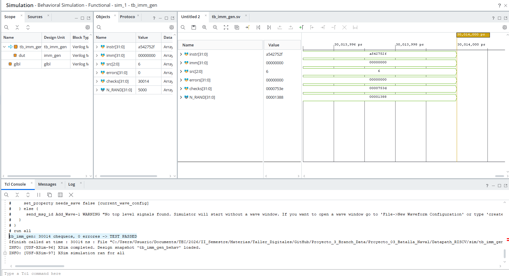
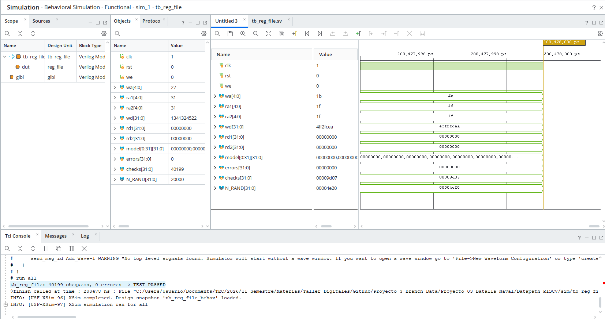
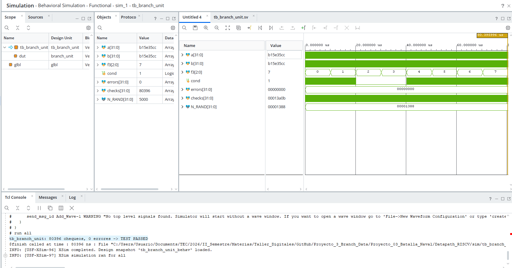
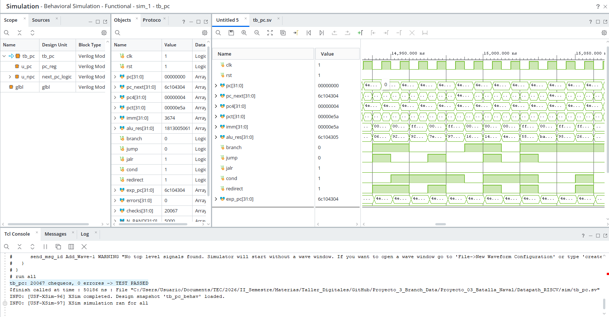
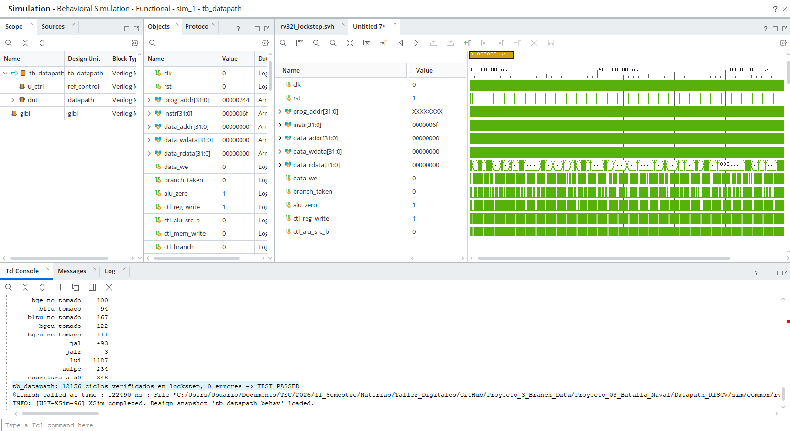
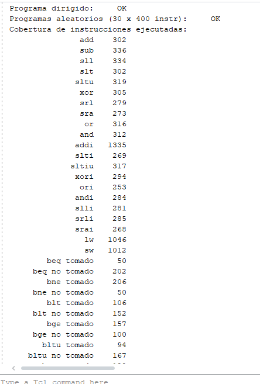

# Datapath del núcleo RISC-V (RV32I uniciclo)

## Objetivo

Diseñar e implementar el **datapath** del microprocesador RISC-V de 32 bits del sistema de Batalla Naval: el conjunto de bloques que almacena el estado del procesador (PC y banco de registros), ejecuta las operaciones (ALU), genera los inmediatos, decide la siguiente instrucción y se comunica con la memoria de programa y la memoria de datos.

El datapath ejecuta las instrucciones del subconjunto **rv32i** que pide el enunciado:

```text
lw, sw, add, sub, and, or, xor, sll, srl, sra, slt, sltu,
addi, andi, ori, xori, slli, srli, srai, slti, sltiu,
beq, bne, blt, bge, bltu, bgeu, jal, jalr
```

y además `lui` y `auipc`, que el ensamblador necesita para las pseudoinstrucciones `li`, `la` y `call`.

El diseño es **modular**: cada bloque se implementó y verificó por separado antes de integrarlo en `datapath.sv`. La unidad de control no forma parte de este bloque (está en `Control_RISCV/`); ambos se comunican mediante un contrato de señales definido en `riscv_pkg.sv`.

---

# 1. Documentación de Diseño

## 1.1 Arquitectura general

El procesador es **uniciclo**: cada instrucción se ejecuta completa en un solo ciclo de reloj. El núcleo se divide en dos bloques:

| Bloque | Responsabilidad |
|---|---|
| **Datapath** (este documento) | PC, siguiente PC, Register File, generador de inmediatos, ALU, comparación de branches, multiplexores y buses hacia las memorias. |
| **Unidad de control** (`Control_RISCV/`) | Decodifica `opcode`, `funct3` y `funct7[5]` y genera las señales de control. |

Los bloques desarrollados para el datapath son:

- `pc_reg.sv`: registro del Program Counter.
- `next_pc_logic.sv`: calcula PC+4, PC+imm y el destino de `jalr`, y selecciona el siguiente PC.
- `branch_unit.sv`: evalúa la condición de los branches.
- `reg_file.sv`: banco de 32 registros de 32 bits.
- `imm_gen.sv`: extrae y extiende en signo el inmediato de la instrucción.
- `alu.sv`: unidad aritmético-lógica de 32 bits.
- `mux_2_1.sv`, `mux_4_1.sv`, `adder.sv`: bloques genéricos.
- `riscv_pkg.sv`: codificaciones compartidas con la unidad de control.
- `datapath.sv`: integra todos los módulos anteriores.

La estructura general es:

```text
              ┌────────────── Unidad de control ───────────────┐
              │ reg_write alu_src_b alu_ctrl imm_src result_src │
              │ mem_write branch jump jalr                      │
              └──────────────────────┬──────────────────────────┘
                                     ▼
 ProgIn_i ──► instr ──┬──► ┌─────────┐ imm ──────────────┐
                      │    │ imm_gen │                   │
                      │    └─────────┘                   ▼
                      │    ┌──────────┐ rs1 ──────► ┌─────────┐ alu_result ──► DataAddress_o
                      ├──► │ reg_file │             │   ALU   │
                      │    └──────────┘ rs2 ─┬─mux─►└─────────┘
                      │         ▲            ├──────────────────────────────► DataOut_o
                      │         │            └──► ┌─────────────┐
                      └─funct3──┼───────────────► │ branch_unit │── cond ──┐
                                │                 └─────────────┘          ▼
                                │   ┌────────┐  pc_next  ┌───────────────────┐
 ProgAddress_o ◄────────────────┼── │ pc_reg │ ◄──────── │   next_pc_logic   │
                                │   └────────┘           └───────────────────┘
                                │
                  mux write-back {ALU, DataIn_i, PC+4, PC+imm}
```

`datapath.sv` integra estos bloques y constituye la interfaz del datapath con la unidad de control y con las memorias.

---

## 1.2 Ejecución de una instrucción

En cada ciclo de reloj el datapath recorre la siguiente secuencia:

```text
PC ──► ROM ──► instrucción
                  │
                  ├──► Unidad de control ──► señales de control
                  ├──► Register File ──► rs1, rs2
                  └──► imm_gen ──► inmediato
                            │
                            ▼
                ALU (rs1 op rs2/inmediato)   branch_unit (rs1 vs rs2)
                            │                        │
                  ┌─────────┴────────┐               ▼
                  ▼                  ▼          next_pc_logic ──► PC siguiente
          dirección de memoria   resultado
                  │                  │
                  ▼                  ▼
            RAM / periféricos ──► mux write-back ──► rd (flanco de reloj)
```

Al final del ciclo, en el flanco positivo del reloj, se actualizan al mismo tiempo el PC, el registro destino `rd` y la memoria (si la instrucción es `sw`).

---

## 1.3 Program Counter

El módulo `pc_reg.sv` es un registro de 32 bits que guarda la dirección de la instrucción en ejecución.

```text
rst = 1  →  PC = 0x0000_0000   (vector de reset del enunciado)
rst = 0  →  PC = pc_next       (en cada flanco positivo)
```

No tiene habilitación de escritura: en un procesador uniciclo el PC cambia en todos los ciclos.

---

## 1.4 Selección del siguiente PC

El módulo `next_pc_logic.sv` contiene dos sumadores y un multiplexor:

```text
pc_plus4  = PC + 4              actualización normal / dirección de retorno
pc_target = PC + imm            destino de branch y jal; resultado de auipc
jalr_tgt  = (rs1 + imm) & ~1    destino de jalr (la suma la hace la ALU)
```

La selección sigue esta prioridad:

| Condición | `pc_next` |
|---|---|
| `jalr = 1` | `(rs1 + imm) & ~1` |
| `jump = 1` o (`branch = 1` y condición cumplida) | `PC + imm` |
| resto | `PC + 4` |

La unidad de control solo indica **qué tipo** de instrucción es (`branch`, `jump`, `jalr`); la decisión de tomar o no el branch se hace dentro del datapath con el resultado de `branch_unit`.

---

## 1.5 Unidad de branches

El módulo `branch_unit.sv` compara `rs1` y `rs2` según el campo `funct3` de la instrucción:

| `funct3` | Instrucción | Condición |
|---|---|---|
| `000` | beq | `rs1 == rs2` |
| `001` | bne | `rs1 != rs2` |
| `100` | blt | `rs1 < rs2` con signo |
| `101` | bge | `rs1 >= rs2` con signo |
| `110` | bltu | `rs1 < rs2` sin signo |
| `111` | bgeu | `rs1 >= rs2` sin signo |

Los valores `010` y `011` no existen en RV32I y producen condición `0`.

Se implementó como un comparador independiente de la ALU para que la ALU quede libre y la lógica del branch sea más fácil de verificar.

---

## 1.6 Register File

El módulo `reg_file.sv` contiene los 32 registros de 32 bits (`x0` a `x31`):

```text
2 puertos de lectura   combinacionales   (rs1, rs2)
1 puerto de escritura  síncrono          (rd, flanco positivo)
```

El registro `x0` vale siempre cero gracias a una **doble protección**:

- nunca se escribe, aunque `rd = 0` y `reg_write = 1`;
- la lectura de la dirección 0 devuelve 0 directamente.

Si en el mismo ciclo se lee y se escribe el mismo registro, la lectura devuelve el valor **anterior**; el nuevo aparece después del flanco. Ese es el comportamiento correcto para un uniciclo.

---

## 1.7 Generador de inmediatos

El módulo `imm_gen.sv` reordena los bits del inmediato según el formato de la instrucción y lo extiende en signo a 32 bits. El formato lo indica la unidad de control con `imm_src`:

| Formato | Instrucciones | Inmediato de 32 bits |
|---|---|---|
| I | addi, slti, lw, jalr, slli... | `{{20{i[31]}}, i[31:20]}` |
| S | sw | `{{20{i[31]}}, i[31:25], i[11:7]}` |
| B | beq, bne, blt... | `{{19{i[31]}}, i[31], i[7], i[30:25], i[11:8], 0}` |
| J | jal | `{{11{i[31]}}, i[31], i[19:12], i[20], i[30:21], 0}` |
| U | lui, auipc | `{i[31:12], 12'b0}` |

En los desplazamientos inmediatos (`slli`, `srli`, `srai`) los bits `[11:5]` contienen `funct7`, pero no hace falta un caso especial porque la ALU solo usa los 5 bits bajos.

---

## 1.8 ALU

El módulo `alu.sv` ejecuta la operación indicada por `alu_ctrl`. La ALU no conoce la instrucción ni el opcode; solo recibe dos operandos y un código de operación.

| Operación | Resultado |
|---|---|
| ADD / SUB | `a + b` / `a - b` |
| AND / OR / XOR | operaciones lógicas bit a bit |
| SLL / SRL | desplazamiento lógico con `b[4:0]` |
| SRA | desplazamiento aritmético (conserva el signo) |
| SLT / SLTU | `1` si `a < b` con signo / sin signo |
| PASS_B | `b` (usado por `lui`) |

**Decisión de diseño importante:** `SRA` se escribe como una sentencia propia (`$signed(a) >>> shamt`) y **no dentro de un operador ternario**. En SystemVerilog, si una rama del `?:` es sin signo, toda la expresión se vuelve sin signo y `>>>` pasa a ser un desplazamiento lógico. Ese error estaba en un diseño anterior de referencia y se comprobó en simulación.

---

## 1.9 Multiplexores y write-back

El datapath usa dos multiplexores controlados por la unidad de control:

**Operando B de la ALU** (`mux_2_1`, señal `alu_src_b`):

```text
alu_src_b = 0  →  rs2         (instrucciones tipo R, branches)
alu_src_b = 1  →  inmediato   (tipo I, lw, sw, jalr, lui)
```

**Dato que se escribe en el Register File** (`mux_4_1`, señal `result_src`):

```text
00  →  resultado de la ALU     (tipo R, tipo I, lui)
01  →  dato leído (DataIn_i)   (lw)
10  →  PC + 4                  (jal, jalr: dirección de retorno)
11  →  PC + inmediato          (auipc)
```

---

## 1.10 Integración mediante `datapath.sv`

`datapath.sv` instancia y conecta todos los bloques anteriores. De la instrucción toma directamente los campos:

```text
rs1    = instr[19:15]
rs2    = instr[24:20]
rd     = instr[11:7]
funct3 = instr[14:12]
```

El `opcode` (`instr[6:0]`) no lo usa el datapath: solo lo necesita la unidad de control.

Los buses hacia las memorias se obtienen así:

```text
ProgAddress_o = PC
DataAddress_o = resultado de la ALU (rs1 + inmediato)
DataOut_o     = rs2
we_o          = mem_write
```

De esta forma, `datapath.sv` puede usarse como un único bloque que, junto con la unidad de control, forma el núcleo completo del procesador.

---

# 2. Documentación Técnica

## 2.1 Archivos implementados

```text
Datapath_RISCV/
├── source/
│   ├── riscv_pkg.sv        contrato de señales con la unidad de control
│   ├── datapath.sv         módulo superior del datapath
│   ├── pc_reg.sv
│   ├── next_pc_logic.sv
│   ├── branch_unit.sv
│   ├── reg_file.sv
│   ├── alu.sv
│   ├── imm_gen.sv
│   ├── mux_2_1.sv
│   ├── mux_4_1.sv
│   └── adder.sv
├── sim/
│   ├── tb_alu.sv
│   ├── tb_imm_gen.sv
│   ├── tb_reg_file.sv
│   ├── tb_branch_unit.sv
│   ├── tb_pc.sv
│   ├── tb_datapath.sv
│   └── common/
│       ├── rv32i_enc_pkg.sv     funciones para escribir programas de prueba
│       ├── ref_control.sv       modelo de referencia del control (solo simulación)
│       └── rv32i_lockstep.svh   memorias, ISS, programas y cobertura de tb_datapath
├── scripts/
│   ├── rtl_files.f         orden de compilación
│   ├── run_tests.sh        corre todos los testbenches
│   └── lint.sh             lint estricto con Verilator
└── imagenes/               capturas de simulación en Vivado
```

El orden de compilación está en `scripts/rtl_files.f`: `riscv_pkg.sv` debe compilarse primero.

---

## 2.2 Interfaz del datapath

Parámetros: `WIDTH = 32`, `RST_VECTOR = 32'h0000_0000`. Reset **síncrono, activo en alto**. Todo el datapath trabaja con el flanco positivo de `clk_i`.

### Reloj y control

| Señal | Dirección | Ancho | Función |
|---|---|---|---|
| `clk_i` | Entrada | 1 | Reloj del CPU |
| `rst_i` | Entrada | 1 | Reset síncrono: PC ← 0, registros ← 0 |

### Interfaz con memoria de programa (ROM)

| Señal | Dirección | Ancho | Conecta con | Función |
|---|---|---|---|---|
| `prog_addr_o` | Salida | 32 | `ProgAddress_o` | PC actual |
| `instr_i` | Entrada | 32 | `ProgIn_i` | Instrucción leída (lectura combinacional) |

### Interfaz con memoria de datos y periféricos

| Señal | Dirección | Ancho | Conecta con | Función |
|---|---|---|---|---|
| `data_addr_o` | Salida | 32 | `DataAddress_o` | Dirección efectiva = `rs1 + imm` |
| `data_wdata_o` | Salida | 32 | `DataOut_o` | Dato a escribir en `sw` (= `rs2`) |
| `data_we_o` | Salida | 1 | `we_o` | Habilita escritura (= `mem_write_i`) |
| `data_rdata_i` | Entrada | 32 | `DataIn_i` | Dato leído, **disponible en el mismo ciclo** |

### Interfaz con la unidad de control

| Señal | Dirección | Ancho | Función |
|---|---|---|---|
| `reg_write_i` | Entrada | 1 | Escribe `rd` en el siguiente flanco |
| `alu_src_b_i` | Entrada | 1 | 0: operando B = `rs2`; 1: inmediato |
| `alu_ctrl_i` | Entrada | 4 | Operación de la ALU (sección 2.3) |
| `imm_src_i` | Entrada | 3 | Formato del inmediato (sección 2.3) |
| `result_src_i` | Entrada | 2 | Fuente del write-back (sección 2.3) |
| `mem_write_i` | Entrada | 1 | La instrucción es `sw` |
| `branch_i` | Entrada | 1 | La instrucción es un branch condicional |
| `jump_i` | Entrada | 1 | La instrucción es `jal` |
| `jalr_i` | Entrada | 1 | La instrucción es `jalr` |
| `branch_taken_o` | Salida | 1 | Branch tomado (depuración) |
| `alu_zero_o` | Salida | 1 | Resultado de la ALU = 0 (depuración) |

---

## 2.3 Contrato con la unidad de control (`riscv_pkg.sv`)

Estas codificaciones las usan tanto el datapath como la unidad de control. **No deben cambiarse sin acordarlo entre ambos**, porque el procesador deja de funcionar.

### `alu_ctrl[3:0]`

La codificación es `{funct7[5], funct3}` de RISC-V, así el decodificador de ALU es casi directo.

| `alu_ctrl` | Operación | Resultado |
|---|---|---|
| `0000` | ADD | `a + b` |
| `1000` | SUB | `a - b` |
| `0001` | SLL | `a << b[4:0]` |
| `0010` | SLT | `($signed(a) < $signed(b)) ? 1 : 0` |
| `0011` | SLTU | `(a < b) ? 1 : 0` |
| `0100` | XOR | `a ^ b` |
| `0101` | SRL | `a >> b[4:0]` (lógico) |
| `1101` | SRA | `a >>> b[4:0]` (aritmético) |
| `0110` | OR | `a \| b` |
| `0111` | AND | `a & b` |
| `1111` | PASS_B | `b` (para `lui`) |
| otros | — | `0` |

Regla para el control:
- Tipo R: `alu_ctrl = {instr[30], instr[14:12]}`
- Tipo I aritmético: `alu_ctrl = {1'b0, instr[14:12]}`, **excepto** `funct3 = 101` (srli/srai): `{instr[30], 3'b101}`
- `lw`, `sw`, `jalr`: `ALU_ADD`. `lui`: `ALU_PASS_B`.

>  En `addi`, `slti`, etc. **no** se debe usar `instr[30]`: ese bit forma parte del inmediato. Solo en `srai` indica la variante aritmética.

### `imm_src[2:0]`

| `imm_src` | Formato |
|---|---|
| `000` | I |
| `001` | S |
| `010` | B |
| `011` | J |
| `100` | U |

### `result_src[1:0]`

| `result_src` | Se escribe en `rd` | Instrucciones |
|---|---|---|
| `00` | resultado de la ALU | tipo R, tipo I, lui |
| `01` | `data_rdata_i` | lw |
| `10` | PC + 4 | jal, jalr |
| `11` | PC + inmediato | auipc |

### Tabla de verdad esperada del control

| Instr. | opcode | reg_write | alu_src_b | alu_ctrl | imm_src | result_src | mem_write | branch | jump | jalr |
|---|---|---|---|---|---|---|---|---|---|---|
| tipo R | 0110011 | 1 | 0 | {f7[5],f3} | x | 00 | 0 | 0 | 0 | 0 |
| tipo I | 0010011 | 1 | 1 | {0,f3} / srai | 000 | 00 | 0 | 0 | 0 | 0 |
| lw | 0000011 | 1 | 1 | 0000 | 000 | 01 | 0 | 0 | 0 | 0 |
| sw | 0100011 | 0 | 1 | 0000 | 001 | x | 1 | 0 | 0 | 0 |
| branch | 1100011 | 0 | x | x | 010 | x | 0 | 1 | 0 | 0 |
| jal | 1101111 | 1 | x | x | 011 | 10 | 0 | 0 | 1 | 0 |
| jalr | 1100111 | 1 | 1 | 0000 | 000 | 10 | 0 | 0 | 0 | 1 |
| lui | 0110111 | 1 | 1 | 1111 | 100 | 00 | 0 | 0 | 0 | 0 |
| auipc | 0010111 | 1 | x | x | 100 | 11 | 0 | 0 | 0 | 0 |
| otro | — | 0 | 0 | 0000 | 000 | 00 | 0 | 0 | 0 | 0 |

`sim/common/ref_control.sv` implementa exactamente esta tabla y es el control que usa `tb_datapath`. La unidad de control real (`Control_RISCV/`) genera las mismas señales en todo lo que importa; solo difiere en valores "no importa" (por ejemplo `alu_ctrl = SUB` en branches, que el datapath ignora porque la comparación la hace `branch_unit`).

---

## 2.4 Señales internas principales

| Señal | Ancho | Origen → destino | Significado |
|---|---|---|---|
| `pc` | 32 | `pc_reg` → todo | PC de la instrucción en ejecución |
| `pc_next` | 32 | `next_pc_logic` → `pc_reg` | PC del siguiente ciclo |
| `pc_plus4` | 32 | `next_pc_logic` → mux write-back | Dirección de retorno de `jal`/`jalr` |
| `pc_target` | 32 | `next_pc_logic` → mux write-back | `PC + imm`: destino de branch/jal, resultado de `auipc` |
| `rs1_addr`, `rs2_addr`, `rd_addr` | 5 | campos de la instrucción | Direcciones del Register File |
| `funct3` | 3 | `instr[14:12]` → `branch_unit` | Tipo de branch |
| `rs1_data`, `rs2_data` | 32 | `reg_file` | Operandos leídos |
| `imm_ext` | 32 | `imm_gen` | Inmediato extendido en signo |
| `alu_b` | 32 | mux `alu_src_b` → ALU | Segundo operando de la ALU |
| `alu_result` | 32 | ALU | Resultado / dirección efectiva / destino de `jalr` |
| `branch_cond` | 1 | `branch_unit` → `next_pc_logic` | Condición del branch cumplida |
| `wb_data` | 32 | mux `result_src` → `reg_file` | Dato que se escribe en `rd` |

---

## 2.5 Requisitos hacia memorias y reloj

Como el procesador es **uniciclo**, `lw` lee la memoria y escribe `rd` en el mismo ciclo. Esto impone:

```text
ProgIn_i  debe responder en el mismo ciclo que ProgAddress_o
DataIn_i  debe responder en el mismo ciclo que DataAddress_o
```

Una RAM con lectura registrada (1 o 2 ciclos de latencia) **rompe `lw`**. Las opciones válidas son RAM distribuida (LUTRAM) con lectura combinacional, o una BRAM síncrona con la dirección adelantada (`pc_next`) y documentada.

Regiones de memoria del enunciado:

```text
ROM          0x0000_0000 – 0x0000_1FFF   programa
RAM          0x0000_2000 – 0x0000_2FFF   datos
Periféricos  0x0001_0000 – 0x0001_FFFF
```

Tras el reset todos los registros valen 0, así que el programa en ensamblador debe inicializar el puntero de pila (por ejemplo `li sp, 0x3000`).

**Reloj:** el camino crítico de un uniciclo es largo (ROM → Register File → ALU → RAM → mux → Register File). Conviene alimentar el CPU con un reloj derivado del PLL (por ejemplo 25 MHz, el mismo reloj de píxel del VGA, o 50 MHz si el timing post-implementación lo permite) y confirmarlo con el reporte de timing de Vivado.

---

## 2.6 Integración en el núcleo

La unión del datapath con la unidad de control se hace en `Core_RISCV/source/riscv_core.sv`, en un PR aparte, una vez que este branch y el de control estén en `main`. Sus puertos son exactamente los de la Figura 2 del enunciado:

| Puerto del núcleo | Dirección | Se conecta a |
|---|---|---|
| `clk_i`, `rst_i` | Entrada | reloj del CPU y reset |
| `ProgAddress_o[31:0]` | Salida | `datapath.prog_addr_o` |
| `ProgIn_i[31:0]` | Entrada | `datapath.instr_i` y unidad de control (`opcode = [6:0]`, `funct3 = [14:12]`, `funct7_5 = [30]`) |
| `DataAddress_o[31:0]` | Salida | `datapath.data_addr_o` |
| `DataOut_o[31:0]` | Salida | `datapath.data_wdata_o` |
| `DataIn_i[31:0]` | Entrada | `datapath.data_rdata_i` |
| `we_o` | Salida | `datapath.data_we_o` |

---

# 3. Pruebas y Validación

## 3.1 Metodología de simulación

Todos los testbenches son **autoverificables**: aplican estímulos, comparan cada salida contra un modelo de referencia, cuentan los errores y terminan con:

```text
TEST PASSED   → 0 errores
TEST FAILED   → $fatal con el número de errores
```

La estrategia fue verificar primero cada bloque por separado con casos dirigidos (valores límite calculados a mano) más miles de casos aleatorios, y después el datapath completo ejecutando programas.

| Testbench | Qué verifica | Modelo de referencia |
|---|---|---|
| `tb_alu` | 11 operaciones, esquinas (0, −1, MIN, MAX, shifts 0/31/32), códigos no usados | aritmética de 64 bits + 5 000 vectores aleatorios por operación |
| `tb_imm_gen` | formatos I/S/B/J/U, extremos de rango, extensión de signo | se **codifica** un inmediato aleatorio y se verifica que `imm_gen` lo **recupere** |
| `tb_reg_file` | reset, 32 registros por ambos puertos, x0, `we = 0`, lectura durante escritura | arreglo de 32 registros + 20 000 ciclos aleatorios |
| `tb_branch_unit` | 6 condiciones, `funct3` inválidos, igualdad | resta de 33 bits |
| `tb_pc` | reset a 0x0, +4, branch ±, jal, jalr con bit 0, prioridades | modelo del siguiente PC + 5 000 casos aleatorios |
| `tb_datapath` | datapath completo ejecutando programas | **ISS** (modelo del conjunto de instrucciones) en lockstep |

---

## 3.2 Configuración de la simulación en Vivado

Las simulaciones se ejecutaron en **Vivado 2026.1 (xsim)**, con simulación de comportamiento.

### Paso 1 — Fuentes del proyecto

Los archivos se agregaron **sin copiarlos al proyecto**, apuntando directamente al repositorio, para que Vivado y git trabajen sobre los mismos archivos:

```text
Design Sources      →  Datapath_RISCV/source/*.sv
Simulation Sources  →  Datapath_RISCV/sim/tb_*.sv
                       Datapath_RISCV/sim/common/*
```

### Paso 2 — Directorio de include

`tb_datapath.sv` incluye el archivo `rv32i_lockstep.svh`. Para que Vivado lo encuentre se configuró:

```text
Settings → Simulation → Compilation → Verilog options
Verilog Include Files Search Paths = Datapath_RISCV/sim/common
```

### Paso 3 — Tiempo de simulación

Por defecto Vivado simula solo 1000 ns, y los testbenches duran bastante más. Se configuró:

```text
Settings → Simulation → Simulation
xsim.simulate.runtime = all
```

### Paso 4 — Ejecución

Para cada testbench: clic derecho → **Set as Top** → **Run Behavioral Simulation**. El resultado se lee en la **Tcl Console**.

---

## 3.3 Prueba de la ALU (`tb_alu`)

Verifica las 11 operaciones de la ALU:

- Casos calculados a mano (por ejemplo `-16 >>> 4 = -1` y `-1 < 1` con y sin signo).
- Todas las combinaciones de valores límite (`0`, `1`, `-1`, `0x80000000`, `0x7FFFFFFF`, shifts de 31 y 32) para cada operación.
- 5 000 pares aleatorios por operación.
- Códigos de `alu_ctrl` no asignados, que deben dar 0.

```text
tb_alu: 55715 chequeos, 0 errores -> TEST PASSED
```


---

## 3.4 Prueba del generador de inmediatos (`tb_imm_gen`)

Se escoge un inmediato válido aleatorio, se **codifica** dentro de una instrucción (con el resto de bits también aleatorios) y se verifica que `imm_gen` lo **recupere** exactamente con su signo. Así el modelo de referencia es independiente del diseño.

Se probaron además los extremos de cada formato (por ejemplo `-2048` y `2047` en tipo I, `-4096` en tipo B y `-1048576` en tipo J).

```text
tb_imm_gen: 30014 chequeos, 0 errores -> TEST PASSED
```



---

## 3.5 Prueba del Register File (`tb_reg_file`)

Condiciones verificadas:

- Todos los registros en 0 después del reset.
- Escritura y lectura de los 32 registros por ambos puertos.
- `x0` permanece en 0 aunque se intente escribir.
- `we = 0` no modifica nada.
- Lectura y escritura del mismo registro en el mismo ciclo devuelve el valor anterior.
- 20 000 ciclos aleatorios contra un modelo.
- Reset a mitad de la operación.

```text
tb_reg_file: 40199 chequeos, 0 errores -> TEST PASSED
```



---

## 3.6 Prueba de la unidad de branches (`tb_branch_unit`)

Se probaron las 8 combinaciones de `funct3` con valores límite (incluyendo `-1` contra `1`, donde la comparación con y sin signo da resultados opuestos), operandos iguales y 5 000 pares aleatorios por condición.

```text
tb_branch_unit: 80396 chequeos, 0 errores -> TEST PASSED
```



---

## 3.7 Prueba del PC y siguiente PC (`tb_pc`)

Condiciones verificadas:

- Reset lleva el PC a `0x0000_0000`.
- Avance secuencial de +4 por ciclo.
- Branch tomado hacia adelante y hacia atrás, y branch no tomado.
- Condición cumplida sin instrucción de branch (no debe saltar).
- `jal` salta a PC + inmediato.
- `jalr` a dirección impar (el bit 0 debe limpiarse) y su prioridad sobre `jal`.
- 5 000 combinaciones aleatorias.

```text
tb_pc: 20067 chequeos, 0 errores -> TEST PASSED
```



---

## 3.8 Prueba integrada del datapath (`tb_datapath`)

El datapath completo, con el control de referencia y memorias modeladas en el testbench, ejecuta programas escritos en ensamblador RISC-V. Un **ISS** (modelo de referencia del conjunto de instrucciones) ejecuta los mismos programas en paralelo y **en cada ciclo** se comparan:

```text
PC del datapath         vs  PC del ISS
32 registros            vs  32 registros del ISS
bus de datos (we, dirección, dato)  vs  lo esperado por el ISS
```

Al final se compara la RAM completa y una firma de resultados calculada a mano.

Programas ejecutados:

- **Programa dirigido:** usa todas las instrucciones del enunciado más `lui` y `auipc`, cada branch tomado y no tomado, un lazo que suma 1..10 (= 55), llamadas a subrutina con `jal` y `ret`, `jalr` a dirección impar, `lw`/`sw` con offsets negativos y escritura a `x0`.
- **30 programas aleatorios** de 400 instrucciones cada uno.

```text
tb_datapath: ~12000 ciclos verificados en lockstep, 0 errores -> TEST PASSED
```



El testbench reporta la **cobertura**: cuántas veces se ejecutó cada instrucción, incluyendo cada branch tomado y no tomado. La prueba falla si alguna queda en 0.



---

## 3.9 Resultado general de simulación

```text
tb_alu           → PASS   (55 715 chequeos)
tb_imm_gen       → PASS   (30 014 chequeos)
tb_reg_file      → PASS   (40 199 chequeos)
tb_branch_unit   → PASS   (80 396 chequeos)
tb_pc            → PASS   (20 067 chequeos)
tb_datapath      → PASS   (~12 000 ciclos en lockstep)
```

Esto permitió comprobar progresivamente:

```text
Bloques individuales (ALU, inmediatos, registros, branches, PC)
      ↓
Datapath integrado ejecutando programas
      ↓
Todas las instrucciones del enunciado cubiertas
```

Los mismos testbenches pasan también en Icarus Verilog 12 y Verilator 5.020 (`scripts/run_tests.sh`).

---

## 3.10 Pruebas de mutación

Para comprobar que los testbenches realmente detectan errores, se introdujeron a propósito fallas en el diseño y se verificó que las pruebas fallaran:

| Error introducido | Detectado por |
|---|---|
| `sra` escrito con operador ternario | `tb_alu`, `tb_datapath` |
| `slt` comparando sin signo | `tb_alu`, `tb_datapath` |
| `shamt` tomado de bits equivocados | `tb_alu`, `tb_datapath` |
| bit 11 del inmediato B cambiado | `tb_imm_gen`, `tb_datapath` |
| inmediato S sin extensión de signo | `tb_imm_gen`, `tb_datapath` |
| `bge` comparando sin signo | `tb_branch_unit`, `tb_datapath` |
| `jalr` sin limpiar el bit 0 | `tb_pc`, `tb_datapath` |
| branches ignorados | `tb_pc`, `tb_datapath` |
| `auipc` conectado a la ALU | `tb_datapath` |
| `DataOut` tomado del inmediato | `tb_datapath` |

Quitar **una sola** de las dos protecciones de `x0` no cambia el comportamiento (la otra lo sigue garantizando), por eso esas mutaciones no se detectan.

---

## 3.11 Lint y síntesis

**Lint:** `scripts/lint.sh` ejecuta Verilator con `-Wall` sobre el datapath y sobre cada submódulo por separado. Detecta anchos de bus inconsistentes, latches, señales sin usar o sin manejar y bloques combinacionales incompletos.

```text
10 módulos → 0 advertencias
```

**Síntesis de prueba** (Yosys, `synth_xilinx`, familia 7):

```text
Latches     0
LUT         ≈ 1 630
FF          1 024   (992 del Register File + 32 del PC)
CARRY4      44
```

Los valores definitivos de recursos y el análisis de timing se obtendrán del reporte post-implementación de Vivado con el sistema completo.

---

# 4. Estado actual

El datapath cuenta actualmente con:

- Program Counter con vector de reset `0x0000_0000`.
- Actualización normal del PC (+4) y selección del siguiente PC para branches, `jal` y `jalr`.
- Unidad de branches con comparaciones con y sin signo.
- Register File de 32 × 32 bits con `x0` fijo en cero.
- ALU de 32 bits: ADD, SUB, AND, OR, XOR, SLL, SRL, SRA, SLT, SLTU y PASS_B.
- Generador de inmediatos I, S, B, J y U con extensión de signo.
- Multiplexores de operando de la ALU y de write-back.
- Interfaz hacia memoria de programa y memoria de datos (puertos de la Figura 2).
- Contrato de señales con la unidad de control (`riscv_pkg.sv`).
- Testbenches autoverificables de cada submódulo y del datapath integrado.
- Lint sin advertencias y síntesis sin latches.

Las simulaciones en Vivado obtuvieron:

```text
tb_alu           → PASS
tb_imm_gen       → PASS
tb_reg_file      → PASS
tb_branch_unit   → PASS
tb_pc            → PASS
tb_datapath      → PASS
```

Quedan pendientes:

- Integración con la unidad de control en `Core_RISCV/` (PR posterior al merge de datapath y control).
- Integración con las memorias y periféricos del sistema completo.
- Simulación post-implementación temporizada y análisis de timing del sistema completo.
