# Informe técnico — Proyecto 3: Batalla Naval sobre FPGA

## 1. Introducción

Este proyecto implementa un sistema completo de Batalla Naval de 8 × 8 sobre una FPGA Basys 3. Se integra un procesador RISC-V desarrollado en SystemVerilog, memorias de programa y datos, periféricos mapeados en memoria, comunicación UART con una aplicación de PC, entradas físicas para el Jugador 1, salida VGA y periféricos de realimentación como displays, indicadores de estado y buzzer.

La lógica principal del juego se ejecuta como un programa en ensamblador RV32I. El procesador se encarga de consultar las entradas, validar colocaciones y disparos, administrar turnos, actualizar los tableros y comunicarse con los periféricos mediante accesos lw y sw.

Cada jugador coloca tres barcos de 4, 3 y 2 casillas. El Jugador 1 interactúa directamente con la FPGA y observa el juego mediante VGA, mientras que el Jugador 2 utiliza una aplicación de consola desarrollada en Python y conectada a la FPGA mediante UART. El sistema incluye, además, un contador acumulado de victorias, indicación visual de la fase de la partida y efectos sonoros.

El desarrollo se realizó de manera modular. Cada subsistema fue probado de forma independiente antes de integrarlo, lo que permitió detectar errores en etapas tempranas y reducir la complejidad de la depuración final.

---

## 2. Arquitectura general del sistema

La arquitectura puede entenderse como tres niveles que trabajan de forma coordinada:

1. **Procesamiento:** núcleo RISC-V RV32I, ROM y RAM.
2. **Interconexión:** bus de memoria y periféricos MMIO.
3. **Interacción:** VGA, UART, entradas del Jugador 1, displays, indicadores y buzzer.

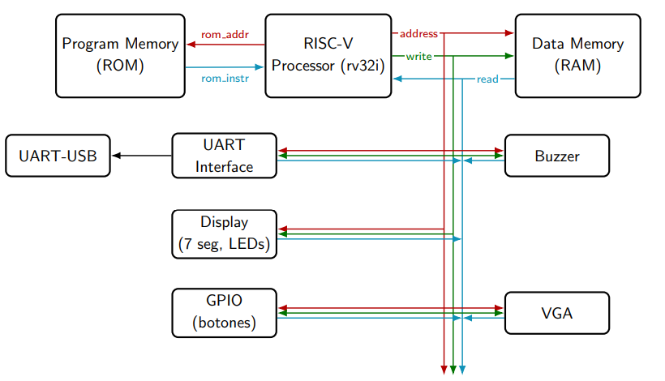

El núcleo RISC-V es el centro del sistema y accede tanto a la RAM como a los periféricos mediante direcciones de memoria. El interconector MMIO se encarga de dirigir cada acceso al módulo correspondiente, permitiendo que el procesador controle VGA, UART, displays y otros periféricos simplemente leyendo o escribiendo registros.

---

# 3. Fundamentación teórica

## 3.1 Procesador RISC-V RV32I uniciclo

El sistema utiliza un procesador RISC-V que opera con un reloj principal de 100 MHz. Su ejecución se controla mediante una señal de habilitación cpu_en, que permite avanzar una instrucción cada tres ciclos de reloj. De esta forma, el procesador dispone de aproximadamente 30 ns por instrucción, manteniendo un único dominio de reloj para todo el sistema. El PC, el banco de registros y las escrituras hacia memoria y periféricos se actualizan únicamente cuando esta señal está activa, lo que permite una operación sincronizada con el resto de los módulos.

---

## 3.2 Datapath

El datapath integra:

- Program Counter.
- Lógica de siguiente PC.
- Banco de 32 registros de 32 bits.
- Generador de inmediatos.
- ALU.
- Unidad de branches.
- Multiplexores de selección.
- Interfaces hacia memoria de programa y memoria de datos.

El Program Counter inicia en 0x0000_0000 y, en condiciones normales, avanza cuatro bytes por instrucción. Para branches y saltos se selecciona una dirección alternativa. Se implementó como un bloque independiente de la ALU. Esta decisión simplificó la verificación de las comparaciones con signo y sin signo y permitió que la ALU se mantuviera enfocada en operaciones aritméticas, lógicas y desplazamientos.

---

## 3.3 Unidad de control

La unidad de control está formada por tres módulos:

- main_decoder.sv
- alu_decoder.sv
- control_unit.sv

El main_decoder identifica el tipo general de instrucción a partir del opcode; alu_decoder utiliza opcode, funct3 y funct7[5] para elegir la operación de ALU; y control_unit integra ambos.

Entre las señales generadas se encuentran:

| Señal | Función |
|---|---|
| reg_write | Habilita escritura en el Register File. |
| alu_src_b | Selecciona rs2 o un inmediato como operando B. |
| alu_ctrl | Determina la operación de la ALU. |
| imm_src | Selecciona el formato del inmediato. |
| result_src | Selecciona la fuente de write-back. |
| mem_write | Habilita escritura en memoria. |
| branch | Identifica una instrucción de salto condicional. |
| jump | Identifica jal. |
| jalr| Identifica jalr. |

Cuando el opcode es no reconocido. En ese caso se deshabilitan escrituras a memoria y registros, así como branches y saltos. Esto evita que una instrucción inválida modifique accidentalmente el estado del sistema.

---

## 3.4 Arquitectura uniciclo y memoria

La arquitectura uniciclo requiere que las lecturas de ROM y RAM estén disponibles en el mismo ciclo. Por ello se utilizaron memorias con lectura combinacional y escritura de RAM en el flanco ascendente. Si la memoria introdujera latencia, instrucciones como lw no podrían completarse en un solo ciclo.

---

## 3.5 Memoria mapeada y MMIO

El acceso memory-mapped I/O utiliza instrucciones de carga y almacenamiento para consultar o modificar periféricos. La dirección determina el destino; el dato contiene información o comandos. El decoder compara la dirección, genera una selección exclusiva y combina esa selección con la solicitud de escritura. El multiplexor devuelve al procesador el dato del destino seleccionado.

La ROM almacena instrucciones y constantes invariables; la RAM conserva los tableros y variables modificables. El puerto de instrucciones permanece separado del puerto de datos, mientras que el acceso de datos puede recuperar constantes de ROM mediante lw. Esta separación permite obtener la instrucción y atender su operación de datos sin compartir una única conexión de memoria.

| Destino | Dirección o rango | Organización |
|---|---|---|
| Program ROM | 0x0000_0000–0x0000_1FFF | 2048 palabras × 32 bits; 8 KiB |
| Data RAM | 0x0000_2000–0x0000_2FFF | 1024 palabras × 32 bits; 4 KiB |
| UART CONTROL/ESTADO | 0x0001_0040 | Disponibilidad y comandos |
| UART DATA_TX | 0x0001_0044 | Byte de transmisión |
| UART DATA_RX | 0x0001_0048 | Byte recibido |
| Entradas Jugador 1 | 0x0001_0120 | Niveles y eventos de botones |
| Display | 0x0001_0130 | Valores de ambos jugadores |
| LED | 0x0001_0138 | Estado de la partida |
| Buzzer | 0x0001_0140 | Inicio y selección de sonido |
| Ventana MMIO de video | 0x0001_1000–0x0001_17FF | Índice local de 9 bits |
| Palabras utilizadas de video | 0x0001_1000–0x0001_14AC | 300 palabras; índices 0–299 |

Las direcciones representan bytes. Para una palabra de 32 bits, el índice se obtiene dividiendo entre cuatro la diferencia entre la dirección y la base. El decoder exige alineación de palabra antes de seleccionar RAM o periféricos. Un acceso no alineado o sin destino no produce escrituras y devuelve cero desde el interconector. La ROM utiliza NOP como respuesta a direcciones de instrucción inválidas.

Habilitación de escritura del destino = solicitud de escritura del procesador AND selección del destino.

Índice de palabra = (dirección de bytes − dirección base) / 4.

---

## 3.6 Comunicación UART

La UART transmite información serial de manera asíncrona: los extremos acuerdan la velocidad y el formato, sin compartir una señal de reloj. El formato 8N1 emplea un bit de inicio en bajo, ocho bits enviados desde el menos significativo y un bit de parada en alto. La línea permanece en alto durante el reposo.

El enlace se configura a 115200 baudios. Cada byte requiere diez intervalos de bit, por lo que la capacidad nominal máxima es de 11520 bytes/s. El receptor utiliza una habilitación de muestreo ×16 para ubicar las muestras cerca del centro de cada bit. El generador produce pulsos de habilitación; el receptor y transmisor mantienen el reloj principal de 100 MHz.

Las FIFO desacoplan el tiempo de ejecución del procesador del tiempo de transmisión. Cada cola almacena cuatro bytes. El software consulta disponibilidad antes de escribir TX y consume explícitamente RX después de leerlo. Los indicadores de desbordamiento permiten detectar cuando la atención del enlace no fue suficiente.

---

## 3.7 Sistema VGA basado en tiles

La salida gráfica utiliza una resolución de:

640 × 480 píxeles

El reloj principal de la Basys 3 es de 100 MHz. Para el subsistema VGA se genera un reloj de píxel de 25 MHz mediante la IP Clocking Wizard configurada con PLL.

Para evitar que el procesador tenga que trabajar píxel por píxel, la pantalla se organiza en tiles de:

32 × 32 píxeles

El procesador guarda en la Video RAM la información de lo que debe mostrarse en cada casilla, y el sistema VGA se encarga de convertir esa información en los colores que aparecen en pantalla. Así, el procesador no tiene que controlar cada píxel individualmente, lo que simplifica mucho el funcionamiento del sistema. 

Cada palabra de Video RAM tiene 32 bits y los tres bits menos significativos codifican el estado visual principal:

| Código | Estado | RGB |
|---|---|---|
| 000 | Agua | 0,4,F |
| 001 | Barco | 8,8,8 |
| 010 | Fallo | 0,F,F |
| 011 | Impacto | F,0,0 |
| 100 | Selección | F,F,0 |
| 101–111 | Reservado | 0,0,0 |

La Video RAM funciona además como punto de comunicación entre el dominio principal del sistema y el dominio de 25 MHz utilizado por VGA.

---

## 3.8 Entradas físicas y debounce

Los botones son entradas asíncronas respecto al reloj y sus contactos producen rebotes. La sincronización y el debounce resuelven problemas distintos: dos flip-flops consecutivos reducen la probabilidad de propagación de metastabilidad, mientras que el filtro exige estabilidad temporal antes de aceptar un cambio lógico.

Cada entrada tiene un nivel aceptado y un contador. Si la entrada sincronizada coincide con ese nivel, el contador vuelve a cero. Si difiere durante el umbral completo, se acepta el nuevo nivel. El filtrado se aplica tanto a la pulsación como a la liberación.

La transición aceptada de cero a uno produce un pulso de un ciclo. Como el procesador puede estar ocupado, ese pulso activa un bit pendiente que conserva el evento hasta su reconocimiento mediante W1C, es decir, escribir uno para limpiar. Así se separan el estado sostenido del botón y la notificación de una pulsación.

Un bit pendiente representa la presencia de al menos un evento; varias pulsaciones antes del reconocimiento se reúnen en el mismo bit. Esta organización es adecuada para acciones discretas de navegación y confirmación.

---

## 3.9 Aplicación del Jugador 2

La aplicación de PC funciona como terminal de entrada y salida. Captura coordenadas y orientación, transmite solicitudes y representa únicamente los estados confirmados por la FPGA. El firmware RISC-V decide la legalidad de las colocaciones, turnos, impactos, hundimientos y victoria.

UART transporta bytes, no mensajes completos. Una lectura puede contener parte de una línea o varias líneas. El cliente conserva un buffer, extrae tramas terminadas en salto de línea y mantiene los fragmentos incompletos para la siguiente lectura. El parser valida el tipo de mensaje, el número de campos y los valores permitidos antes de modificar la presentación.

La captura de consola se separa de la recepción serial para que esperar al usuario no impida atender mensajes. Una solicitud permanece pendiente hasta recibir confirmación o rechazo; el cliente no anticipa el resultado de una acción.

---

# 4. Implementación del sistema

## 4.1 Núcleo RISC-V

El núcleo RISC-V integra el datapath.sv y la control_unit.sv, conectados mediante señales definidas en riscv_pkg.sv. El datapath procesa los datos y direcciones, mientras que la unidad de control interpreta la instrucción y genera las señales necesarias. Esta separación permitió comprobar primero cada parte por separado y luego realizar la integración completa.

---

## 4.2 ROM, RAM e interconexión

El Issue 4 integra almacenamiento y direccionamiento en memory_mmio_system. La arquitectura contiene una ROM para instrucciones y una instancia adicional inicializada con la misma imagen para leer constantes desde el puerto de datos.

| Módulo | Responsabilidad |
|---|---|
| program_rom.sv | Inicializar y leer 2048 palabras de instrucciones o constantes |
| data_ram.sv | Almacenar 1024 palabras con escritura síncrona y lectura combinacional |
| mmio_interconnect.sv | Seleccionar destinos, producir índices y habilitaciones, y multiplexar lecturas |
| memory_mmio_system.sv | Conectar las memorias y el interconector con el procesador |

### Interfaz con el procesador y los periféricos

| Señal | Dirección | Ancho | Función |
|---|---|---:|---|
| clk_i | Entrada | 1 | Reloj de 100 MHz |
| ProgAddress_i | Entrada | 32 | Dirección de instrucción |
| ProgIn_o | Salida | 32 | Instrucción leída |
| DataAddress_i | Entrada | 32 | Dirección del acceso de datos |
| DataOut_i | Entrada | 32 | Dato de escritura |
| we_i | Entrada | 1 | Solicitud de escritura |
| DataIn_o | Salida | 32 | Dato de lectura hacia el CPU |
| bus_wdata_o | Salida | 32 | Dato distribuido a memorias y periféricos |
| Selecciones y habilitaciones individuales | Salida | 1 por destino | Identificar y autorizar el dispositivo |
| uart_addr_o / vga_addr_o | Salida | 2 / 9 | Selección local de registro o palabra |
| Datos de retorno de periféricos | Entrada | 32 por destino | Fuentes del multiplexor de lectura |

### Inicialización y decisiones de implementación

La imagen batalla_naval.mem contiene una palabra hexadecimal de 32 bits por línea y se carga mediante la inicialización de memoria. Las posiciones de ROM no ocupadas por el programa contienen 0x0000_0013, correspondiente a una instrucción NOP. La escritura de software no modifica la ROM.

La RAM se inicializa en cero al configurar el sistema. Su escritura requiere selección y habilitación en el flanco ascendente. Las lecturas combinacionales son compatibles con el camino de datos del procesador; el tiempo de propagación de ROM, decoder, multiplexores y RAM forma parte del análisis temporal de integración.

La dirección absoluta se decodifica una sola vez. Los periféricos reciben una selección y, cuando corresponde, un índice local, evitando repetir comparadores de 32 bits en cada módulo. Las habilitaciones deben representar una transacción del procesador; una escritura mantenida durante varios flancos puede repetir comandos con efectos laterales, como insertar bytes o consumir eventos.

---

## 4.3 Firmware de Batalla Naval

La lógica de alto nivel del juego se encuentra en:

- firmware/batalla_naval.S

El ensamblador genera:

- firmware/batalla_naval.mem

que posteriormente se utiliza para inicializar la Program ROM.

La imagen documentada ocupa 4072 bytes de los 8192 bytes disponibles. El programa utiliza instrucciones de 32 bits, sin extensión comprimida, sin multiplicación o división y sin accesos lb/sb.

El firmware administra:

- inicialización;
- colocación de barcos;
- validación de posiciones;
- disparos;
- cambios de turno;
- impactos y fallos;
- detección de victoria;
- actualización de VGA;
- comunicación con el Jugador 2;
- contadores de victoria;
- estados de salida.

---

## 4.4 VGA y Video RAM

El subsistema VGA integra los módulos encargados del reloj, temporización, conversión de píxeles a tiles, memoria de video, decodificación y salida RGB. Además, utiliza una interfaz MMIO para que el procesador pueda actualizar la pantalla mediante escrituras en memoria. 

El flujo general es:

CPU → MMIO → Video RAM → Tile Decoder → RGB → Monitor

La pantalla se organiza en dos tableros de 8 × 8, uno para cada jugador, junto con una región destinada al HUD.

## 4.5 UART y aplicación de PC

Los issues 8 y 9 implementan los extremos del enlace remoto. El hardware opera a nivel de bytes; el firmware construye e interpreta los mensajes de aplicación; Python presenta los resultados confirmados.

### Periférico UART — Issue 8

Se reutilizan los núcleos de transmisión, recepción y generación de baud del Proyecto 2. La adaptación incorpora las colas y la interfaz MMIO para que el procesador controle el enlace mediante registros de 32 bits.

El periférico reúne uart_mmio_peripheral, uart_mmio_fifo, uart_receiver, uart_transmitter y baud_rate_generator. La entrada RX pasa por dos flip-flops antes del receptor.

| Señal | Dirección | Ancho | Función |
|---|---|---:|---|
| clk_i / rst_i | Entrada | 1 cada una | Reloj y reset |
| select_i / write_enable_i | Entrada | 1 cada una | Selección y escritura MMIO |
| addr_i | Entrada | 2 | CONTROL, TX o RX |
| wdata_i | Entrada | 32 | Dato o comando escrito |
| rdata_o | Salida | 32 | Estado o dato leído |
| uart_rx_i / uart_tx_o | Entrada / salida | 1 cada una | Conexión serial con PC |

| Dirección | Registro | Lectura | Escritura |
|---|---|---|---|
| 0x0001_0040 | CONTROL/ESTADO | Indicadores de disponibilidad y error | Comandos definidos por bit |
| 0x0001_0044 | DATA_TX | Último byte aceptado en bits 7:0 | Insertar bits 7:0 en TX si hay espacio |
| 0x0001_0048 | DATA_RX | Byte en la cabeza de RX, bits 7:0 | Sin modificación de RX |

| Bit de CONTROL/ESTADO | Lectura | Escritura de uno |
|---|---|---|
| 0 | RX_VALID: hay datos en RX | Sin acción |
| 1 | TX_READY: hay espacio en TX | Sin acción |
| 2 | RX_FULL: RX está llena | Sin acción |
| 3 | RX_OVERRUN: desbordamiento de RX | Limpiar indicador, W1C |
| 4 | TX_OVERRUN: escritura en TX llena | Limpiar indicador, W1C |
| 8 | Cero | Retirar un byte de RX, W1P |
| Restantes | Cero | Sin acción |

TX_READY representa espacio en la cola y no significa que la línea serial esté inactiva. Leer RX no retira el dato: el programa primero lo procesa y luego escribe 0x0000_0100 en CONTROL. Si RX está vacía, el comando no modifica la cola. Los errores permanecen registrados hasta su reconocimiento; un error nuevo prevalece sobre la limpieza coincidente.

### Máquinas de estados de transmisión y recepción

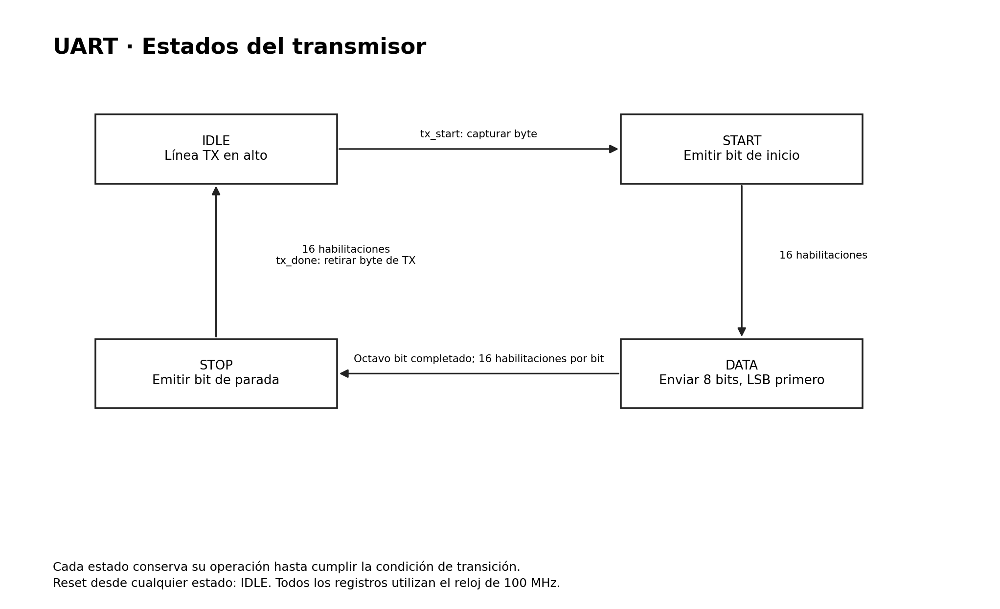

Figura 4.5a. El transmisor captura el byte, envía inicio, ocho bits y parada; al finalizar solicita retirar el byte de TX.

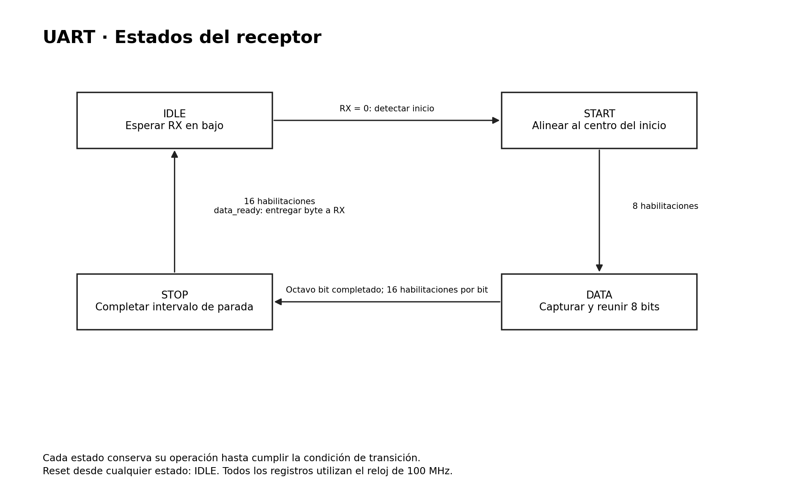

Figura 4.5b. El receptor espera inicio, alinea el muestreo y reconstruye el byte antes de notificar disponibilidad.

### Aplicación de PC — Issue 9

El archivo battle_client.py organiza la solución en LineFramer, parse_frame, BattleState e InputWorker. LineFramer reúne bytes; parse_frame valida mensajes; BattleState mantiene la presentación; InputWorker captura entradas sin detener la recepción.

La apertura del puerto utiliza 115200 baudios, 8N1, timeout de lectura de 50 ms y de escritura de 2 s. Las coordenadas válidas son de 0 a 7 y la orientación es H o V. El cliente limita las líneas a 128 bytes antes del terminador; ante exceso de longitud descarta hasta el siguiente salto de línea y recupera la recepción.

### Protocolo de aplicación

Los mensajes son ASCII, con campos separados por comas y terminador LF. La recepción también admite finales CRLF.

| Dirección | Trama | Semántica |
|---|---|---|
| PC → FPGA | PLACE,id,fila,columna,H/V | Solicitar colocación |
| PC → FPGA | FIRE,fila,columna | Solicitar disparo |
| FPGA → PC | NEW | Comenzar otra partida |
| FPGA → PC | PLACE,id,OK | Confirmar colocación |
| FPGA → PC | PLACE,id,REJECT,motivo | Rechazar colocación y permitir corrección |
| FPGA → PC | BATTLE | Ambas flotas listas; entrar a batalla |
| FPGA → PC | TURN,P1 o TURN,P2 | Confirmar jugador activo |
| FPGA → PC | SHOT,fila,columna,resultado,barco | Resultado de disparo de J2 |
| FPGA → PC | INCOMING,fila,columna,resultado,barco | Disparo recibido por J2 |
| FPGA → PC | SHOT_REJECT,fila,columna,motivo | Rechazar solicitud de disparo |
| FPGA → PC | END,ganador,disparosP1,disparosP2,hundidosP1,hundidosP2 | Resultado y resumen |
| FPGA → PC | ERROR,motivo | Notificar error de mensaje |

Resultado toma HIT, MISS o SUNK; barco contiene un identificador o el marcador − cuando no corresponde informar uno. Una colocación aceptada incorpora el barco propio. SHOT actualiza el tablero rival conocido e INCOMING el propio. La respuesta de un disparo no habilita por sí sola otra acción: el cliente espera TURN o END. NEW reinicia la presentación para otra partida.

---

## 4.6 Entradas del Jugador 1

El Issue 7 utiliza siete instancias de debounce_button dentro de j1_inputs_peripheral. Sus entradas son clk_i, rst_i, los siete controles físicos, select_i, write_enable_i y wdata_i de 32 bits. La salida rdata_o presenta el registro ESTADO y devuelve cero cuando el periférico no está seleccionado.

El registro ESTADO está en 0x0001_0120:

| Botón | Bit de nivel, RO | Bit pendiente, W1C | Acción del programa |
|---|---:|---:|---|
| Arriba | 0 | 8 | Navegar arriba |
| Abajo | 1 | 9 | Navegar abajo |
| Izquierda | 2 | 10 | Navegar a la izquierda |
| Derecha | 3 | 11 | Navegar a la derecha |
| SEL | 4 | 12 | Selección o rotación |
| OK | 5 | 13 | Confirmar |
| RST | 6 | 14 | Solicitar nueva partida |

El bit 7 y los bits 31:15 se leen como cero. Una escritura solo reconoce los bits pendientes indicados por unos en 14:8; no modifica niveles ni limpia los restantes. La nueva pulsación prevalece si coincide con el reconocimiento.

Evento siguiente = (evento actual AND NOT máscara de reconocimiento) OR nuevas pulsaciones.

Con 100 MHz y 20 ms, el umbral es de 2 000 000 ciclos y requiere 21 bits de conteo. Los testbenches reducen el umbral mediante parámetros para verificar la misma secuencia en menos tiempo de simulación.

El reset del periférico limpia filtros y eventos. BTN RST es una entrada consultada por el programa, independiente del reset global; la conservación de victorias al iniciar otra partida corresponde al firmware.

---

## 4.7 Periféricos de salida

El sistema incorpora tres salidas locales:

### Display de siete segmentos

El display de cuatro dígitos muestra las victorias acumuladas de ambos jugadores: dos dígitos para J2 y dos para J1, con valores entre 00 y 99.

### Indicadores de estado

El registro de estado selecciona una indicación distinta para:

Colocación
Batalla
Resultado final

En la integración física documentada para Basys 3, estos estados se llevan a LEDs independientes.

### Buzzer

El controlador de buzzer permite seleccionar diferentes efectos:

- impacto;
- fallo;
- barco hundido;
- colocación inválida;
- victoria.

Se realizó un circuito muy sencillo con un transistor 2N2222 y una resistencia de 1 kΩ para mejorar el sonido.

---

## 4.8 Módulo superior

La integración final se realiza mediante:

rtl/batalla_naval_top.sv

Este módulo reúne:

- CPU;
- ROM y RAM;
- MMIO;
- UART;
- entradas;
- periféricos de salida;
- Video RAM;
- VGA;
- señales físicas de la Basys 3.

El top funciona como punto de conexión. La arquitectura mantiene la lógica de juego en el firmware y la lógica especializada dentro de cada periférico.

---

# 5. Metodología de verificación

La verificación se realizó de forma progresiva, comenzando con pruebas individuales de cada módulo y avanzando luego hacia los subsistemas, las interfaces MMIO y la integración completa.

Los testbenches autoverificables comparan automáticamente los resultados obtenidos con los esperados y reportan PASS o FAIL, lo que facilita la detección de errores. En el caso del datapath también se utilizó un modelo de referencia en lockstep, permitiendo comparar ciclo a ciclo el PC, los registros y las operaciones de memoria.

Esta metodología ayudó a comprobar cada parte antes de integrarla y a identificar con mayor rapidez el origen de posibles fallas.

---

# 6. Presentación de resultados

## 6.1 Datapath

Las simulaciones se realizaron en Vivado mediante simulación de comportamiento. Cada testbench compara automáticamente los resultados obtenidos con los valores esperados y reporta PASS cuando no se encuentran errores.

### Prueba de la ALU

El testbench `tb_alu.sv` verificó las 11 operaciones implementadas en la ALU, incluyendo operaciones aritméticas, lógicas, comparaciones y desplazamientos. También se probaron valores límite y 5 000 combinaciones aleatorias por operación.

El resultado obtenido fue:

tb_alu: 55715 chequeos, 0 errores → TEST PASSED

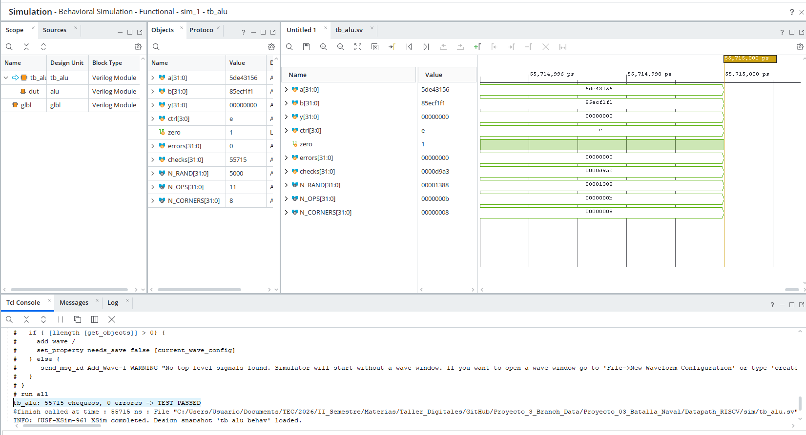

---

### Prueba del generador de inmediatos

El testbench tb_imm_gen.sv comprobó la generación correcta de los inmediatos de tipo I, S, B, J y U, incluyendo valores positivos, negativos y extremos de cada formato. Para la verificación se codificaron inmediatos dentro de instrucciones y se comprobó que el módulo recuperara correctamente su valor y extensión de signo.

Resultado:

tb_imm_gen: 30014 chequeos, 0 errores → TEST PASSED

---

### Prueba del Register File

El testbench tb_reg_file.sv verificó el funcionamiento de los 32 registros del procesador, sus dos puertos de lectura y el puerto de escritura. También se comprobaron el reset, la protección del registro x0, la desactivación de escritura y el comportamiento durante una lectura y escritura del mismo registro.

Además, se ejecutaron 20 000 ciclos aleatorios contra un modelo de referencia.

Resultado:

tb_reg_file: 40199 chequeos, 0 errores → TEST PASSED

---

### Prueba de la unidad de branches

El testbench tb_branch_unit.sv verificó las condiciones de salto utilizadas por las instrucciones:

BEQ
BNE
BLT
BGE
BLTU
BGEU

Se probaron comparaciones con signo y sin signo, operandos iguales, valores límite y combinaciones aleatorias. Esto permitió comprobar que el datapath identifica correctamente cuándo debe realizarse un branch.

Resultado:

tb_branch_unit: 80396 chequeos, 0 errores → TEST PASSED

---

### Prueba del Program Counter

El testbench tb_pc.sv comprobó el comportamiento del Program Counter y la selección de la siguiente dirección de ejecución.

Entre las condiciones verificadas se encuentran:

- Reset del PC a 0x0000_0000.
- Avance normal de PC + 4.
- Branch tomado y no tomado.
- Saltos hacia adelante y hacia atrás.
- Funcionamiento de jal.
- Funcionamiento de jalr.
- Eliminación del bit menos significativo en el destino de jalr.
- Prioridad entre las diferentes fuentes del siguiente PC.

Resultado:

tb_pc: 20067 chequeos, 0 errores → TEST PASSED

---

### Prueba integrada del datapath

Después de comprobar los módulos individualmente se ejecutó tb_datapath.sv, encargado de verificar el funcionamiento conjunto del datapath.

Durante esta prueba, el procesador ejecuta programas escritos con instrucciones RISC-V y su comportamiento se compara ciclo a ciclo con un modelo de referencia mediante lockstep.

En cada ciclo se comprueban:

- El Program Counter.
- Los 32 registros.
- Las operaciones de lectura y escritura de memoria.
- La dirección y los datos presentes en el bus.

La prueba incluye un programa dirigido que utiliza las instrucciones implementadas y, adicionalmente, 30 programas aleatorios de 400 instrucciones cada uno.

El resultado final fue:

tb_datapath: ~12000 ciclos verificados en lockstep

0 errores → TEST PASSED

### Cobertura de instrucciones

El testbench integrado también genera información de cobertura para comprobar que las instrucciones implementadas hayan sido ejecutadas durante las pruebas. En el caso de los branches se verifica tanto el caso tomado como el no tomado.

La prueba se considera válida únicamente cuando las instrucciones requeridas presentan cobertura.

---

## 6.2 Unidad de control

La unidad de control se verificó mediante testbenches autoverificables. El objetivo fue comprobar que cada instrucción genere correctamente las señales necesarias para controlar el datapath.

### Prueba del main_decoder

El módulo main_decoder.sv se encarga de interpretar el opcode de la instrucción y generar las señales generales de control.

Durante la simulación se verificó la correcta decodificación de:

- Instrucciones R-type
- Instrucciones I-type
- lw
- sw
- Branches
- jal
- jalr
- lui
- auipc
- Opcodes no válidos

El resultado obtenido fue:

Pruebas ejecutadas : 10
Errores encontrados: 0

TODOS LOS TEST PASARON - PASS

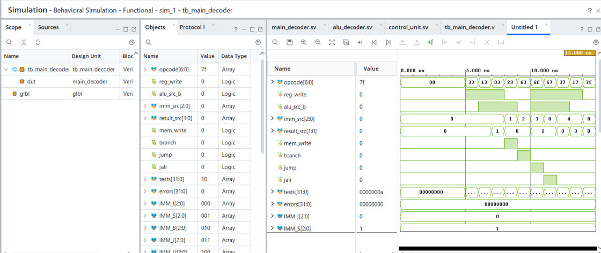

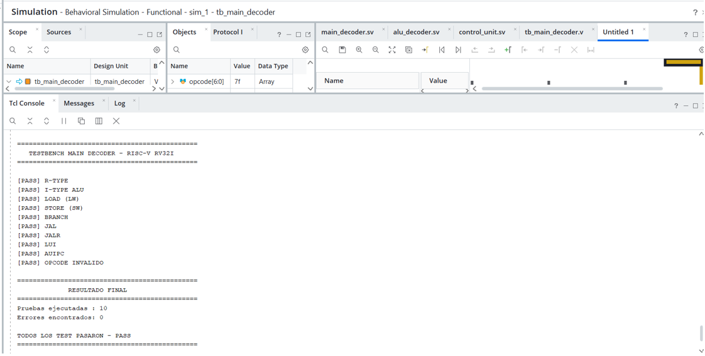

---

### Prueba del alu_decoder

Durante las pruebas se verificaron operaciones aritméticas, lógicas, comparaciones y desplazamientos, además de las operaciones requeridas para los accesos a memoria.

Las simulaciones permitieron comprobar que la señal alu_ctrl selecciona correctamente la operación correspondiente para cada instrucción.

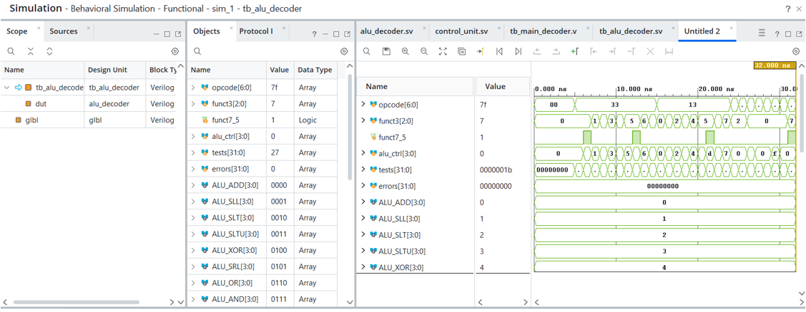

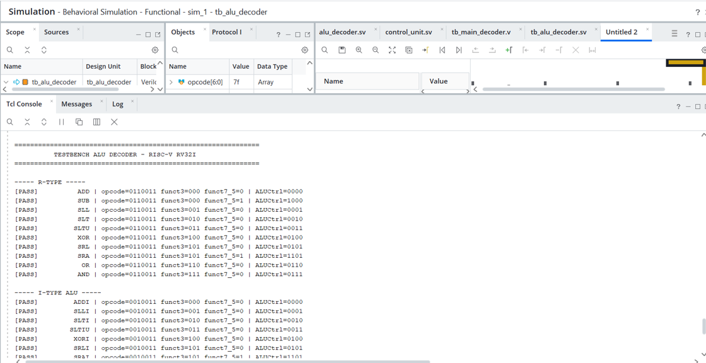

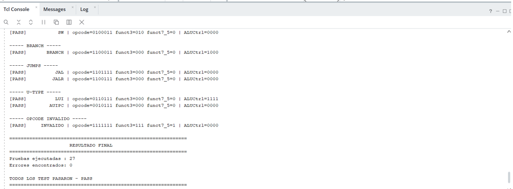

---

### Prueba integrada de control_unit

Después de verificar los dos decodificadores por separado, se realizó la prueba integrada de control_unit.sv, donde se comprobó el funcionamiento conjunto de main_decoder y alu_decoder.

La prueba integrada contempló un total de 27 casos, incluyendo distintos tipos de instrucciones y combinaciones de los campos utilizados para la decodificación.

El resultado obtenido fue:

Pruebas ejecutadas : 27

Errores encontrados: 0

TODOS LOS TEST PASARON - PASS

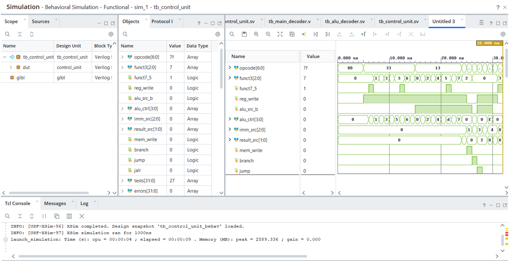

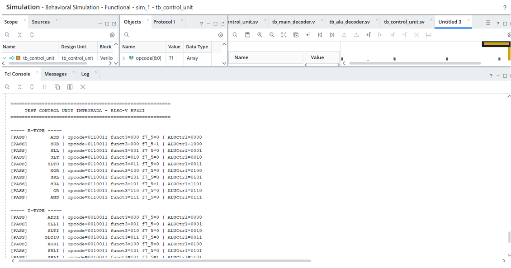

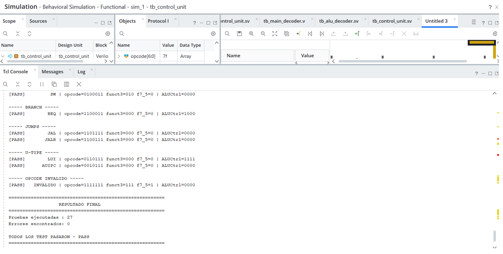

---

## 6.3 Núcleo VGA

Se verificaron la generación del reloj de píxel, la temporización VGA, la conversión de coordenadas, la Video RAM, la decodificación de los tiles, la salida RGB y finalmente el funcionamiento conjunto mediante vga_top.sv.

### Configuración del reloj VGA

La Basys 3 dispone de un reloj principal de 100 MHz, mientras que el sistema VGA requiere un reloj de píxel de 25 MHz. Para obtenerlo se utilizó la IP Clocking Wizard de Vivado configurada mediante PLL.

La configuración final permitió obtener:

- Reloj de entrada: 100 MHz.
- Reloj de salida: 25 MHz.
- Fase: 0°.
- Duty cycle: 50 %.

---

### Prueba de temporización VGA

Se comprobó el reinicio de los contadores, los cambios de línea y el recorrido completo de un frame.

---

### Prueba de la Video RAM

Se verificó el funcionamiento de la memoria utilizada para almacenar la información gráfica de los tiles.

Se realizaron escrituras y lecturas mediante sus dos puertos, comprobando que ambos pudieran trabajar de manera independiente y recuperar correctamente los datos almacenados.

---

### Prueba integrada de vga_top

Después de verificar los módulos individualmente, se realizó una prueba integrada mediante tb_vga_top.sv.

Esta prueba comprobó el funcionamiento conjunto de la cadena completa:
También se verificaron las operaciones de lectura y escritura sobre la memoria de video.

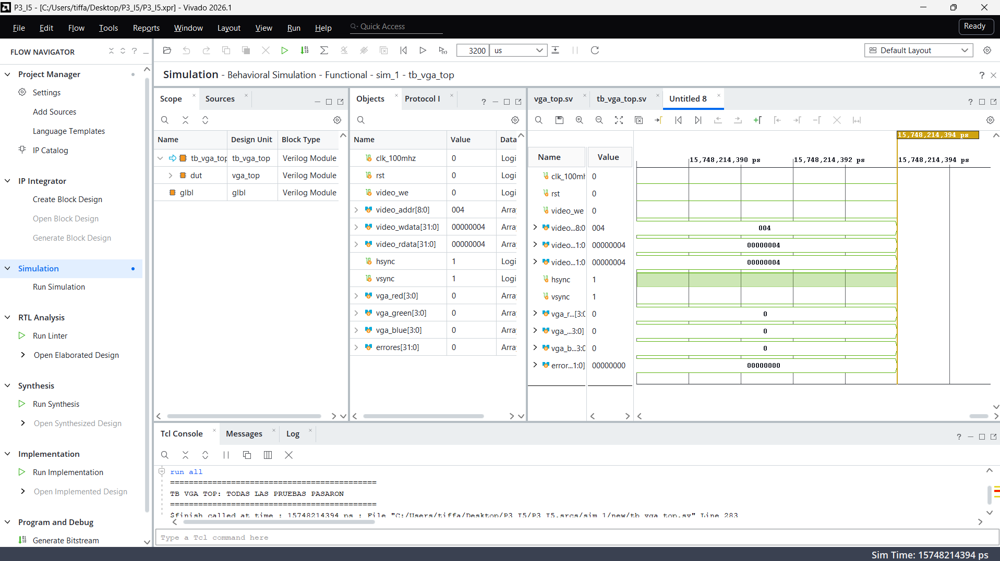

---

### Prueba física en FPGA

Finalmente, se realizó una prueba física utilizando la FPGA Basys 3 conectada a un monitor VGA.

Para verificar la salida se generó un patrón de barras de colores. El monitor reconoció correctamente la señal y mostró una imagen estable, sin pérdida de sincronización ni desplazamientos visibles.

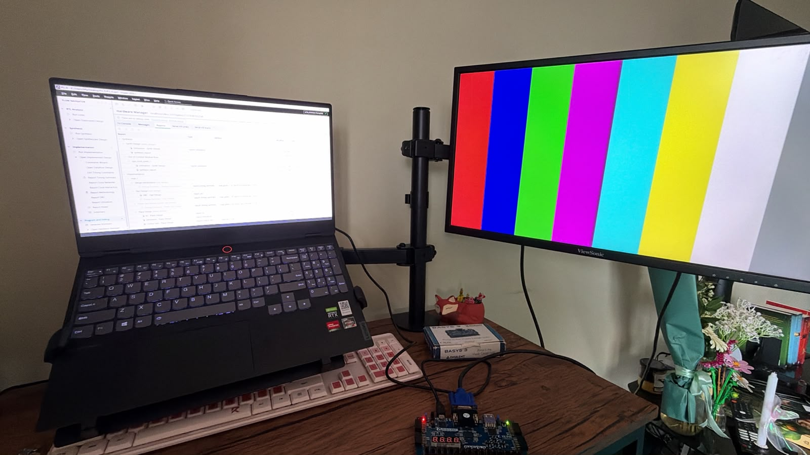

## 6.4 Video RAM y renderizado

La validación del sistema de video se realizó de forma progresiva, comenzando con la interfaz MMIO y avanzando hasta comprobar el recorrido completo de los datos desde el procesador hasta la salida VGA. También se realizó una prueba física utilizando la FPGA Basys 3 y un monitor.

### Prueba de la interfaz MMIO de video

El testbench tb_video_mmio_interface.sv verifica la comunicación entre el procesador y la Video RAM mediante direcciones mapeadas en memoria.

Durante la prueba se comprobó que:

- Las direcciones dentro del rango VGA sean reconocidas correctamente.
- Las direcciones fuera del rango no generen escrituras.
- La dirección del procesador se convierta correctamente en una dirección interna de Video RAM.
- Los datos escritos por el procesador lleguen correctamente a la memoria.
- La señal video_we_o solamente se active durante una escritura válida.

---

### Prueba del periférico de video

El testbench tb_video_peripheral.sv verifica la integración entre video_mmio_interface y el núcleo VGA.

La prueba realiza escrituras desde la interfaz del procesador y comprueba que los datos lleguen correctamente hasta la memoria de video, verificando el recorrido:

CPU → MMIO → Video RAM

El núcleo VGA permanece activo durante la simulación para comprobar que ambas partes puedan trabajar de manera conjunta.

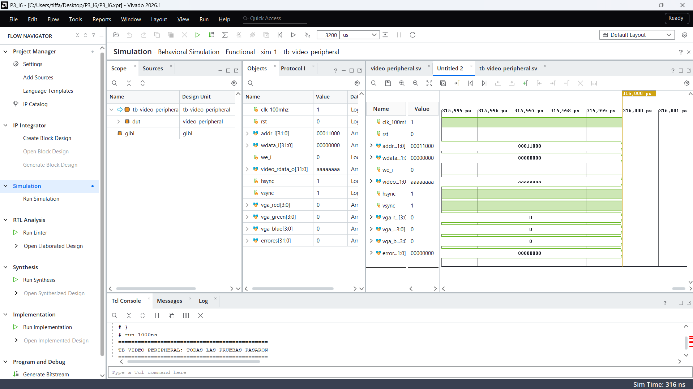

---

### Prueba de distribución de pantalla

Se verifica la organización lógica de la pantalla utilizada para Batalla Naval.

Se probaron diferentes coordenadas de tile_x y tile_y para comprobar la correcta identificación de las regiones:

- Fondo.
- Tablero propio.
- Tablero rival.
- HUD.

También se verificó el cálculo de board_x y board_y para las casillas pertenecientes a los tableros de 8 × 8.

---

### Prueba de integración de Video RAM

Se verifica el recorrido completo de una escritura desde la interfaz MMIO hasta la Video RAM.
Durante la prueba se escribieron diferentes códigos de tile en varias posiciones de memoria y posteriormente se comprobó que los valores almacenados fueran correctos.

---

### Prueba final de renderizado

Se verifica el recorrido completo desde una escritura realizada por el procesador hasta la generación del color correspondiente en la salida VGA.

Durante la simulación se escribieron diferentes estados de tiles y se comprobó que las señales vga_red, vga_green y vga_blue coincidieran con el color definido para cada estado.

---

### Prueba física en FPGA

Después de completar las simulaciones se realizó una validación física utilizando la FPGA Basys 3 conectada a un monitor mediante VGA.

En el monitor se verificó correctamente:

- El tablero propio de 8 × 8 casillas.
- El tablero rival de 8 × 8 casillas.
- La región destinada al HUD.
- El fondo de la pantalla.
- La cuadrícula de tiles.
- Los colores correspondientes a agua, barcos, impactos, fallos y selección.

La imagen se mantuvo estable y correctamente sincronizada, permitiendo verificar el funcionamiento del sistema de video sobre el hardware real.

---

## 6.5 Memoria e interconexión MMIO

Las pruebas dirigidas comparan cada lectura y habilitación con el valor esperado. Una discrepancia detiene el testbench con FAIL; PASS se imprime al completar las comprobaciones.

| Prueba | Casos comprobados | Resultado documentado |
|---|---|---|
| tb_program_rom | Instrucciones conocidas; relleno NOP; última palabra; dirección desalineada y fuera de ROM | PASS |
| tb_data_ram | Inicialización; primera y última palabra; independencia de posiciones; bloqueo de escritura sin selección | PASS |
| tb_mmio_interconnect | Selección de destinos; índices locales; datos de retorno; accesos inválidos | PASS |
| tb_memory_mmio_system | Recorrido integrado de instrucciones, RAM e interconexión | PASS |

Figura 6.5a. PASS de ROM; finalización a 7 ns de tiempo simulado.

Figura 6.5b. PASS de RAM; finalización a 30 ns de tiempo simulado.

Figura 6.5c. PASS del interconector; finalización a 19 ns de tiempo simulado.

Figura 6.5d. PASS del sistema de memorias y MMIO. El nombre de la captura no altera el nombre del testbench mostrado.

Las pruebas de límites y deselección comprueban que una operación válida no modifique otra palabra o periférico. Los tiempos de finalización corresponden a la duración del estímulo del testbench, no a mediciones del camino crítico de implementación.

---

## 6.6 Entradas del Jugador 1

La verificación combina estímulos de rebote, niveles sostenidos y accesos de bus. Se comparan los niveles filtrados, los eventos pendientes y el dato de retorno.

| Comprobación | Criterio de aceptación |
|---|---|
| Rebotes de pulsación y liberación | No aceptar cambios antes del umbral |
| Pulsación sostenida | Un evento de pulsación; nivel permanece activo |
| Siete entradas | Correspondencia correcta entre botón y bits |
| Liberación | Nivel vuelve a cero; evento continúa pendiente |
| W1C individual | Limpiar únicamente los eventos reconocidos |
| Reset | Niveles y eventos limpios |
| MMIO válido e inválido | Retorno correcto y ausencia de modificaciones en otra dirección |

Figura 6.6a. PASS tb_j1_inputs_peripheral; finalización a 2791 ns con parámetros de prueba.

Figura 6.6b. PASS tb_j1_mmio_integration.

En la prueba integrada de OK, la lectura esperada es 0x0000_2020: el bit 5 representa el nivel y el bit 13 el evento. Escribir 0x0000_2000 reconoce el evento y deja 0x0000_0020 mientras el botón continúa presionado. Una escritura en 0x0001_0124 no debe cambiarlo. Este caso comprueba la separación entre nivel físico, evento y selección MMIO.

---

## 6.7 UART

La verificación se divide entre cola de bytes, periférico serial e integración con el bus. Los bancos de prueba comparan datos y estados, y reportan PASS o FAIL automáticamente.

| Prueba | Propósito | Resultado |
|---|---|---|
| tb_uart_mmio_fifo | Orden de bytes y operación de la cola | PASS |
| tb_uart_mmio_peripheral | Accesos a registros y transmisión/recepción serial | PASS |
| tb_uart_mmio_bus | Direccionamiento UART a través del interconector | PASS |

Figura 6.7a. PASS de la cola utilizada por UART.

Figura 6.7b. PASS del periférico UART MMIO.

Figura 6.7c. PASS de integración entre UART y direccionamiento MMIO.

### Comparación con la temporización teórica

| Magnitud | Valor calculado |
|---|---:|
| Reloj principal | 100 MHz |
| Divisor de habilitación | 54 ciclos |
| Habilitaciones por bit | 16 |
| Duración de bit | 8,64 µs |
| Velocidad resultante | 115740,74 baudios |
| Referencia de PC | 115200 baudios |
| Diferencia relativa | +0,4694 % |
| Duración de trama 8N1 | 86,4 µs |

Velocidad = 100 000 000 / (54 × 16).

Error relativo = (115740,74 − 115200) / 115200 × 100.

El cálculo expresa la cuantización del divisor entero. Los PASS evidencian el funcionamiento de los estímulos seriales y accesos comprobados; el porcentaje calculado no constituye por sí solo una medida de tasa de errores del enlace físico.

---

## 6.8 Periféricos de salida

Los periféricos de salida —display de 7 segmentos, LED de estado y buzzer— se verificaron mediante testbenches autoverificables y posteriormente mediante una prueba de integración con el bus MMIO.

### Display de 7 segmentos

Se comprobó la visualización de los contadores de ambos jugadores, el rango de 00 a 99, el multiplexado de los cuatro dígitos y la correcta decodificación de los segmentos.

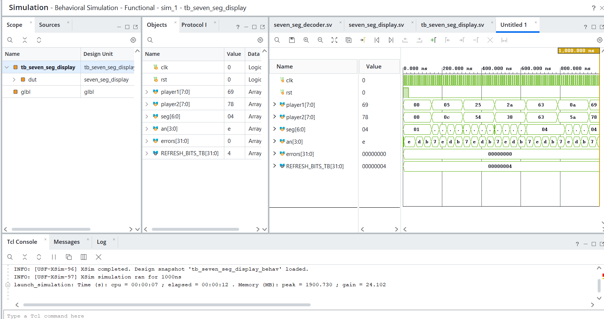

---

### LED de estado

Se verificó los diferentes estados de la partida:

- Colocación.
- Batalla.
- Resultado final.
- Estado inválido.

La simulación comprobó que cada estado genera correctamente la salida correspondiente.

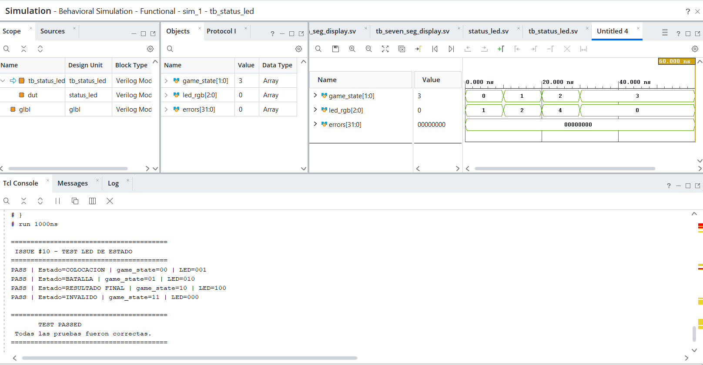

---

### Buzzer
Se verificó los sonidos asociados a impacto, fallo, barco hundido, colocación inválida y victoria. También se comprobó la activación de la señal busy y la finalización correcta de cada efecto sonoro.

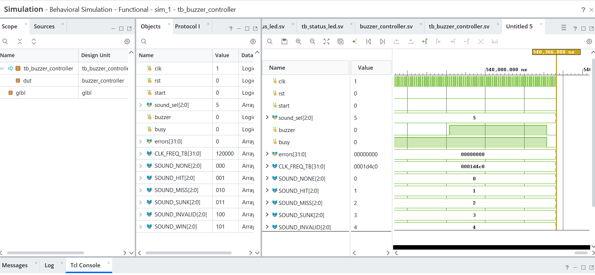

---

### Prueba de la interfaz MMIO

Finalmente se comprobó el acceso a los tres periféricos mediante sus direcciones:

| Periférico | Dirección |
|---|---|
| Display | 0x0001_0130 |
| LED | 0x0001_0138 |
| Buzzer | 0x0001_0140 |

También se verificó que cada periférico funcionara de forma independiente y que una escritura sobre uno de ellos no modificara los demás.

---

### Integración final

Finalmente, tb_issue10_bus_integration.sv verificó el funcionamiento conjunto de los periféricos con el bus MMIO del Issue #4.

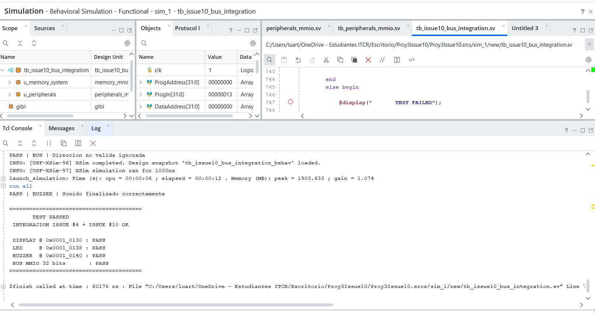

En conjunto, las pruebas confirmaron el funcionamiento correcto de los tres periféricos de salida y su control mediante el bus MMIO de 32 bits.

## 6.9 Integración del sistema completo

La integración dispone de tres testbenches principales:

tb_integration_memory
tb_system_nominal_uart
tb_batalla_naval_system

Sus criterios de aceptación documentados son:

PASS tb_integration_memory: constantes ROM, protección, RAM, VGA y rangos

PASS tb_system_nominal_uart: CPU/MMIO, transmisión FPGA y recepción desde PC a 115200 8N1

PASS tb_batalla_naval_system: dos partidas completas, MMIO, UART, GPIO, salidas, VGA y reset

Finalmente, el tb_batalla_naval_system está diseñado para recorrer dos partidas completas sobre el CPU RTL, incluyendo entradas físicas simuladas y tráfico UART serial.

---

## 6.10 Aplicación de PC del Jugador 2

La suite test_battle_client ejecutó ocho pruebas unitarias y finalizó con OK. Las comprobaciones comparan tramas reconstruidas, comandos, excepciones y estado de presentación mediante unittest.

| Prueba | Comprobación |
|---|---|
| Fragmentos y CRLF | Conservar una línea parcial y reconstruir TURN,P2 |
| Byte inválido y trama extensa | Detectar errores y recuperar la siguiente línea NEW |
| Configuración serial | Solicitar 115200, 8N1 y los timeouts definidos |
| Coordenadas y orientación | Aceptar entradas válidas y rechazar valores o formatos inválidos |
| Mensajes UART inválidos | Rechazar tipos, campos y rangos incompatibles |
| Secuencia de partida y nueva partida | Aceptación/rechazo, turnos, tableros, hundimiento, resumen y limpieza |
| Protección de la presentación | Mensajes inválidos no alteran el tablero |
| Recuperación tras error FPGA | Liberar la solicitud pendiente y permitir reintento cuando corresponde |

Figura 6.10a. Ocho pruebas ejecutadas en 0,002 s, con resultado OK.

La prueba de configuración utiliza un puerto serial simulado; verifica los argumentos de apertura. La secuencia de partida utiliza eventos controlados para verificar la presentación, sin transferir al cliente la decisión de impactos o legalidad. La actualización del tablero propio y rival se comprueba de forma independiente.

---

# 7. Análisis e interpretación de resultados

## 7.1 Verificación progresiva

La estrategia de pruebas avanzó desde módulos individuales hasta la integración completa. En el procesador se verificaron primero la ALU, inmediatos, Register File, branches y PC, y posteriormente el datapath completo y su conexión con memoria y periféricos.

Este enfoque facilitó la detección de errores, ya que permitió descartar fallas en bloques previamente validados y concentrar la depuración en las interfaces y señales de control.

---

## 7.2 Arquitectura uniciclo y memoria

El procesador uniciclo requiere que las lecturas de memoria estén disponibles dentro del mismo ciclo, especialmente para instrucciones como lw. Por esta razón, la ROM y la RAM utilizan lectura combinacional.

---

## 7.3 Integración mediante MMIO

Los PASS del decoder y de las integraciones de entradas y UART muestran que el mapa de memoria funciona como contrato entre módulos. La selección exclusiva impide escrituras en otros destinos, mientras que el multiplexor conserva una única fuente de retorno hacia DataIn.

La lectura de ROM a través del puerto de datos permite al firmware recuperar textos y constantes sin copiarlos previamente a RAM. La protección de escritura conserva la imagen del programa. La división entre direccionamiento absoluto e índices locales facilita reutilizar periféricos con otra ubicación de memoria.

La escritura síncrona evita capturar datos fuera del flanco previsto, pero requiere que la habilitación represente exactamente la operación del CPU. En comandos con efectos laterales, repetir una habilitación equivale a repetir la acción. La coordinación temporal del procesador y el bus es, por ello, tan importante como la dirección correcta.

---

## 7.4 Comunicación UART

La diferencia calculada de +0,4694 % se debe al divisor entero de 54 ciclos. El muestreo ×16 permite ubicar las muestras dentro del intervalo de bit; la sincronización de RX reduce el riesgo de metastabilidad antes del receptor.

Las FIFO permiten atender bytes sin detener al procesador durante cada trama, pero tienen capacidad finita. Cuatro bytes representan aproximadamente 345,6 µs de tráfico continuo a la velocidad calculada. Este valor ilustra la escala de atención requerida; no es una garantía universal de tiempo disponible, pues depende de la ocupación previa de la cola.

Consultar TX_READY antes de escribir y ejecutar RX_POP después de leer evita saturación de envío y repetición del mismo byte. Los indicadores persistentes permiten distinguir un desbordamiento real de un error de formato de aplicación. Un mensaje BAD_FRAME indica rechazo de una trama por el firmware y requiere analizar el contenido recibido; no identifica por sí solo la causa eléctrica.

El receptor implementado reconstruye la trama y notifica su finalización, pero no expone un indicador separado de error de parada ni utiliza paridad. El protocolo de aplicación valida estructura y rangos; tampoco incorpora un checksum. Estas decisiones mantienen el enlace sencillo y delimitan el tipo de errores detectables.

---

## 7.5 Sistema de video

El uso de tiles simplificó considerablemente el manejo de la pantalla. En lugar de controlar cada píxel, el procesador modifica el estado de las casillas y el núcleo VGA genera automáticamente los colores correspondientes.

Las pruebas físicas permitieron confirmar además que los sincronismos y las señales RGB producen una imagen estable en un monitor real.

---

## 7.6 Aplicación del Jugador 2

Las ocho pruebas aprobadas muestran que la reconstrucción de líneas, la validación y la presentación mantienen un comportamiento definido ante entradas válidas e inválidas. La recuperación después de una trama extensa impide que un error deje permanentemente desalineado el flujo de mensajes.

Mantener una solicitud pendiente hasta la respuesta evita mostrar barcos o disparos antes de su aceptación. Esperar TURN o END después de un resultado conserva la coordinación con el firmware. Los tableros son representaciones de información confirmada; el tablero rival no revela posiciones de barcos desconocidos.

El timeout de lectura permite revisar periódicamente la entrada de consola sin suspender la recepción indefinidamente. Una espera sin datos no equivale automáticamente a un error de partida. El proceso de entrada separado evita que la demora del usuario detenga la atención serial.

---

## 7.7 Validación del datapath

El datapath presenta una validación sólida mediante pruebas dirigidas, casos aleatorios y comparación con un modelo de referencia en lockstep.

Estas pruebas permiten verificar tanto operaciones específicas como el comportamiento general del procesador durante la ejecución de programas.

---

## 7.8 Síntesis e implementación

Se dispone de resultados de síntesis para el datapath y de confirmación de síntesis correcta para el subsistema VGA. Además, el proyecto contempla reportes de utilización, timing, DRC y CDC para la implementación completa.

## 7.9 Decisiones, problemas y aprendizaje de los issues 4, 7, 8 y 9

| Situación | Decisión o corrección | Efecto técnico |
|---|---|---|
| Imagen ROM no localizada en simulación | Alinear nombre, extensión y ubicación del archivo con el parámetro de inicialización | La ROM entrega las instrucciones esperadas |
| Pulsación breve mientras el CPU atiende otros módulos | Retener el evento y reconocerlo mediante W1C | La liberación del botón no elimina la notificación |
| Diferencia de velocidad CPU/UART | Colas RX/TX y consulta de disponibilidad | Separar atención de software y tiempo serial |
| Lecturas de PC fragmentadas | Buffer con delimitación por LF | Reconstruir mensajes sin depender de cada lectura serial |
| Solicitudes aún no confirmadas | Estado pendiente hasta aceptación o rechazo | Evitar divergencia entre presentación y firmware |

La retención de botones tiene prioridad para eventos nuevos frente a limpieza simultánea. Un bit pendiente no cuenta pulsaciones múltiples; una cola de eventos sería una ampliación para aplicaciones que exijan conservar cada accionamiento.

La parametrización permite acelerar las pruebas de debounce manteniendo su lógica. El umbral físico de 20 ms corresponde a un tiempo de respuesta del filtro, no a la duración observada de los testbenches parametrizados.

El análisis de timing del sistema debe considerar ROM, direccionamiento y retorno de lectura, además del reloj y habilitación del CPU. Una habilitación cada tres ciclos solo amplía el intervalo funcional de actualización; las excepciones temporales deben corresponder a caminos cuyos registros respeten esa habilitación. Las capturas PASS son resultados funcionales y no sustituyen los reportes de timing y utilización.

---

# 8. Resultados finales del sistema

Una vez completada la integración de los diferentes módulos, se realizaron pruebas sobre el sistema físico para comprobar el funcionamiento conjunto del procesador RISC-V, los periféricos, la salida VGA y la comunicación con la aplicación del Jugador 2.

## 8.1 Implementación física en FPGA

Durante la ejecución se utilizaron los botones y switches de la tarjeta para controlar las acciones del Jugador 1, mientras que los displays y LEDs permitieron visualizar información relacionada con el estado de la partida.

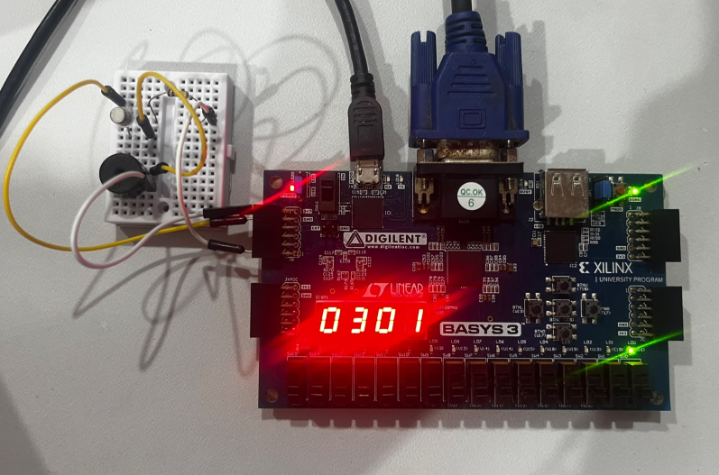

---

## 8.2 Visualización en monitor VGA

La salida VGA permitió visualizar los tableros de Batalla Naval y los diferentes estados de las casillas durante la ejecución del juego. En pantalla se representan elementos como agua, barcos, impactos, fallos y el cursor de selección.

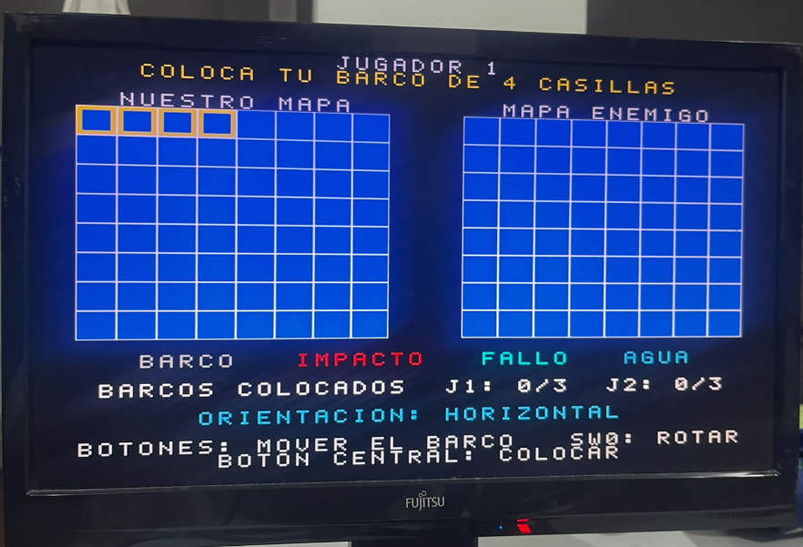
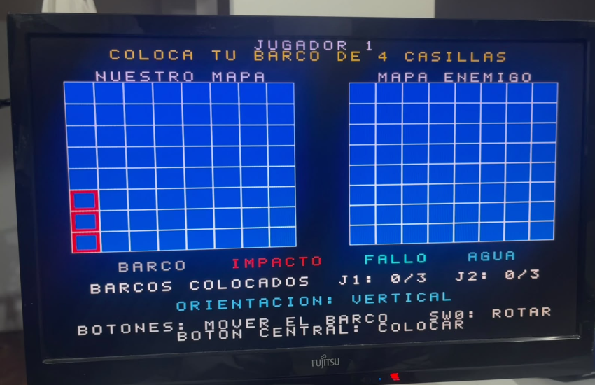

## 8.3 Aplicación del Jugador 2

El Jugador 2 interactúa con el sistema mediante una aplicación desarrollada en Python y conectada a la FPGA por UART. La aplicación permite realizar la colocación de barcos, seleccionar coordenadas de disparo y visualizar la información correspondiente a la partida.

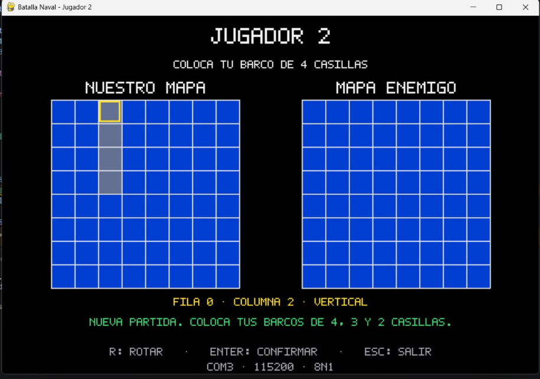

---

## 8.4 Sistema completo

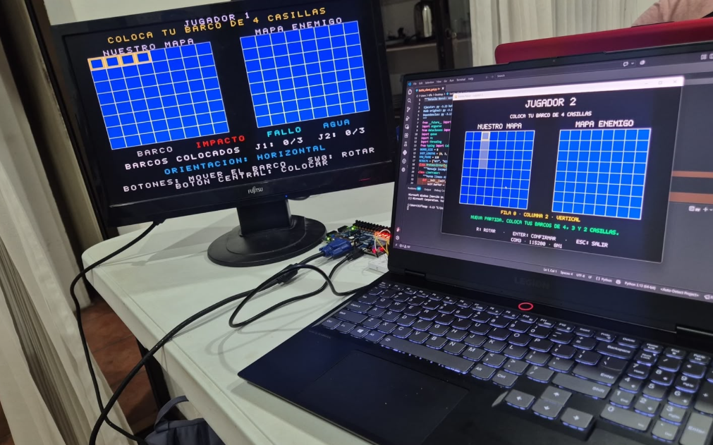

# 9. Guía de uso

Cada jugador debe colocar tres barcos de 4, 3 y 2 casillas. El Jugador 1 interactúa directamente con la FPGA y el monitor VGA, mientras que el Jugador 2 utiliza la aplicación de Python conectada mediante UART.

## 9.1 Inicio de la partida

Antes de comenzar se debe programar la FPGA, conectar el monitor VGA y ejecutar la aplicación del Jugador 2 en la computadora.

La aplicación puede iniciarse mediante:

python python/battle_client.py --port COM3

donde COM3 debe sustituirse por el puerto correspondiente a la conexión UART.

Para comenzar una nueva partida se acciona SW1 en la FPGA. Ambos jugadores pasan entonces a la etapa de colocación de barcos.

## 9.2 Colocación de barcos

Cada jugador debe colocar tres barcos de longitudes:

4 casillas
3 casillas
2 casillas

### Jugador 1

El Jugador 1 utiliza los controles de la Basys 3:

| Control | Función |
|---|---|
| BTNU | Mover cursor hacia arriba |
| BTND | Mover cursor hacia abajo |
| BTNL | Mover cursor hacia la izquierda |
| BTNR | Mover cursor hacia la derecha |
| BTNC | Confirmar la posición |
| SW0 | Cambiar orientación horizontal/vertical |

El cursor se muestra mediante un borde amarillo en la pantalla VGA.

### Jugador 2

La aplicación de PC solicita la posición y orientación de cada barco utilizando el formato:

fila,columna,H/V

Por ejemplo:

2,3,H

La FPGA valida la colocación y, si esta es aceptada, la aplicación muestra el barco en el tablero propio del Jugador 2.

## 9.3 Fase de batalla

Cuando ambos jugadores terminan de colocar sus barcos comienza la batalla y el Jugador 1 realiza el primer disparo.

El Jugador 1 selecciona la casilla utilizando los botones de dirección y confirma el disparo con BTNC.

Durante el turno del Jugador 2, la aplicación solicita una coordenada en el formato:

fila,columna

Por ejemplo:

4,6

Un disparo válido cambia el turno al otro jugador. Si se intenta disparar nuevamente sobre una casilla que ya había sido seleccionada, el disparo no avanza el turno.

## 9.4 Final de la partida

La partida termina cuando uno de los jugadores logra destruir todos los barcos del oponente.

El display de siete segmentos mantiene el contador acumulado de victorias de ambos jugadores.

Para iniciar otra partida se utiliza SW1. Esta acción limpia los tableros, pero conserva las victorias acumuladas.

Si se utiliza SW15, se realiza un reset global del sistema, reiniciando también los contadores de victorias.

# 8. Conclusiones y aprendizaje obtenido

El proyecto permitió integrar en una sola plataforma conceptos que normalmente se estudian por separado: arquitectura de computadores, diseño digital, comunicación serial, memoria mapeada, procesamiento de entradas físicas y generación de video.

El resultado más relevante no es únicamente que cada periférico pueda funcionar de forma aislada. La arquitectura construida permite que un programa RISC-V controle el juego completo utilizando un mapa de memoria coherente y que esa información llegue finalmente a interfaces físicas muy diferentes.

La separación entre datapath y unidad de control hizo posible verificar el procesador de manera ordenada. De forma similar, la separación entre núcleo VGA, Video RAM e interfaz MMIO permitió probar primero la generación de video y después su control desde el procesador.

También quedó clara la importancia de definir interfaces antes de integrar. Direcciones MMIO, codificaciones compartidas y señales de selección funcionan como contratos entre módulos. Cuando estos contratos se mantienen, el trabajo desarrollado en issues distintos puede unirse sin reconstruir el sistema desde cero.

Otro aprendizaje importante fue la diferencia entre una simulación que “se ve bien” y una verificación realmente útil. Los testbenches autoverificables, el lockstep del datapath y las pruebas de mutación ofrecen un nivel de confianza mucho mayor que una inspección manual de formas de onda. Al mismo tiempo, las pruebas físicas de VGA demuestran que la validación en simulación debe complementarse con hardware real cuando existen interfaces externas.

Finalmente, mantener las reglas de Batalla Naval en firmware resultó una decisión coherente con la arquitectura general. El hardware se especializa en ejecutar instrucciones, almacenar información, comunicar y mostrar resultados; el programa define el comportamiento del juego. Esto hace que el sistema sea más fácil de modificar y evita convertir el módulo superior en una colección de reglas específicas difíciles de mantener.

En conjunto, el proyecto muestra una integración progresiva y modular: desde operaciones elementales de la ALU hasta una partida controlada por un procesador propio, con entrada local, comunicación con una PC y salida gráfica en un monitor.

# 10. Conclusiones y aprendizaje obtenido

El proyecto permitió integrar en una sola plataforma distintos conceptos de diseño digital, como el procesador RISC-V, las memorias, la comunicación UART, los periféricos MMIO y la generación de video VGA. Esta integración ayudó a comprender cómo cada bloque cumple una función específica dentro de un sistema completo y cómo deben coordinarse para ejecutar correctamente una aplicación.

La división del diseño en módulos independientes facilitó tanto el desarrollo como la verificación. Separar el datapath de la unidad de control y dividir el sistema VGA en bloques específicos permitió probar cada componente antes de integrarlo, reduciendo la dificultad para localizar errores y haciendo el diseño más ordenado y mantenible.

La interfaz MMIO fue fundamental para conectar el procesador con los diferentes periféricos. Gracias a este esquema, el firmware puede controlar botones, displays, buzzer, UART y VGA mediante operaciones normales de lectura y escritura en memoria. Esto permitió mantener una arquitectura uniforme y facilitó la integración de módulos desarrollados en distintos issues.

La etapa de verificación demostró la importancia de utilizar pruebas autoverificables y validaciones progresivas. Los testbenches, la comparación del datapath mediante lockstep y las pruebas físicas del sistema VGA permitieron comprobar no solo el funcionamiento individual de los módulos, sino también su comportamiento dentro del sistema integrado. Como resultado, se logró implementar una versión funcional de Batalla Naval controlada por un procesador RISC-V, con interacción desde la FPGA, comunicación con una PC y visualización mediante VGA.

## 10.1 Conclusiones de memorias, entradas y comunicación

La verificación de ROM, RAM e interconexión confirmó la lectura de instrucciones, el almacenamiento de datos y la selección de destinos mediante el mapa MMIO. La separación entre programa, datos y registros de periféricos permite que el firmware controle el sistema con operaciones de carga y almacenamiento.

El periférico de entradas distingue sincronización, filtrado y retención de eventos. La prueba de reconocimiento de OK demuestra que limpiar una pulsación no modifica el nivel físico, y que una escritura fuera de la dirección asignada no consume el evento.

La UART permite intercambiar bytes mediante registros de 32 bits y colas independientes. Sus pruebas documentadas validan los componentes y la conexión con el bus. La atención de las colas y la generación de una sola escritura por transacción son condiciones esenciales para mantener el intercambio ordenado.

Las ocho pruebas de Python confirmaron reconstrucción de tramas, validación y actualización de la presentación. Mantener la autoridad de reglas en el firmware evita duplicar decisiones entre PC y FPGA. El principal aprendizaje de estos cuatro issues fue que una interfaz exige definir dirección, significado de bits, efectos laterales y tiempo de operación, además de conectar señales.

## 10.2 Referencias de las partes documentadas

- Enunciado del Proyecto 3, EL3313 Taller de Diseño Digital: especificaciones de memoria y periféricos, entregables y rúbrica A.3 del informe técnico.
- Implementaciones de program_rom, data_ram, mmio_interconnect y memory_mmio_system.
- Implementaciones de debounce_button y j1_inputs_peripheral.
- Implementaciones de uart_mmio_peripheral, uart_mmio_fifo, uart_receiver, uart_transmitter y baud_rate_generator.
- battle_client.py y suite test_battle_client.py; testbenches y capturas de resultados asociados a los issues 4, 7, 8 y 9.
