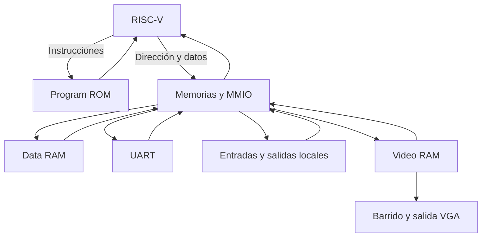

# Integración del sistema FPGA

## 1. Top y conexiones

`batalla_naval_top` conecta el procesador `riscv_core` con `memory_mmio_system`. Este último instancia Program ROM, Data RAM y el decoder MMIO. El top conecta los destinos del decoder con UART, entradas de J1, salidas locales y video.

| Señal del CPU | Conexión |
|---|---|
| `ProgAddress_o` | Dirección de Program ROM. |
| `ProgIn_i` | Instrucción de Program ROM. |
| `DataAddress_o` | Dirección para RAM, constantes ROM o MMIO. |
| `DataOut_o` | Dato distribuido por el bus de escritura. |
| `DataIn_i` | Dato leído del destino seleccionado. |
| `we_o` | Escritura, inhibida mientras el sistema está en reset. |

El decoder genera un write enable independiente por destino. La dirección absoluta selecciona el dispositivo, mientras `uart_addr` determina el registro interno UART y `vga_addr` determina el tile.

Las lecturas hacia el CPU son combinacionales y las escrituras se efectúan en el flanco ascendente de 100 MHz. Este contrato permite que una instrucción `lw` termine en un ciclo del procesador.

## 2. Módulos reutilizados

- `riscv_core`, unidad de control y datapath: procesador del equipo.
- `program_rom`, `data_ram`, `mmio_interconnect`, `memory_mmio_system`: memorias e interconexión del Issue #4.
- `j1_inputs_peripheral`, `debounce_button`: entradas del Issue #7.
- `uart_mmio_peripheral`, PHY UART, baud generator y FIFOs: Issue #8.
- `peripherals_mmio`, display, LED y buzzer: salidas locales.
- `vga_top`, `video_ram`, timing, conversión de coordenadas y decodificación de tiles: núcleo de video.
- `battle_client.py`: terminal del Issue #9.

`video_mmio_interface` realiza una decodificación equivalente a la que ya entrega el bus. El top utiliza directamente `vga_top` con la dirección local del bus para conectar una sola ruta de selección de video. Las reglas de colocación y disparos permanecen en el ensamblador.

## 3. Cambios de integración

| Archivo modificado | Ajuste y motivo |
|---|---|
| `Memorias_Bus/rtl/program_rom.sv` | Segundo puerto combinacional de solo lectura para las constantes del ensamblador. |
| `Memorias_Bus/rtl/memory_mmio_system.sv` | Selecciona ese puerto en lecturas de datos `0x0000..0x1FFF`; las escrituras ROM no habilitan ningún destino. |
| `Nucleo_VGA/modulos_nucleo_vga/video_ram.sv` | Lectura CPU combinacional; lectura VGA registrada; protección de indices >=300 e inicialización en fondo negro. |
| `Nucleo_VGA/modulos_nucleo_vga/vga_top.sv` | Desactivación sincronizada del reset de píxel y retardo de hsync/vsync para alinearlos con RGB. |
| `Nucleo_VGA/modulos_nucleo_vga/tile_decoder.sv` | Bit 3 para borde amarillo del cursor, conservando el contenido de la casilla. |
| `Entradas_Jugador1/rtl/debounce_button.sv` | Atributo `ASYNC_REG` en sincronizadores de entrada. |
| `UART/rtl/uart_mmio_peripheral.sv` | Atributo `ASYNC_REG` en sincronizador RX. |
| `Aplicacion_Python/python/battle_client.py` | Espera `TURN` o `END` tras un `SHOT` aceptado antes de solicitar otro disparo. |
| `Aplicacion_Python/tests/test_battle_client.py` | Prueba de esa espera entre resultado y siguiente turno. |

Los archivos nuevos del programa, top, pruebas y scripts están en `Integracion/`. El ensamblador aportado como referencia fue sustituido por una implementación de 8×8 y tres barcos que utiliza el mapa MMIO y el protocolo ASCII de este sistema.

## 4. Relojes

| Dominio | Frecuencia | Elementos |
|---|---:|---|
| Sistema | 100 MHz | CPU, ROM/RAM, bus, UART, botones, displays, LED, buzzer y puerto de escritura de video. |
| Píxel | 25 MHz | Timing VGA, lectura del tile, pipeline de color y salida VGA. |

El reloj de píxel proviene del Clock Wizard con PLL, entrada de 100 MHz y salida de 25 MHz. Vivado deriva su restricción a partir del reloj principal. Los dos relojes están relacionados; no se declaran como dominios asíncronos mediante `set_clock_groups`.

La memoria de video proporciona el enlace entre la escritura del sistema y la lectura VGA. El pipeline retrasa coordenadas locales, habilitación de video y sincronismos un ciclo de píxel para presentar el color correspondiente al tile leído. Los contadores recorren 800 píxeles por línea y 525 líneas por cuadro, con región visible 640×480.

## 5. Resets y entradas externas

El reset global es activo en alto. Su activación llega al sincronizador de reset y su desactivación se sincroniza a 100 MHz. Una secuencia de encendido de 16 ciclos asegura el reset inicial. El programa inicia en PC 0 y borra los contadores de victorias.

La lógica VGA permanece en reset mientras la PLL no indique `locked`. Su reset se desactiva mediante dos registros del dominio de píxel.

Las entradas de botones y UART RX se sincronizan antes de utilizarse. El debounce requiere 20 ms de estabilidad y produce un evento por flanco estable de pulsación. Las excepciones XDC para entradas asíncronas terminan en el primer registro de sincronización.

BTN RST de partida es un evento MMIO atendido por el programa. No se conecta al reset del CPU: esto permite conservar las victorias. Las pulsaciones pendientes se reconocen escribiendo uno en sus bits W1C; el programa atiende RST con prioridad sobre movimiento, SEL y OK.

## 6. Interfaz física

El top expone únicamente señales físicas: reloj, resets/controles, UART, VGA, displays, LED y buzzer. Los buses y registros de periféricos son señales internas.

Para Basys 3, BTNC confirma; los cuatro botones restantes navegan; SW0 produce SEL, SW1 produce reinicio de partida y SW15 controla reset global. Los tres bits del periférico LED se conectan a LED0..2 y la salida de buzzer a JA1.

Referencia de asignaciones: [Digilent Basys-3-Master.xdc](https://github.com/Digilent/digilent-xdc/blob/master/Basys-3-Master.xdc).

## 7. Flujo de implementación

`scripts/create_project.tcl` crea el proyecto y genera el IP de reloj en la versión de Vivado instalada. `stage_rom.tcl` prepara la imagen en los directorios de simulación y síntesis.

`scripts/implement.tcl` sintetiza, revisa latches y DRC, implementa, verifica slack de setup/hold y exporta reportes de recursos, timing, CDC, relojes y netlist. Exporta también SDF y netlist temporizado para la simulación posterior a implementación. La revisión del hardware usa el top completo y sus constraints, con todos los accesos a periféricos originados por el programa de la ROM.

La preparación de la imagen para XSim utiliza la opción oficial `xsim.compile.tcl.pre`, que ejecuta el hook antes de compilar. Referencia: [AMD UG900 — Vivado Simulator Compilation Options](https://docs.amd.com/r/en-US/ug900-vivado-logic-simulation/Vivado-Simulator-Compilation-Options).
