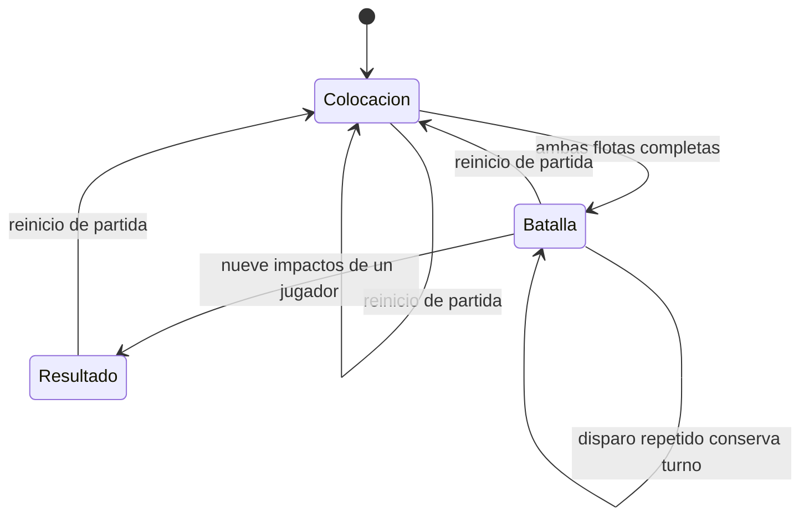

# Programa de Batalla Naval en ensamblador RISC-V

## 1. Arquitectura de software

El programa implementa las reglas de Batalla Naval sobre dos tableros de 8×8. Cada flota contiene tres barcos con identificadores 0, 1 y 2 y longitudes 4, 3 y 2. Las coordenadas recorren el rango 0..7 y la orientación puede ser horizontal o vertical.

El bucle principal atiende transmisión UART, sonidos pendientes, controles locales y recepción UART. Los contadores de colocación de J1 y J2 se actualizan de forma independiente. El programa inicia batalla cuando ambos contadores alcanzan tres.



En la RAM, fase 0 representa colocación, fase 1 batalla y fase 2 resultado. Turno 0 corresponde a J1 y turno 1 a J2. J1 realiza el primer disparo. El resultado permanece hasta que se solicita una nueva partida.

## 2. Colocación

Para J1, el cursor determina fila y columna; SEL alterna orientación y OK solicita la colocación del siguiente barco. Para J2, el mensaje `PLACE,id,fila,columna,H/V` solicita la misma operación.

La rutina `place_ship` comprueba:

1. Fase de colocación y barco siguiente de ese jugador.
2. Identificador 0..2, coordenadas 0..7 y orientación válida.
3. Extremo del barco dentro del tablero.
4. Ausencia de ocupación en todas las casillas requeridas.

La validación recorre el barco completo antes de modificar RAM. Por ello, una colocación rechazada no deja un barco parcial. La aceptación escribe `id+1` en cada celda e incrementa el contador del jugador. `check_start` inicia batalla únicamente con ambos contadores en tres.

## 3. Disparos y victoria

`fire_shot` exige fase de batalla, turno del jugador solicitante y coordenadas válidas. Calcula la posición en el tablero del rival y consulta la marca de disparo.

Un disparo repetido no modifica los tableros, los contadores ni el turno. En un disparo nuevo, la rutina marca la casilla, incrementa disparos y determina fallo o impacto a partir de su ocupación. Ante un impacto, incrementa el total del atacante y el contador de impactos del barco defensor. Si este contador alcanza la longitud del barco, se notifica hundimiento e incrementa el total de barcos hundidos por el atacante.

La flota tiene nueve casillas ocupadas. Alcanzar nueve impactos válidos produce victoria, incrementa el contador acumulado del ganador y pasa a resultado. El último disparo transmite su resultado y después el resumen final; no emite otro turno.

## 4. Memoria de datos

| Rango | Uso |
|---|---|
| `0x2000..0x20FF` | 64 palabras: tablero de J1. |
| `0x2100..0x21FF` | 64 palabras: tablero de J2. |
| `0x2200..0x227F` | Estado del programa y punteros de colas. |
| `0x2280..0x228B` | Impactos por barco del tablero J1. |
| `0x2290..0x229B` | Impactos por barco del tablero J2. |
| `0x22C0..0x22DB` | Argumentos y resultado de la acción actual. |
| `0x2300..0x237F` | Buffer RX: 32 palabras, un carácter por palabra. |
| `0x23C0..0x23DF` | Cola circular de ocho posiciones para sonidos. |
| `0x2400..0x27FF` | Cola circular TX: 256 posiciones, un carácter por palabra. |
| `0x2800..0x2CFF` | Reserva de datos. |
| `0x2D00..0x2FEF` | Reserva de pila, crecimiento descendente. |

La pila comienza en `sp=0x2FF0`. Las regiones no asignadas se reservan para ampliaciones.

### Codificación de una celda

| Bits | Interpretación |
|---|---|
| `[1:0]` | 0: agua; 1: barco 0; 2: barco 1; 3: barco 2. |
| `[8]` | 1: esta casilla ya recibió un disparo. |
| Resto | Reservados, escritos como cero. |

La dirección de una celda es `base + 4 × (fila × 8 + columna)`. Las operaciones de fila se implementan mediante desplazamientos; no se requiere multiplicador.

### Estado relativo a `0x2200`

| Offset | Dato |
|---:|---|
| `0` | Fase. |
| `4` | Turno. |
| `8`, `12` | Fila y columna del cursor J1. |
| `16` | Orientación: 0 horizontal, 1 vertical. |
| `20`, `24` | Barcos colocados de J1/J2. |
| `28`, `32` | Disparos válidos de J1/J2. |
| `36`, `40` | Barcos hundidos por J1/J2. |
| `44`, `48` | Impactos realizados por J1/J2. |
| `52`, `56` | Victorias acumuladas de J1/J2, palabras de 32 bits. |
| `60`, `64` | Longitud RX y descarte de trama RX. |
| `68`, `72` | Cabeza y cola del buffer TX. |
| `84`, `88` | Cabeza y cola de sonidos. |

`new_game` borra tableros, colocaciones, disparos, impactos y estado de la partida. Conserva las palabras de victorias y la cola TX para mantener completos los mensajes anteriores. El reset global reinicia el programa en `_start`, que pone ambas victorias en cero. Los displays representan cada contador con saturación visual en 99; las palabras de RAM continúan acumulando victorias.

## 5. Mapa de memoria del sistema

| Dirección/rango | Destino |
|---|---|
| `0x0000..0x1FFF` | Program ROM: instrucciones y constantes; lectura de datos mediante `lw`, sin escrituras. |
| `0x2000..0x2FFF` | Data RAM, 1024 palabras. |
| `0x10040` | UART CONTROL/ESTADO. |
| `0x10044` | UART TX. |
| `0x10048` | UART RX. |
| `0x10120` | Entradas J1: niveles y eventos W1C. |
| `0x10130` | Display: victorias J1 `[7:0]`, J2 `[15:8]`. |
| `0x10138` | LED: 0 colocación, 1 batalla, 2 resultado. |
| `0x10140` | Buzzer: START `[0]`, sonido `[3:1]`; lectura busy `[0]`. |
| `0x11000..0x114AF` | 300 palabras de video, cuadrícula 20×15. |
| `0x114B0..0x117FF` | Reserva de ventana VGA: lectura cero y escritura descartada. |

Los accesos son de palabra y deben estar alineados a cuatro bytes. Una dirección no mapeada o desalineada devuelve cero y no escribe destinos.

## 6. Rutinas y convención de registros

| Rutina | Responsabilidad |
|---|---|
| `_start` | Define registros base, pila, victorias y colas; inicia partida. |
| `main_loop` | Atiende TX, buzzer, botones y RX continuamente. |
| `new_game` | Inicializa estructuras y periféricos para una nueva partida. |
| `service_buttons` | Lee y reconoce eventos, mueve cursor y ejecuta acciones de J1. |
| `service_rx` | Reconstruye una línea ASCII y descarta tramas inválidas. |
| `parse_command` | Comprueba formato de PLACE/FIRE y solicita acciones de J2. |
| `place_ship` | Valida y coloca un barco de forma atómica. |
| `check_start` | Sincroniza finalización de ambas flotas. |
| `fire_shot` | Resuelve disparo, hundimiento, turno y victoria. |
| `render` | Actualiza los tableros y el HUD VGA. |
| `putc`, `putstr`, `putnum` | Encolan caracteres, cadenas y números decimales. |
| `service_tx` | Envía un carácter pendiente si la FIFO UART tiene espacio. |
| `queue_sound`, `service_sound` | Encolan y activan efectos cuando el buzzer está disponible. |
| `update_scores` | Actualiza las victorias mostradas. |
| `emit_coords`, `emit_turn`, `emit_player` | Construyen campos del protocolo. |

Registros permanentes: `s0=0x2200` para estado, `s1=0x10000` para MMIO y `s2=0x11000` para video. `s3..s8` son registros locales preservados por las subrutinas que los utilizan. `t0..t6` y `a0..a7` son temporales; `a0` transporta argumentos o resultados. `ra` conserva la dirección de retorno y `sp` administra la pila.

Las macros `ENTER`/`LEAVE` reservan y liberan 48 bytes, preservando `ra` y `s3..s8`. La pila conserva alineación de 16 bytes. Las rutinas hoja que utilizan únicamente temporales no necesitan marco. Las rutinas no dependen de registros temporales a través de llamadas.

`place_ship` devuelve 0 aceptado, 1 fuera del tablero, 2 traslape o 3 solicitud inválida. `fire_shot` devuelve 0 válido, 1 repetido o 2 fuera de fase/turno. El parser rechaza coordenadas de disparo fuera de 0..7 antes de llamar esa rutina.

## 7. Comunicación UART

La UART física utiliza 8N1. Con 100 MHz y divisor 54, la velocidad interna es aproximadamente 115741 baudios, compatible con la PC configurada a 115200. CONTROL bit 0 indica RX disponible y bit 1 espacio en TX. El programa lee RX y escribe bit 8 de CONTROL para retirar el byte. Escribir TX encola el byte para transmitirlo.

Todos los mensajes ASCII terminan en LF. El receptor acepta CRLF ignorando CR, limita la entrada a 31 caracteres y descarta una trama inválida hasta LF antes de responder `ERROR,BAD_FRAME`.

### PC hacia FPGA

```text
PLACE,0,0,0,H
PLACE,1,1,0,V
PLACE,2,1,1,H
FIRE,3,4
```

### FPGA hacia PC

```text
NEW
PLACE,0,OK
PLACE,1,REJECT,OVERLAP
PLACE,1,REJECT,OUT_OF_BOUNDS
PLACE,1,REJECT,INVALID
BATTLE
TURN,P1
TURN,P2
SHOT,3,4,HIT,-
SHOT,3,4,MISS,-
SHOT,3,4,SUNK,1
SHOT_REJECT,3,4,REPEAT
SHOT_REJECT,3,4,NOT_TURN
INCOMING,3,4,HIT,-
END,P1,9,8,3,0
ERROR,BAD_FRAME
```

`SHOT` describe un disparo de J2; `INCOMING` describe un disparo de J1 contra el tablero de J2. En `END`, los campos son ganador, disparos J1, disparos J2, barcos hundidos por J1 y barcos hundidos por J2. El identificador de barco se comunica al hundirse; impactos y fallos llevan `-`.

Las colas software permiten atender ambos jugadores mientras se transmiten respuestas. La cola TX tiene capacidad útil de 255 caracteres; si está llena, `putc` espera únicamente mientras `service_tx` libera espacio. La cola de sonidos tiene capacidad útil de siete efectos pendientes. El diseño está orientado al intercambio normal de solicitudes y respuestas de la terminal.

## 8. Video y salidas

La memoria de video guarda un tile por palabra. Los bits `[2:0]` indican agua 0, barco 1, fallo 2, impacto 3, selección 4 o fondo negro 5. El bit 3 solicita un borde amarillo sin cambiar el estado interior de la casilla.

El tablero propio ocupa columnas 1..8 y filas 2..9. El rival ocupa columnas 11..18 y filas 2..9. El programa oculta las posiciones de barcos rivales no disparadas. El HUD usa filas 11..13 para fase, orientación, turno y progreso de colocación de ambas flotas.

Los sonidos codifican impacto 1, fallo 2, hundimiento 3, colocación inválida 4 y victoria 5. En el disparo que completa la victoria se transmite el hundimiento y se solicita el efecto de victoria.
