# Núcleo VGA

## Objetivo

Diseñar e implementar el subsistema de video VGA encargado de generar la salida gráfica del sistema de Batalla Naval sobre una resolución de **640×480 píxeles**.

El núcleo VGA genera los sincronismos horizontal y vertical, transforma las coordenadas de píxel en posiciones del tablero gráfico, consulta la memoria de video y genera las señales RGB que finalmente se envían al puerto VGA de la FPGA Basys3.

El diseño se desarrolló de forma modular para permitir que cada bloque pudiera ser implementado y verificado independientemente antes de realizar la integración completa del subsistema.

---

# 1. Documentación de Diseño

## 1.1 Arquitectura general

El núcleo VGA fue dividido en módulos independientes con el objetivo de separar la generación de temporización, el direccionamiento de la pantalla, el almacenamiento de información gráfica y la generación del color.

Los principales bloques desarrollados son:

- `vga_clock`: genera el reloj de píxel utilizado por el sistema VGA.
- `vga_timing.sv`: genera las coordenadas de píxel y los sincronismos VGA.
- `pixel_to_tile.sv`: convierte las coordenadas de píxel en coordenadas de tile.
- `tile_address.sv`: calcula la dirección correspondiente dentro de la memoria de video.
- `video_ram.sv`: almacena la información gráfica de los tiles.
- `tile_decoder.sv`: interpreta la información del tile y determina su color.
- `rgb_output.sv`: controla la salida final de los canales RGB.
- `vga_top.sv`: integra todos los módulos anteriores.

La estructura general del subsistema es:

```text
                    clk_100mhz
                        │
                        ▼
                 ┌─────────────┐
                 │  vga_clock  │
                 │ 100 → 25 MHz│
                 └──────┬──────┘
                        │
                   pixel_clk
                        │
                        ▼
                 ┌─────────────┐
                 │ vga_timing  │
                 └──────┬──────┘
                        │
                pixel_x / pixel_y
                        │
                        ▼
                ┌───────────────┐
                │ pixel_to_tile │
                └───────┬───────┘
                        │
                  tile_x / tile_y
                        │
                        ▼
                ┌──────────────┐
                │ tile_address │
                └───────┬──────┘
                        │
                    tile_addr
                        │
                        ▼
                 ┌─────────────┐
                 │  video_ram  │
                 └──────┬──────┘
                        │
                   tile_data
                        │
                        ▼
                ┌──────────────┐
                │ tile_decoder │
                └───────┬──────┘
                        │
                       RGB
                        │
                        ▼
                 ┌────────────┐
                 │ rgb_output │
                 └─────┬──────┘
                       │
                       ▼
                VGA R / G / B
```

El módulo `vga_top.sv` integra estos bloques y constituye la interfaz del núcleo VGA con el resto del sistema.

---

## 1.2 Organización de la pantalla

El sistema trabaja con una resolución VGA de:

```text
640 × 480 píxeles
```

Para simplificar la representación gráfica, la pantalla se divide en regiones o **tiles** de:

```text
32 × 32 píxeles
```

Por lo tanto, horizontalmente se tienen:

```text
640 / 32 = 20 tiles
```

y verticalmente:

```text
480 / 32 = 15 tiles
```

El mapa gráfico completo contiene:

```text
20 × 15 = 300 tiles
```

Cada tile posee una posición determinada dentro de la pantalla y una dirección asociada dentro de la memoria de video.

La organización puede representarse como:

```text
            20 tiles
     ┌──────────────────────┐
     │                      │
     │                      │
     │                      │
15   │      Pantalla        │
tiles│      640 × 480       │
     │                      │
     │                      │
     │                      │
     └──────────────────────┘
```

---

## 1.3 Generación del reloj VGA

La FPGA Basys3 proporciona un reloj principal de:

```text
100 MHz
```

Sin embargo, el subsistema VGA requiere un reloj de píxel de:

```text
25 MHz
```

Para obtener esta frecuencia se utilizó la IP **Clocking Wizard** de Vivado.

La IP fue configurada utilizando un **PLL**, generando la señal:

```text
pixel_clk
```

a partir del reloj principal.

La relación general del bloque es:

```text
clk_100mhz
    │
    ▼
┌─────────────┐
│  vga_clock  │
│     PLL     │
└──────┬──────┘
       │
       ▼
   pixel_clk
     25 MHz
```

Además del reloj de salida, la IP genera la señal `locked`, utilizada para indicar que el PLL alcanzó una condición estable de funcionamiento.

---

## 1.4 Generación de sincronismos VGA

El módulo `vga_timing.sv` genera las coordenadas actuales del barrido y las señales de sincronización necesarias para VGA.

El barrido horizontal utiliza:

```text
640 píxeles visibles
16  front porch
96  HSYNC
48  back porch
----------------
800 posiciones totales
```

El barrido vertical utiliza:

```text
480 líneas visibles
10  front porch
2   VSYNC
33  back porch
----------------
525 líneas totales
```

El módulo mantiene contadores horizontal y vertical que permiten determinar la posición actual del barrido.

Sus principales salidas son:

| Señal | Función |
|---|---|
| `pixel_x[9:0]` | Posición horizontal actual |
| `pixel_y[9:0]` | Posición vertical actual |
| `hsync` | Sincronización horizontal |
| `vsync` | Sincronización vertical |
| `active_video` | Indica que el píxel pertenece al área visible |

Cuando:

```text
active_video = 1
```

el píxel actual pertenece a la región visible de **640×480**.

Cuando:

```text
active_video = 0
```

el barrido se encuentra dentro de los intervalos de sincronización o blanking.

---

## 1.5 Conversión de píxel a tile

El módulo `pixel_to_tile.sv` recibe las coordenadas:

```text
pixel_x
pixel_y
```

generadas por `vga_timing.sv`.

Estas coordenadas representan la posición actual del barrido sobre la pantalla completa.

El módulo las transforma en:

```text
tile_x
tile_y
local_x
local_y
```

donde:

- `tile_x` indica la columna del tile.
- `tile_y` indica la fila del tile.
- `local_x` indica la posición horizontal dentro del tile.
- `local_y` indica la posición vertical dentro del tile.

Conceptualmente:

```text
pixel_x ─────► tile_x
        └────► local_x

pixel_y ─────► tile_y
        └────► local_y
```

Debido a que cada tile posee **32×32 píxeles**, esta conversión permite identificar tanto el tile que debe mostrarse como el píxel específico dentro de dicho tile.

---

## 1.6 Generación de dirección

El módulo `tile_address.sv` transforma las coordenadas:

```text
tile_x
tile_y
```

en una única dirección utilizada para acceder a la memoria de video.

Debido a que existen 20 tiles por fila, la dirección se obtiene mediante:

```text
tile_addr = tile_y × 20 + tile_x
```

Por ejemplo, los tiles se almacenan de forma lineal:

```text
Fila 0 →   0   1   2   ...  19
Fila 1 →  20  21  22   ...  39
Fila 2 →  40  41  42   ...  59
...
Fila 14 → 280 281 282  ... 299
```

De esta forma, las **300 posiciones** del mapa gráfico pueden almacenarse secuencialmente dentro de la memoria.

---

## 1.7 Memoria de video

El módulo `video_ram.sv` almacena la información correspondiente a los tiles que forman la pantalla.

La memoria contiene:

```text
300 posiciones
32 bits por posición
```

Cada palabra de 32 bits contiene la información asociada a un tile.

La memoria se implementó utilizando una estructura de **doble puerto**, permitiendo separar las operaciones realizadas por el sistema principal de las lecturas realizadas por el VGA.

Conceptualmente:

```text
Sistema principal
       │
       ▼
   Puerto A
┌──────────────┐
│              │
│  VIDEO RAM   │
│              │
└──────────────┘
   Puerto B
       │
       ▼
      VGA
```

El puerto utilizado por el sistema permite modificar el contenido gráfico, mientras que el puerto VGA consulta continuamente la información requerida durante el barrido de la pantalla.

---

## 1.8 Decodificación del tile

El módulo `tile_decoder.sv` recibe:

```text
tile_data
local_x
local_y
```

A partir de estos datos determina el color correspondiente al píxel actual.

`tile_data` identifica el contenido gráfico almacenado en la posición correspondiente de la memoria, mientras que `local_x` y `local_y` permiten conocer la posición exacta dentro del tile.

El resultado del módulo son tres canales de color:

```text
red
green
blue
```

Cada canal utiliza 4 bits.

---

## 1.9 Salida RGB

El módulo `rgb_output.sv` constituye la etapa final de la ruta gráfica.

Este módulo recibe:

```text
red_in
green_in
blue_in
active_video
```

Cuando:

```text
active_video = 1
```

los valores RGB calculados se transmiten hacia las salidas VGA.

Cuando:

```text
active_video = 0
```

los canales se fuerzan a:

```text
R = 0
G = 0
B = 0
```

evitando generar información de color fuera de la región visible.

Las salidas finales son:

```text
vga_red[3:0]
vga_green[3:0]
vga_blue[3:0]
```

---

## 1.10 Integración mediante `vga_top`

El módulo `vga_top.sv` integra los diferentes componentes desarrollados.

El flujo completo de información es:

```text
clk_100mhz
    │
    ▼
vga_clock
    │
    ▼
pixel_clk
    │
    ▼
vga_timing
    │
    ├────► hsync
    ├────► vsync
    │
    ▼
pixel_to_tile
    │
    ▼
tile_address
    │
    ▼
video_ram
    │
    ▼
tile_decoder
    │
    ▼
rgb_output
    │
    ▼
Puerto VGA
```

De esta forma, `vga_top.sv` permite utilizar todo el subsistema VGA como un único bloque dentro del sistema completo de Batalla Naval.

---

# 2. Documentación Técnica

## 2.1 Archivos implementados

Los módulos desarrollados para el núcleo VGA son:

```text
modulos_nucleo_vga/
├── vga_timing.sv
├── pixel_to_tile.sv
├── tile_address.sv
├── video_ram.sv
├── tile_decoder.sv
├── rgb_output.sv
└── vga_top.sv
```

La generación del reloj utiliza adicionalmente la IP:

```text
vga_clock.xci
```

generada mediante **Clocking Wizard** de Vivado.

Los testbenches desarrollados son:

```text
tb_nucleo_vga/
├── tb_vga_timing.sv
├── tb_pixel_to_tile.sv
├── tb_tile_address.sv
├── tb_video_ram.sv
├── tb_tile_decoder.sv
├── tb_rgb_output.sv
└── tb_vga_top.sv
```

---

## 2.2 Interfaz del núcleo VGA

El módulo `vga_top.sv` constituye el módulo superior del subsistema.

Sus señales se pueden dividir en tres grupos principales.

### Reloj y control

| Señal | Dirección | Función |
|---|---|---|
| `clk_100mhz` | Entrada | Reloj principal de 100 MHz |
| `rst` | Entrada | Reinicio del núcleo VGA |

### Interfaz con memoria de video

| Señal | Dirección | Función |
|---|---|---|
| `video_we` | Entrada | Habilita una escritura en la memoria |
| `video_addr[8:0]` | Entrada | Dirección utilizada por el sistema |
| `video_wdata[31:0]` | Entrada | Datos escritos en la memoria |
| `video_rdata[31:0]` | Salida | Datos leídos desde la memoria |

Estas señales permiten que el resto del sistema modifique el contenido mostrado por el VGA.

En la integración final estas conexiones serán señales internas del sistema y no conexiones físicas de la FPGA.

### Interfaz VGA

| Señal | Dirección | Función |
|---|---|---|
| `hsync` | Salida | Sincronización horizontal |
| `vsync` | Salida | Sincronización vertical |
| `vga_red[3:0]` | Salida | Canal rojo VGA |
| `vga_green[3:0]` | Salida | Canal verde VGA |
| `vga_blue[3:0]` | Salida | Canal azul VGA |

---

## 2.3 Relojes del sistema

El núcleo utiliza dos frecuencias principales.

### Reloj del sistema

```text
clk_100mhz = 100 MHz
```

Corresponde al reloj principal disponible en la Basys3.

### Reloj de píxel

```text
pixel_clk = 25 MHz
```

Es generado mediante la IP `vga_clock`.

Este reloj controla principalmente:

```text
vga_timing
      │
      ▼
Barrido VGA
```

---

## 2.4 Flujo interno de información

El flujo de información dentro del núcleo puede resumirse como:

```text
Reloj 100 MHz
      │
      ▼
PLL
      │
      ▼
Reloj 25 MHz
      │
      ▼
Temporización VGA
      │
      ▼
Coordenadas de píxel
      │
      ▼
Coordenadas de tile
      │
      ▼
Dirección de memoria
      │
      ▼
Video RAM
      │
      ▼
Información del tile
      │
      ▼
Decodificador gráfico
      │
      ▼
RGB
      │
      ▼
Salida VGA
```

Cada ciclo del reloj de píxel corresponde al procesamiento de una nueva posición del barrido VGA.

---

## 2.5 Video RAM

La memoria de video utiliza direcciones de 9 bits:

```text
video_addr[8:0]
```

Esto permite representar hasta:

```text
2^9 = 512 direcciones
```

de las cuales se utilizan 300 para representar los tiles de la pantalla.

Cada posición almacena:

```text
32 bits
```

por medio de:

```text
video_wdata[31:0]
video_rdata[31:0]
```

La señal:

```text
video_we
```

controla las operaciones de escritura realizadas por el sistema.

---

## 2.6 Salida física VGA

La Basys3 utiliza 12 señales para representar color:

```text
4 bits → rojo
4 bits → verde
4 bits → azul
```

por lo que el núcleo genera:

```text
vga_red[3:0]
vga_green[3:0]
vga_blue[3:0]
```

Además se generan:

```text
hsync
vsync
```

para mantener la sincronización del monitor.

---

## 2.7 Constraints

Se implementaron constraints para las señales físicas utilizadas por el núcleo VGA.

Estas incluyen:

```text
clk_100mhz
rst

vga_red[3:0]
vga_green[3:0]
vga_blue[3:0]

hsync
vsync
```

Las señales:

```text
video_we
video_addr[8:0]
video_wdata[31:0]
video_rdata[31:0]
```

no poseen asignación física debido a que constituyen la interfaz interna entre el núcleo VGA y el resto del sistema.

Cuando `vga_top` sea integrado dentro del módulo superior del sistema, estas señales dejarán de ser interpretadas como puertos físicos.

---

# 3. Pruebas y Validación

## 3.1 Configuración del reloj VGA

Para generar el reloj requerido por el subsistema VGA se utilizó la IP **Clocking Wizard** incluida en Vivado.

La FPGA Basys3 proporciona un reloj principal de:

```text
100 MHz
```

mientras que el núcleo VGA utiliza:

```text
25 MHz
```

como reloj de píxel.

La configuración se realizó paso a paso.

---

### Paso 1 — Selección de Clocking Wizard

Desde el apartado `IP Catalog` de Vivado se buscó:

```text
Clocking Wizard
```

y se seleccionó la IP correspondiente.

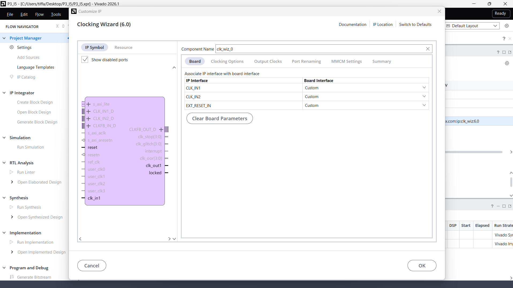

Esta herramienta permite generar un nuevo reloj a partir del reloj principal disponible en la FPGA.

---

### Paso 2 — Configuración mediante PLL

La IP fue denominada:

```text
vga_clock
```

Dentro de las opciones de configuración se seleccionó:

```text
Primitive = PLL
```

También se mantuvieron habilitadas las funciones:

```text
Frequency Synthesis
Phase Alignment
```

con la optimización de jitter configurada como:

```text
Balanced
```

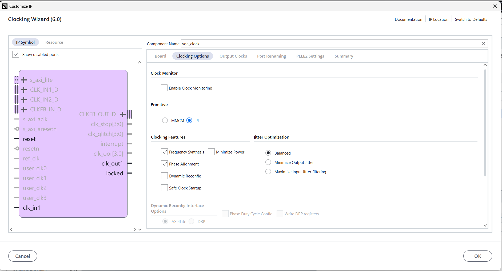

El PLL se utiliza para transformar el reloj de entrada de 100 MHz en el reloj requerido por el sistema VGA.

---

### Paso 3 — Configuración del reloj de píxel

En la sección `Output Clocks` se configuró la salida principal.

Los valores utilizados fueron:

```text
Output Frequency Requested = 25 MHz
Output Frequency Actual    = 25.00000 MHz

Phase Requested            = 0°
Phase Actual               = 0°

Duty Cycle Requested       = 50 %
Duty Cycle Actual          = 50 %

Buffer                     = BUFG
```

La salida fue denominada:

```text
pixel_clk
```

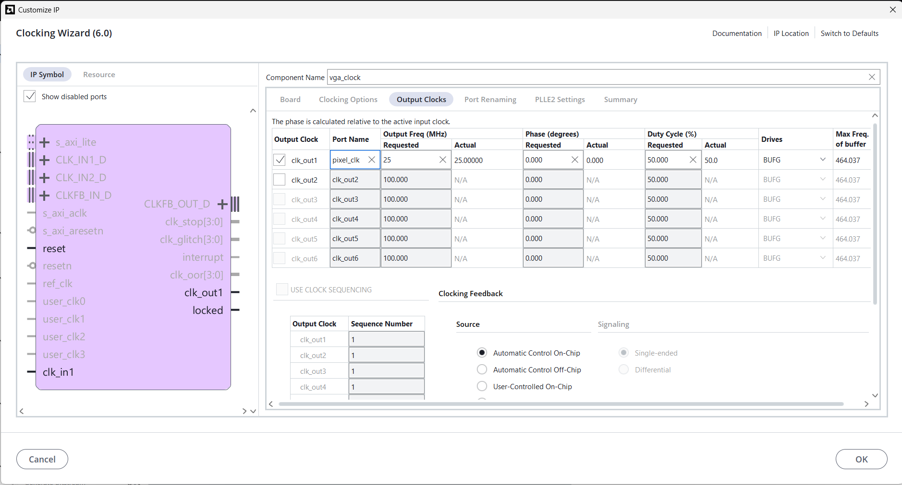

De esta forma se obtiene el reloj utilizado por el generador de temporización VGA.

---

### Paso 4 — Comprobación de la configuración

En la pestaña `Summary` del Clocking Wizard se verificaron los parámetros finales de la IP.

La configuración obtenida fue:

```text
Input Clock Frequency = 100 MHz
Primitive             = PLL

Divide Counter        = 4
Mult Counter          = 33

Output                = pixel_clk
Output Frequency      = 25 MHz
```

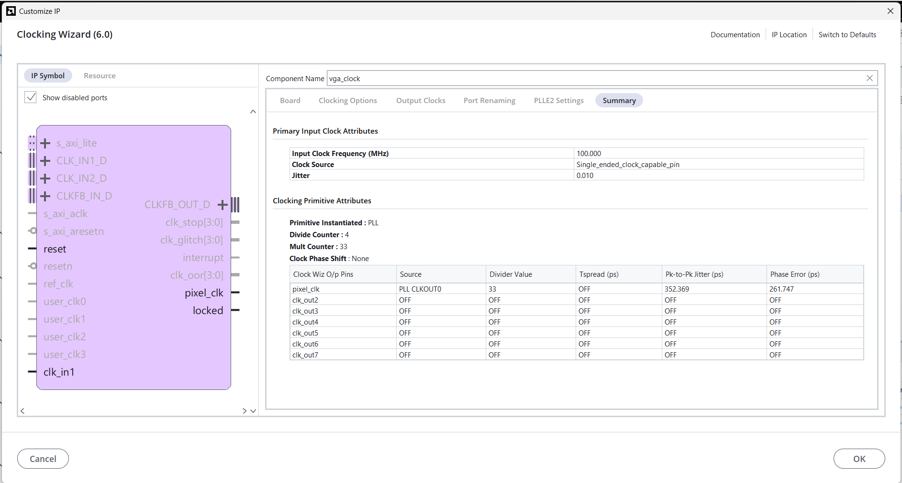

Esta pantalla permitió verificar que la IP produciría correctamente el reloj de 25 MHz requerido.

---

### Paso 5 — Generación de la IP

Después de finalizar la configuración se generaron los productos de salida de la IP.

Vivado incorporó correctamente el archivo:

```text
vga_clock.xci
```

dentro de las fuentes del proyecto.

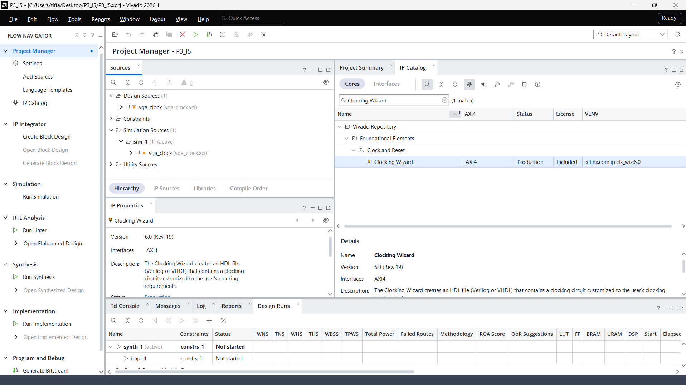

Con esto quedó disponible el reloj de píxel utilizado por el resto de los módulos del núcleo VGA.

---

## 3.2 Metodología de simulación

Para verificar el funcionamiento del diseño se desarrollaron testbenches autoverificables.

La estrategia utilizada consistió en probar inicialmente cada módulo de forma independiente y posteriormente realizar una prueba integrada mediante `vga_top.sv`.

Cada testbench aplica diferentes valores a las entradas del módulo, compara las salidas obtenidas con los resultados esperados y mantiene un contador de errores.

Cuando todas las verificaciones son correctas, el testbench informa que todas las pruebas pasaron.

Los testbenches desarrollados fueron:

```text
tb_vga_timing.sv
tb_pixel_to_tile.sv
tb_tile_address.sv
tb_video_ram.sv
tb_tile_decoder.sv
tb_rgb_output.sv
tb_vga_top.sv
```

---

## 3.3 Prueba de `vga_timing`

El testbench:

```text
tb_vga_timing.sv
```

verifica el funcionamiento del generador de temporización VGA.

Entre las condiciones verificadas se encuentran:

- Reinicio de los contadores.
- Incremento de la posición horizontal.
- Cambio de línea.
- Incremento de la posición vertical.
- Retorno del barrido al origen.
- Generación de `active_video`.
- Generación de `hsync`.
- Generación de `vsync`.
- Recorrido completo del frame.

La simulación finalizó con:

```text
TB VGA TIMING: TODAS LAS PRUEBAS PASARON
```

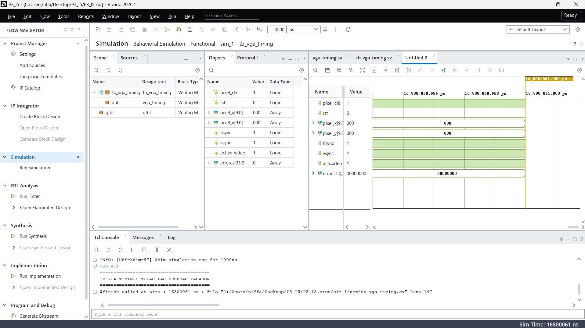

Por lo tanto, se verificó el funcionamiento de la temporización utilizada para generar el barrido VGA.

---

## 3.4 Prueba de `pixel_to_tile`

El testbench:

```text
tb_pixel_to_tile.sv
```

verifica la conversión de las coordenadas de píxel a coordenadas de tile.

Durante la prueba se utilizaron diferentes valores de:

```text
pixel_x
pixel_y
```

y se verificaron las salidas:

```text
tile_x
tile_y
local_x
local_y
```

Se probaron posiciones ubicadas en diferentes regiones de la pantalla, incluyendo cambios entre tiles y posiciones cercanas a los límites.

La simulación finalizó con:

```text
TB PIXEL TO TILE: TODAS LAS PRUEBAS PASARON
```

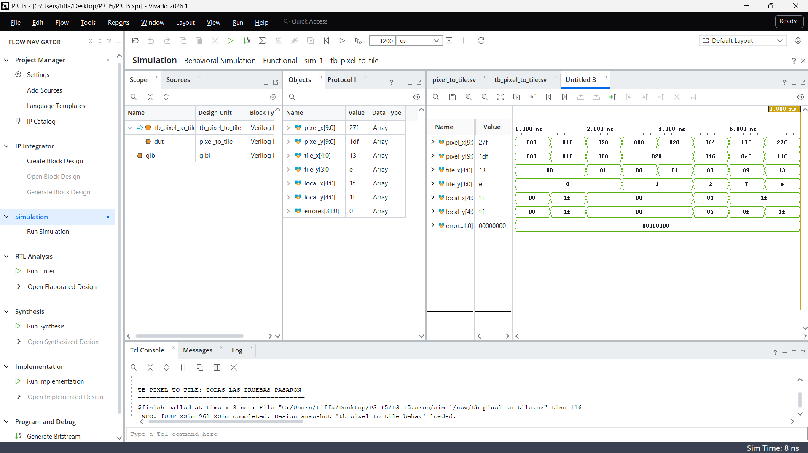

Esto confirma que las coordenadas del barrido pueden transformarse correctamente en posiciones del mapa gráfico.

---

## 3.5 Prueba de `tile_address`

El testbench:

```text
tb_tile_address.sv
```

verifica la generación de la dirección utilizada para acceder a la memoria de video.

Se aplicaron diferentes combinaciones de:

```text
tile_x
tile_y
```

y se verificó el valor obtenido en:

```text
tile_addr
```

La prueba incluyó tiles de diferentes filas y columnas del mapa.

La simulación finalizó con:

```text
TB TILE ADDRESS: TODAS LAS PRUEBAS PASARON
```

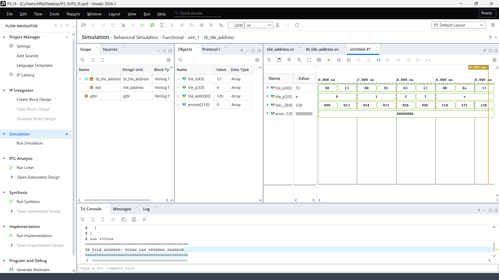

Por lo tanto, se verificó que las coordenadas bidimensionales del mapa son convertidas correctamente en direcciones lineales de memoria.

---

## 3.6 Prueba de `video_ram`

El testbench:

```text
tb_video_ram.sv
```

verifica el funcionamiento de la memoria de video.

La memoria utiliza dos puertos independientes.

Durante la simulación se realizaron:

- Escrituras en diferentes direcciones.
- Lecturas de valores previamente almacenados.
- Accesos mediante el puerto A.
- Accesos mediante el puerto B.
- Verificación de independencia entre ambos puertos.

Entre los datos utilizados durante las pruebas se encuentran valores como:

```text
CAFEBABE
DEADBEEF
```

permitiendo identificar fácilmente la información almacenada y recuperada.

La simulación finalizó con:

```text
TB VIDEO RAM: TODAS LAS PRUEBAS PASARON
```

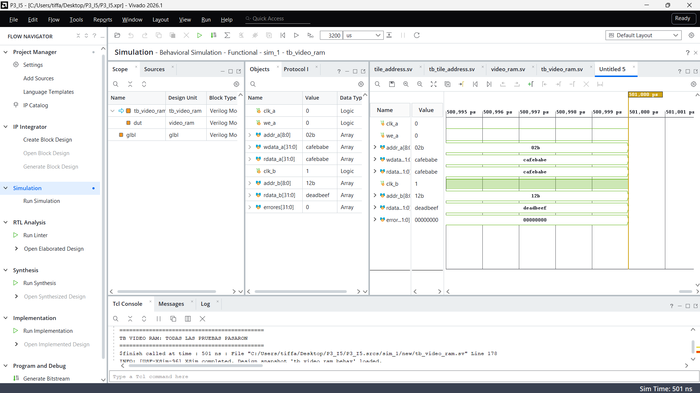

Esto confirma el funcionamiento de la memoria utilizada para almacenar el mapa gráfico.

---

## 3.7 Prueba de `tile_decoder`

El testbench:

```text
tb_tile_decoder.sv
```

verifica la interpretación de los diferentes valores almacenados en la memoria de video.

Durante la simulación se aplicaron distintos valores de:

```text
tile_data
```

junto con diferentes coordenadas:

```text
local_x
local_y
```

y se verificaron las salidas:

```text
red
green
blue
```

La prueba permitió comprobar que el módulo genera el color correspondiente según el contenido gráfico recibido.

La simulación finalizó con:

```text
TB TILE DECODER: TODAS LAS PRUEBAS PASARON
```

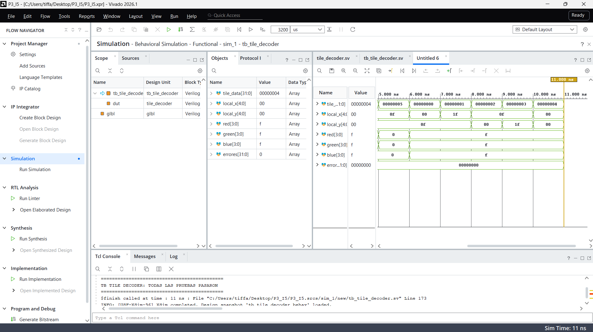

Por lo tanto, se verificó correctamente la etapa encargada de transformar la información almacenada en memoria en información de color.

---

## 3.8 Prueba de `rgb_output`

El testbench:

```text
tb_rgb_output.sv
```

verifica la etapa final de generación de las señales RGB.

Se probaron diferentes combinaciones de:

```text
red_in
green_in
blue_in
```

junto con diferentes estados de:

```text
active_video
```

Cuando:

```text
active_video = 1
```

se comprobó que los valores de entrada fueran enviados correctamente hacia las salidas VGA.

Cuando:

```text
active_video = 0
```

se verificó que:

```text
vga_red   = 0
vga_green = 0
vga_blue  = 0
```

La simulación finalizó con:

```text
TB RGB OUTPUT: TODAS LAS PRUEBAS PASARON
```

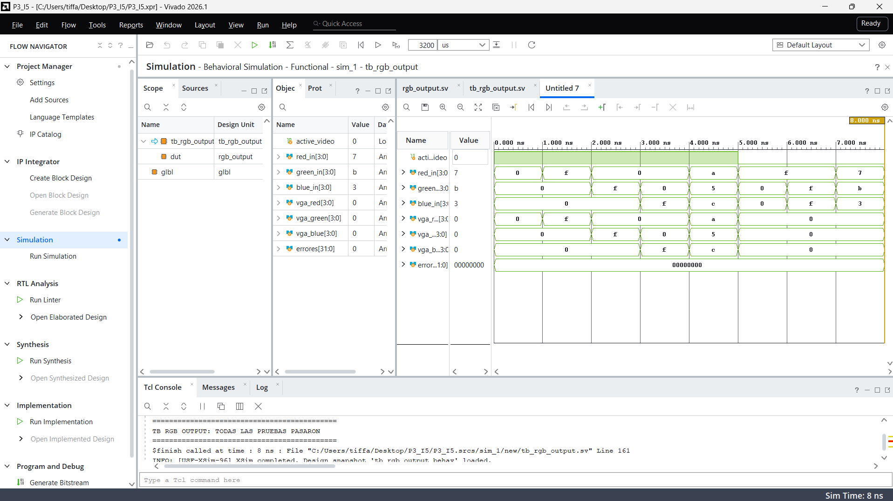

Esto confirma que no se genera información de color durante los intervalos no visibles del barrido.

---

## 3.9 Prueba integrada de `vga_top`

Después de verificar individualmente los diferentes módulos, se desarrolló:

```text
tb_vga_top.sv
```

para comprobar el funcionamiento integrado del núcleo VGA.

La prueba permite verificar conjuntamente la ruta:

```text
vga_clock
    │
    ▼
vga_timing
    │
    ▼
pixel_to_tile
    │
    ▼
tile_address
    │
    ▼
video_ram
    │
    ▼
tile_decoder
    │
    ▼
rgb_output
```

También se realizaron operaciones mediante la interfaz externa de la memoria:

```text
video_we
video_addr
video_wdata
video_rdata
```

para verificar la escritura y lectura de información utilizada posteriormente por el sistema gráfico.

La simulación finalizó con:

```text
TB VGA TOP: TODAS LAS PRUEBAS PASARON
```


Por lo tanto, además del funcionamiento individual de los módulos, se verificó su operación conjunta dentro del núcleo VGA.

---

## 3.10 Resultado general de simulación

Los testbenches realizados obtuvieron los siguientes resultados:

```text
tb_vga_timing      → PASS
tb_pixel_to_tile   → PASS
tb_tile_address    → PASS
tb_video_ram       → PASS
tb_tile_decoder    → PASS
tb_rgb_output      → PASS
tb_vga_top         → PASS
```

Todas las pruebas desarrolladas finalizaron sin errores.

Esto permitió comprobar progresivamente:

```text
Temporización
      ↓
Conversión de coordenadas
      ↓
Direccionamiento
      ↓
Memoria
      ↓
Decodificación
      ↓
Salida RGB
      ↓
Integración completa
```

---

## 3.11 Síntesis

Después de completar las simulaciones se realizó la síntesis de `vga_top.sv` utilizando Vivado.

La síntesis finalizó correctamente:

```text
Synthesis successfully completed
```

Durante la síntesis Vivado reconoció correctamente la jerarquía principal del núcleo VGA.

Además, la memoria implementada mediante `video_ram.sv` fue reconocida como un recurso de memoria del dispositivo.

Por lo tanto, los módulos desarrollados son sintetizables y pueden ser posteriormente integrados con el resto del sistema.

---

## 3.12 Verificación DRC y constraints

Después de la síntesis se realizó una comprobación mediante:

```text
Report DRC
```

Inicialmente Vivado reportó que los puertos físicos no tenían definidos sus estándares eléctricos ni sus ubicaciones.

Por esta razón se añadieron los constraints correspondientes a:

```text
clk_100mhz
rst

vga_red[3:0]
vga_green[3:0]
vga_blue[3:0]

hsync
vsync
```

Una vez aplicados los constraints, estas señales dejaron de aparecer dentro de las advertencias de puertos sin restricciones.

Las señales:

```text
video_we
video_addr[8:0]
video_wdata[31:0]
video_rdata[31:0]
```

continúan apareciendo en las advertencias:

```text
NSTD-1
UCIO-1
```

debido a que actualmente `vga_top` se está utilizando como módulo superior durante la prueba independiente del núcleo.

Estas señales no deben recibir una asignación física, ya que corresponden a la interfaz interna que conectará el núcleo VGA con el resto del sistema.

Cuando `vga_top` sea instanciado dentro del módulo superior definitivo del proyecto, estas conexiones serán internas y no deberán aparecer como puertos físicos de la FPGA.

---

## 3.13 Validación física pendiente

La validación física utilizando un monitor VGA queda pendiente.

Esta prueba no se realizó durante esta etapa debido a que no se encontraba disponible el monitor requerido.

Una vez disponible el monitor se deberá verificar:

- Generación estable de la señal VGA.
- Resolución de 640×480.
- Funcionamiento de `hsync`.
- Funcionamiento de `vsync`.
- Representación del mapa de tiles.
- Escritura y actualización de la memoria de video.
- Visualización de los colores generados por `tile_decoder`.
- Correcto funcionamiento de la salida RGB.
- Actualización de la imagen durante la ejecución.

Los resultados de esta prueba serán incorporados posteriormente a esta sección.

---

# 4. Estado actual

El núcleo VGA cuenta actualmente con:

- Generación de reloj de píxel de 25 MHz mediante PLL.
- Temporización VGA para 640×480.
- Generación de `hsync` y `vsync`.
- Identificación del área visible mediante `active_video`.
- Conversión de coordenadas de píxel a tile.
- Obtención de coordenadas locales dentro del tile.
- Generación de direcciones del mapa gráfico.
- Memoria de video de doble puerto.
- Almacenamiento de información mediante palabras de 32 bits.
- Decodificación de tiles.
- Generación de los canales RGB.
- Control de blanking mediante `rgb_output`.
- Integración completa mediante `vga_top`.
- Testbenches autoverificables para los módulos desarrollados.
- Testbench integrado del núcleo VGA.
- Síntesis correcta en Vivado.
- Constraints para las señales físicas VGA.

Las simulaciones realizadas obtuvieron:

```text
tb_vga_timing      → PASS
tb_pixel_to_tile   → PASS
tb_tile_address    → PASS
tb_video_ram       → PASS
tb_tile_decoder    → PASS
tb_rgb_output      → PASS
tb_vga_top         → PASS
```

La prueba física mediante monitor VGA y la integración definitiva del núcleo con el sistema completo de Batalla Naval permanecen pendientes.
