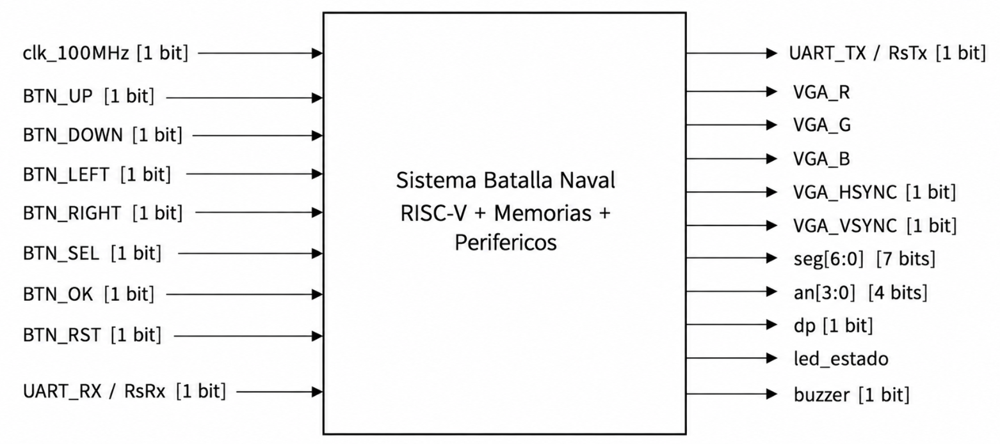
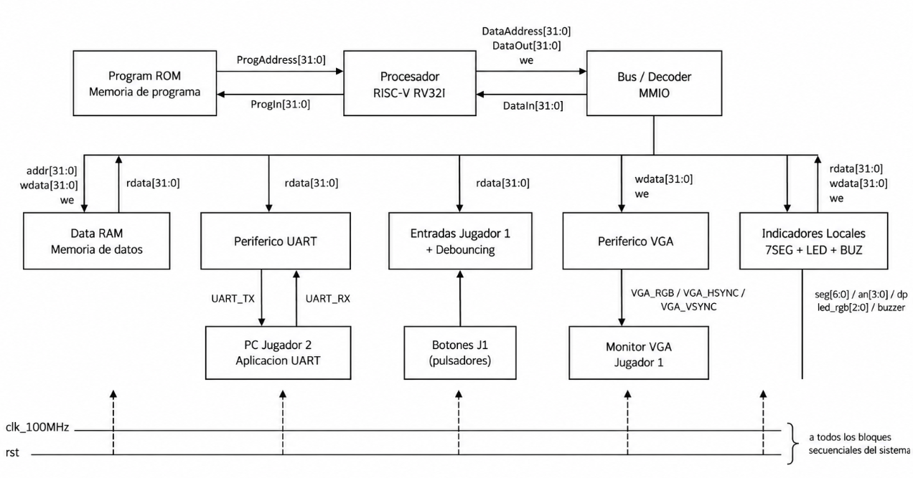
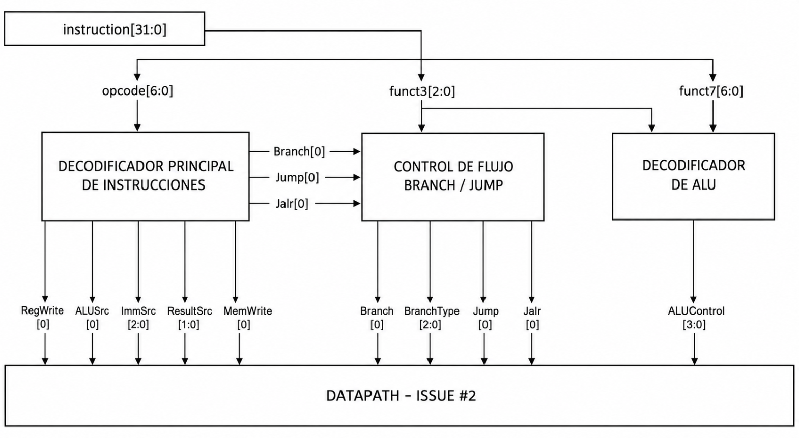
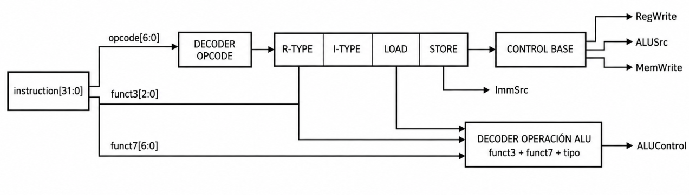
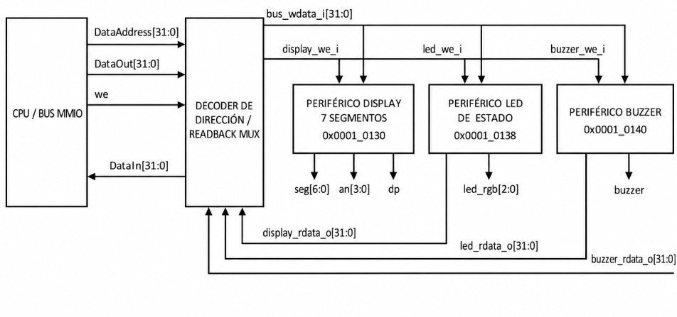
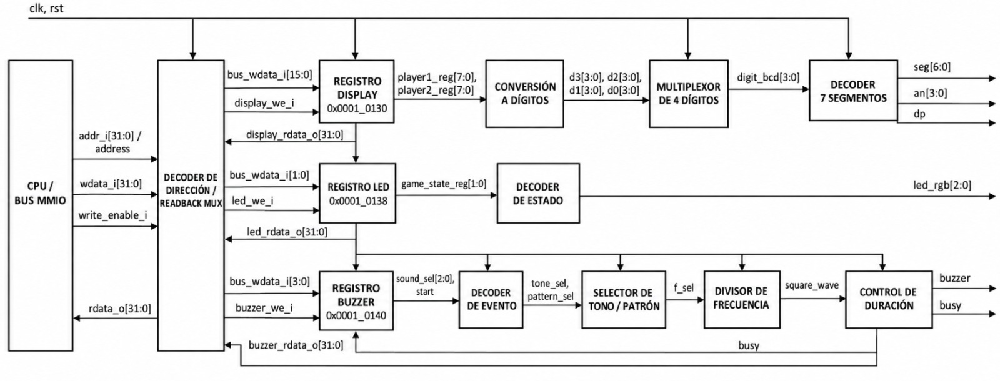

# Documentación del diseño -  Proyecto 3: Batalla Naval sobre RISC-V

---
Este documento presenta el planteamiento de diseño modular del sistema digital del juego Batalla Naval. Se parte de la arquitectura definida en el Avance 1 y se organiza la documentación de acuerdo con los branches del repositorio.

# 1. Objetivo general del diseño

Implementar sobre FPGA una plataforma computacional de 32 bits capaz de ejecutar una partida de Batalla Naval para dos jugadores. La lógica principal del juego se ejecuta mediante un procesador RISC-V RV32I, mientras que las memorias y los periféricos se conectan mediante una interfaz de datos mapeada en memoria (MMIO).

El Jugador 1 interactúa directamente con la FPGA mediante botones, VGA, displays, LED y buzzer. El Jugador 2 utiliza una aplicación de PC comunicada con la FPGA mediante UART.

---

# 2. Diagrama de primer nivel

El primer nivel representa todo el proyecto como un único sistema y muestra únicamente sus entradas y salidas externas.



### Entradas principales

 clk_100MHz: Reloj principal del sistema. 

 BTN_UP, BTN_DOWN, BTN_LEFT, BTN_RIGHT: Movimiento del cursor del Jugador 1. 

 BTN_SEL: Selección o rotación durante la colocación. 

 BTN_OK: Confirmación de una acción. 

 BTN_RST: Solicitud de reinicio de partida. 

 UART_RX: Recepción de información desde la aplicación del Jugador 2. 

### Salidas principales

UART_TX: Transmisión hacia la aplicación del Jugador 2. 

VGA_R/G/B, VGA_HSYNC, VGA_VSYNC: Generación de video para el Jugador 1. 

seg[6:0], an[3:0], dp: Displays de 7 segmentos. 

led_estado: Indicación de la fase de juego. 

buzzer: Retroalimentación sonora. 

---

# 3. Diagrama de segundo nivel

El segundo nivel divide el sistema en sus subsistemas principales. La memoria de programa utiliza un camino independiente, mientras que la RAM y los periféricos comparten el bus de datos MMIO.



### Responsabilidad de los bloques

| Bloque | Responsabilidad principal |
|---|---|
| Procesador RISC-V | Ejecutar la lógica del juego y efectuar accesos a memoria/periféricos. |
| Program ROM | Almacenar las instrucciones del programa. |
| Data RAM | Almacenar variables, tableros y estado de la partida. |
| Bus / Decoder MMIO | Seleccionar el destino de cada acceso de datos. |
| UART | Comunicación serial con el Jugador 2. |
| Entradas Jugador 1 | Filtrar y entregar al CPU los botones físicos. |
| VGA | Generar sincronización, video y representación visual del tablero. |
| Salidas locales | Manejar displays, LED RGB y buzzer. |

---

# 4. Decisiones generales de arquitectura

1. **Diseño modular.** Cada subsistema se desarrolla y valida de forma independiente antes de su integración.
2. **Procesador de 32 bits.** Las direcciones y los datos principales utilizan buses de 32 bits.
3. **Memoria mapeada.** RAM y periféricos se controlan mediante direcciones MMIO, permitiendo que el software acceda a ellos mediante operaciones de carga y almacenamiento.
4. **Separación de programa y datos.** La ROM de instrucciones utiliza un camino separado del bus utilizado por RAM y periféricos.
5. **Lógica del juego en software.** El hardware proporciona CPU, almacenamiento, comunicaciones y E/S; las reglas de Batalla Naval se ejecutan en el programa RISC-V.
6. **Verificación por niveles.** Primero se prueban módulos individuales, luego subsistemas y finalmente la integración sobre el bus y la FPGA.

---

# 5. Organización del diseño por branches

| Branch | Parte del diseño | 
|---|---|
| feature/control-riscv | Unidad de control del procesador |
| feature/datapath-riscv | Ruta de datos del procesador | 
| feature/memorias-bus | ROM, RAM e interconexión MMIO | 
| feature/integracion-top | Integración superior del sistema | 
| feature/nucleo-vga | Núcleo de temporización VGA | 
| feature/render-vga | Renderizado del tablero y colores | 
| feature/entradas-jugador1 | Botones y acondicionamiento de entradas | 
| feature/uart | Comunicación UART |
| feature/aplicacion-python| Interfaz de PC del Jugador 2 
| feature/salidas-locales | Displays, LED, buzzer e interfaz MMIO | 
| develop | Integración de funcionalidades terminadas |
| Avance_1 | Referencia de la arquitectura inicial | 
| docs/planteamiento-diseno`| Documentación técnica del diseño | 
| docs/informe-final | Informe y resultados finales | 

---

# 6. Branch feature/control-riscv

## 6.1 Objetivo

Implementar la Unidad de Control RISC-V RV32I, encargada de decodificar la instrucción y producir las señales que gobiernan el datapath.

La implementación se divide en:

- main_decoder.sv: genera las señales generales de control a partir de opcode.
- alu_decoder.sv: determina la operación de ALU a partir de opcode, funct3 y funct7[5].
- control_unit.sv: integra ambos decodificadores.

## 6.2 Interfaz principal

### Entradas

opcode: Señal de 7 bits que identifica la familia de instrucción.

funct3: Señal de 3 bits que selecciona operaciones dentro de una misma familia.

funct7_5: Señal de 1 bit que distingue principalmente ADD/SUB y SRL/SRA.

### Salidas

reg_write: Señal de 1 bit que habilita la escritura en el Register File.

alu_src_b: Señal de 1 bit que selecciona rs2 o el inmediato como operando B.

alu_ctrl: Señal de 4 bits que selecciona la operación de la ALU.

imm_src: Señal de 3 bits que selecciona el formato de inmediato.

result_src: Señal de 2 bits que selecciona la fuente de write-back.

mem_write: Señal de 1 bit que habilita la escritura hacia memoria/MMIO.

branch: Señal de 1 bit que identifica una instrucción de branch.

jump: Señal de 1 bit que identifica una instrucción jal.

jalr: Señal de 1 bit que identifica una instrucción jalr.

---

## 6.3 Diagrama de tercer nivel — Unidad de Control

Este nivel muestra la división funcional del branch y su conexión con el datapath.



### Justificación del tercer nivel

La separación de main_decoder y alu_decoder evita mezclar la selección de la ruta general de datos con la selección específica de la operación aritmética/lógica. Esto reduce el acoplamiento entre bloques y permite probar ambos decodificadores por separado.

---

## 6.4 Diagrama de cuarto nivel — Decodificación interna



---

## 6.5 Decisiones de diseño

### Codificación del inmediato

| imm_src | Tipo |
|---|---|
| 000 | I |
| 001 | S |
| 010 | B |
| 011 | J |
| 100 | U |

### Selección del resultado

| result_src | Fuente |
|---|---|
| 00 | Resultado de ALU |
| 01 | Dato leído de memoria/MMIO |
| 10 | PC + 4 |
| 11 | PC + inmediato |

### Operaciones de ALU

| alu_ctrl | Operación |
|---|---|
| 0000 | ADD |
| 0001 | SLL |
| 0010 | SLT |
| 0011 | SLTU |
| 0100 | XOR |
| 0101 | SRL |
| 0110 | OR |
| 0111 | AND |
| 1000 | SUB |
| 1101 | SRA |
| 1111 | PASS_B |

---

# 7. Branch feature/salidas-locales

## 7.1 Objetivo

Implementar los periféricos físicos de retroalimentación local del juego:

- cuatro displays de 7 segmentos para los valores de ambos jugadores;
- LED RGB para indicar la fase de la partida;
- buzzer para eventos sonoros;
- registros MMIO que permiten al procesador controlar y consultar estos periféricos.

Los módulos principales son:

- peripherals_mmio.sv
- seven_seg_display.sv
- seven_seg_decoder.sv
- status_led.sv
- buzzer_controller.sv

---

## 7.2 Interfaz principal

### Entradas desde el bus MMIO

bus_wdata_i: Señal de 32 bits que contiene el dato escrito por el procesador.

display_we_i: Señal de 1 bit que genera el pulso de escritura del display.

led_we_i: Señal de 1 bit que genera el pulso de escritura del LED.

buzzer_we_i: Señal de 1 bit que genera el pulso de escritura del buzzer.

clk: Señal de reloj del sistema.

rst: Señal de reinicio del sistema.

### Salidas

display_rdata_o: Señal de 32 bits que permite la lectura del registro de displays.

led_rdata_o: Señal de 1 bit que permite la lectura del estado del LED.

buzzer_rdata_o: Señal de 32 bits que permite la lectura de la selección y del estado busy.

seg: Señal de 7 bits correspondiente a las salidas del display multiplexado.

an: Señal de 4 bits correspondiente a las salidas del display multiplexado.

led_rgb: Señal de 3 bits correspondiente a la salida RGB de estado.

buzzer: Señal digital de salida hacia el buzzer.

---

## 7.3 Diagrama de tercer nivel — Salidas locales




### Justificación del tercer nivel

peripherals_mmio se utiliza como adaptador entre el bus y los módulos físicos. El decoder principal de direcciones pertenece al subsistema de memorias/bus; por ello este branch recibe directamente pulsos de escritura individuales y no vuelve a decodificar la dirección completa.

---

## 7.4 Diagrama de cuarto nivel — Registros y generación de salidas


---

## 7.5 Mapa MMIO

Las direcciones son decodificadas en el branch de memorias/bus. `feature/salidas-locales` recibe las señales `*_we_i` correspondientes.

| Periférico | Dirección | Escritura | 
|---|---|---|
| Displays | 0x0001_0130 | [7:0]=J1, [15:8]=J2 |
| LED | 0x0001_0138 | [1:0]=game_state | 
| Buzzer | 0x0001_0140 | [3:1]=sound_sel, [0]=start | 

### Estados del LED

| game_state | Fase | led_rgb |
|---|---|---|
| 00 | Colocación | 001 |
| 01 | Batalla | 010 |
| 10 | Resultado final | 100 |
| 11 | Inválido / apagado | 000 |

### Códigos del buzzer

| sound_sel | Evento |
|---|---|
| 000 | Sin sonido |
| 001 | Impacto |
| 010 | Fallo |
| 011 | Barco hundido |
| 100 | Colocación inválida |
| 101 | Victoria |

---

## 7.6 Ecuaciones y criterios de implementación

Los valores superiores a `99` se saturan a `99` antes de mostrarse.

Para generar el tono del buzzer mediante una onda cuadrada:

divisor = CLK_FREQ / (2 · f_tono)

El módulo implementa tres divisores aproximados para tonos bajo, medio y alto. El sonido de victoria utiliza una secuencia ascendente de tres etapas.

---

## 7.7 Decisiones de diseño

1. **Un solo adaptador MMIO.** peripherals_mmio centraliza los registros de los tres periféricos.
2. **Decodificación de direcciones fuera del branch.** Se evita duplicar lógica que ya pertenece al bus MMIO.
3. **Saturación del display.** Los valores de cada jugador se limitan al intervalo 00–99.
4. **Start de buzzer de un ciclo.** El bit de inicio no se conserva como nivel; genera un pulso que dispara el sonido seleccionado.
5. **Readback del buzzer.** En escritura el bit 0 representa start; en lectura representa busy, permitiendo al software conocer si el sonido continúa activo.
6. **Independencia de periféricos.** Una escritura a display, LED o buzzer no debe modificar los registros de los otros dos bloques.

---

---

# 8. Branch feature/datapath-riscv

El diagrama de tercer nivel desarrolla internamente el bloque correspondiente al Datapath del procesador RISC-V RV32I. Este subsistema contiene los elementos necesarios para ejecutar las instrucciones soportadas por el procesador, realizar operaciones aritméticas y lógicas, acceder a memoria, actualizar el Register File y determinar la siguiente dirección del Program Counter (PC).

El Datapath recibe las señales de control generadas por la Unidad de Control RISC-V y las utiliza para seleccionar los operandos, determinar la operación de la ALU, seleccionar el formato del inmediato, definir el dato que será escrito en el Register File y determinar la siguiente dirección del Program Counter.

El diseño está orientado a un procesador de 32 bits y debe permitir la ejecución de las instrucciones definidas para el subconjunto RV32I utilizado en el proyecto. El enunciado especifica buses de 32 bits para la dirección de programa, la instrucción, la dirección de datos, el dato de salida y el dato de entrada.

## Objetivo

Diseñar e implementar el Datapath de 32 bits del procesador RISC-V RV32I, proporcionando las rutas de datos necesarias para:

- Mantener y actualizar el Program Counter (PC).
- Leer operandos desde un Register File de 32 registros de 32 bits.
- Garantizar que el registro x0 permanezca permanentemente en cero.
- Generar inmediatos para los formatos de instrucción I, S, B y J.
- Ejecutar operaciones aritméticas y lógicas mediante una ALU de 32 bits.
- Realizar desplazamientos lógicos y aritméticos.
- Realizar comparaciones signed y unsigned.
- Calcular direcciones efectivas para las instrucciones de acceso a memoria.
- Evaluar las condiciones de las instrucciones de branch.
- Calcular las direcciones de destino de jal y jalr.
- Seleccionar el valor que será escrito en el Register File.
- Generar la dirección de acceso a la memoria de datos.
- Integrarse con la Unidad de Control mediante las señales de control correspondientes.

El Datapath debe mantenerse modular y sintetizable en SystemVerilog, de manera que sus submódulos puedan verificarse individualmente antes de realizar la integración completa.

## Entradas

Las principales entradas externas y señales de control del Datapath son:

- clk: reloj principal del procesador.
- rst: señal de reinicio.
- ProgIn[31:0]: instrucción proveniente de la memoria de programa.
- DataIn[31:0]: dato leído desde la memoria de datos o desde un periférico MMIO.
- RegWrite: habilita la escritura en el Register File.
- ALUSrc: selecciona el segundo operando de la ALU entre un registro y un inmediato.
- ALUControl: indica la operación que debe realizar la ALU.
- ImmSrc[1:0]: selecciona el formato del inmediato.
- ResultSrc[1:0]: selecciona el resultado que será escrito en el Register File.
- MemWrite: indica una operación de escritura hacia memoria o periféricos.
- Branch: indica que la instrucción corresponde a un branch.
- BranchType: determina el tipo de comparación utilizado por el branch.
- Jump: indica una instrucción de salto.
- Jalr: identifica el mecanismo de salto utilizado por jalr.

## Salidas

Las principales salidas del Datapath son:

- ProgAddress[31:0]: dirección de la siguiente instrucción hacia la memoria de programa.
- DataAddress[31:0]: dirección generada para acceder a memoria de datos o periféricos.
- DataOut[31:0]: dato que será escrito en memoria.
- we / MemWrite: señal de escritura hacia la interfaz de memoria.
- BranchTaken: resultado de la evaluación de una condición de branch.
- PCPlus4[31:0]: valor de PC + 4.

## Explicación general

El Datapath recibe la instrucción de 32 bits proveniente de la memoria de programa. A partir de esta instrucción se extraen los campos necesarios para acceder al Register File y generar el inmediato correspondiente.

El campo rs1 selecciona el primer registro fuente, rs2 selecciona el segundo registro fuente y rd identifica el registro destino.

El Register File proporciona dos operandos de 32 bits. El primer operando se conecta directamente a la ALU. El segundo pasa por un multiplexor controlado por ALUSrc, que permite seleccionar entre ReadData2 y el inmediato generado.

El generador de inmediatos recibe la instrucción completa y la señal ImmSrc, y genera el inmediato correspondiente a los formatos I, S, B o J.

La ALU realiza las siguientes operaciones:

- ADD
- SUB
- AND
- OR
- XOR
- SLL
- SRL
- SRA
- SLT
- SLTU

Para las instrucciones lw y sw, la dirección efectiva se obtiene mediante:


DataAddress = rs1 + inmediato


Para sw, el dato que será escrito en memoria corresponde al segundo operando del Register File:


DataOut = rs2


Para lw, el dato recibido mediante DataIn se incorpora al camino de write-back.

La actualización del Program Counter puede seguir las siguientes rutas:


PC_nuevo = PC + 4
PC_nuevo = PC + inmediato_B
PC_nuevo = PC + inmediato_J
PC_nuevo = rs1 + inmediato_I


Además, PC + 4 se utiliza como valor de retorno para las instrucciones jal y jalr.


Figura adaptada/basada en: "FIGURE 4.19 The datapath of Figure 4.11 with all necessary multiplexors and all control lines identified", Patterson & Hennessy, Computer Organization and Design: RISC-V Edition.

# Diagramas de Cuarto Nivel

Los siguientes bloques corresponden a la descomposición interna de los principales elementos del Datapath definidos en el tercer nivel.

# Diagrama de Cuarto Nivel - Program Counter

## Objetivo

Diseñar el bloque secuencial encargado de almacenar la dirección actual de ejecución y proporcionar la dirección de la instrucción a la memoria de programa.

## Entradas

- clk
- rst
- PC_next[31:0]

## Salidas

- PC[31:0]
- ProgAddress[31:0]


# Diagrama de Cuarto Nivel - Generación de PC + 4

## Objetivo

Calcular la dirección secuencial de la siguiente instrucción.

## Entrada

- PC[31:0]

## Salida

- PCPlus4[31:0]


# Diagrama de Cuarto Nivel - Register File

## Objetivo

Implementar el banco de registros utilizado para almacenar los operandos y resultados de las instrucciones.

## Entradas

- clk
- rst
- rs1[4:0]
- rs2[4:0]
- rd[4:0]
- WriteData[31:0]
- RegWrite

## Salidas

- ReadData1[31:0]
- ReadData2[31:0]
- 


# Diagrama de Cuarto Nivel - Generador de Inmediatos

## Objetivo

Extraer y reconstruir los campos de inmediato de las instrucciones RISC-V y generar un valor de 32 bits con extensión de signo.

## Entradas

- instruction[31:0]
- ImmSrc[1:0]

## Salida

- ImmExt[31:0]


# Diagrama de Cuarto Nivel - ALU

## Objetivo

Realizar las operaciones aritméticas, lógicas, de desplazamiento y comparación requeridas por el procesador.

## Entradas

-  A[31:0]
- B[31:0]
- ALUControl

## Salidas

-  ALUResult[31:0]
-  Señales de comparación utilizadas por el Datapath.


# Diagrama de Cuarto Nivel - Multiplexor de operandos de ALU

## Objetivo

Seleccionar el segundo operando que será utilizado por la ALU.

## Entradas

-  ReadData2[31:0]
-  ImmExt[31:0]
-  ALUSrc

## Salida

-  ALU_B[31:0]


# Diagrama de Cuarto Nivel - Comparador de Branch

## Objetivo

Evaluar la condición de las instrucciones de branch y generar la señal que determina si debe modificarse el Program Counter.

## Entradas

-  ReadData1[31:0]
- ReadData2[31:0]
- Branch
- BranchType

## Salida

- BranchTaken


# Diagrama de Cuarto Nivel - Interfaz de memoria de datos

## Objetivo

Conectar el Datapath con la memoria de datos para implementar las operaciones de lectura y escritura.

## Entradas

- ALUResult[31:0]
- ReadData2[31:0]
- DataIn[31:0]
- MemWrite

## Salidas

- DataAddress[31:0]
- DataOut[31:0]
- we


# Diagrama de Cuarto Nivel - Multiplexor de Write-Back

## Objetivo

Seleccionar el resultado que será escrito en el registro destino del Register File.

## Entradas

- ALUResult[31:0]
- DataIn[31:0]
- PCPlus4[31:0]
- ResultSrc

## Salida

- WriteData[31:0]


---

# 9. Branch feature/memorias-bus

---

# 10. Branch feature/aplicacion-python 

---

# 11. Branch feature/nucleo-vga en conjunto con Branch feature/render-vga

---


# 12. Branch feature/entradas-jugador1

---

# 13. Branch feature/uart

---

# 14. Branch feature/integracion-top

---

# 15. Estrategia general de implementación


1. Módulos RTL individuales    
2. Testbenches unitarios        
3. Integración por subsistema
4. Integración mediante bus MMIO
5. Integración en top-level
6. Síntesis e implementación
7. Prueba física completa
```

La metodología permite localizar errores antes de integrar el sistema completo y mantiene independencia entre los branches.

---

# 21. Plan general de pruebas

| Nivel | Prueba | Criterio de aceptación |
|---|---|---|
| Módulo | Testbench individual | Salidas esperadas y cero errores. |
| Subsistema | Integración interna | Comunicación correcta entre módulos del mismo branch. |
| MMIO | Lecturas/escrituras por dirección | Un único destino seleccionado y datos correctos. |
| Procesador | Control + datapath | Ejecución correcta del subconjunto RV32I requerido. |
| Integración | Top-level | Todos los periféricos conectados sin conflictos. |
| Hardware | FPGA + VGA + UART + salidas | Partida completa y comportamiento consistente con simulación. |

---

