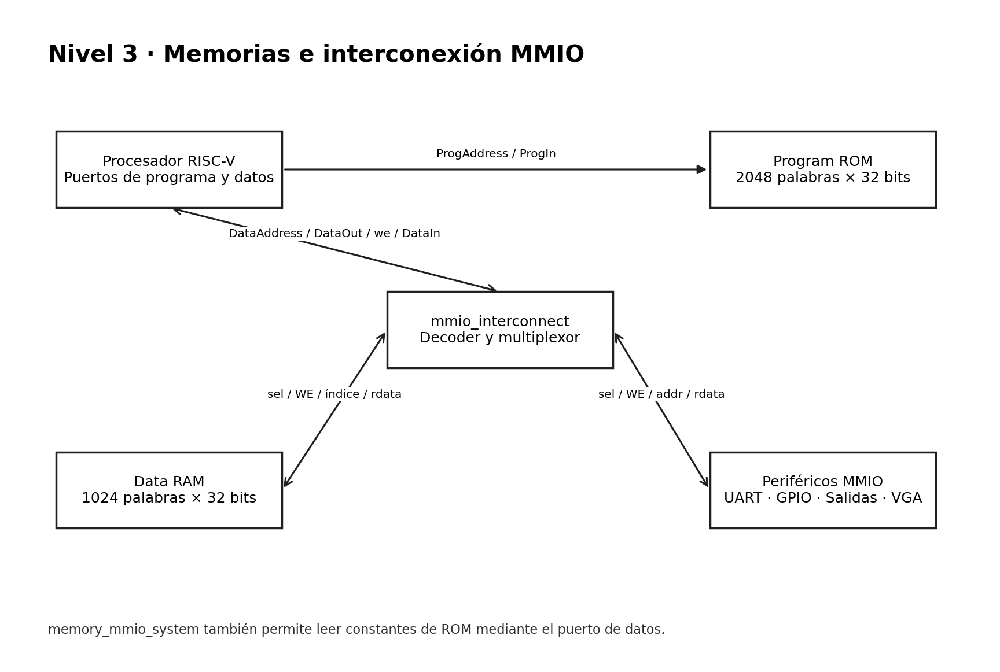
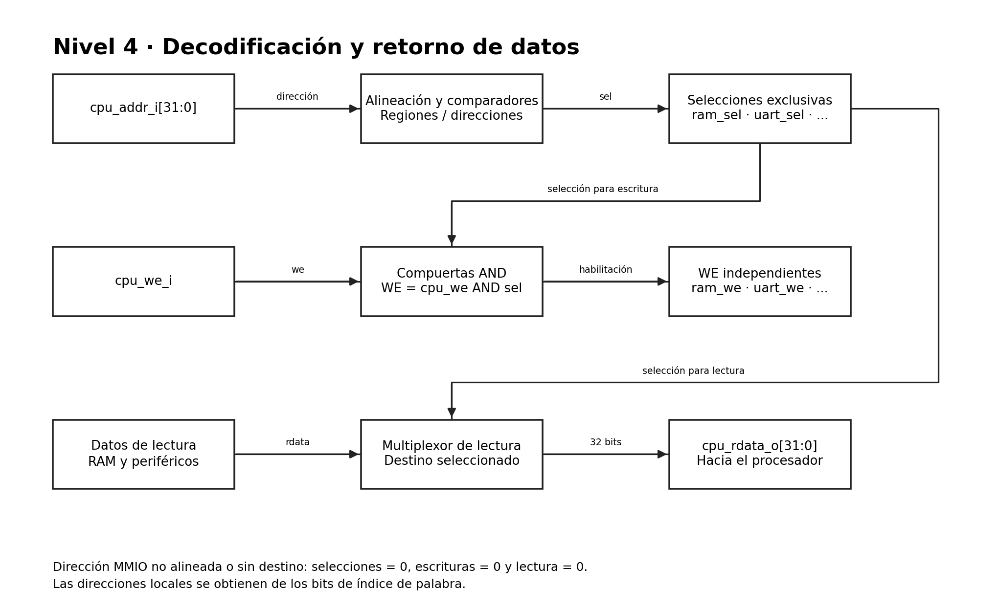
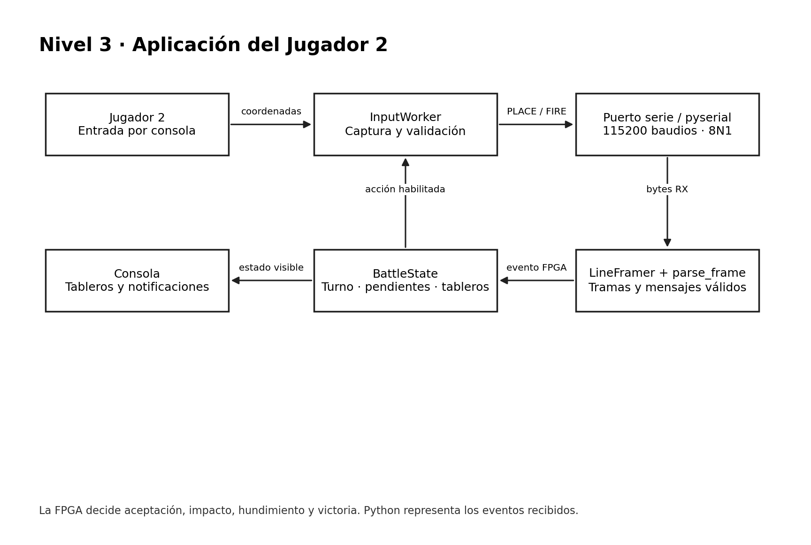
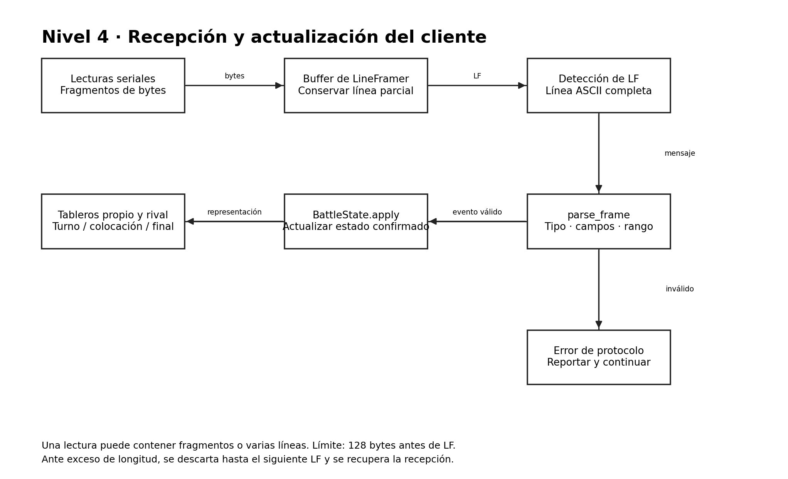
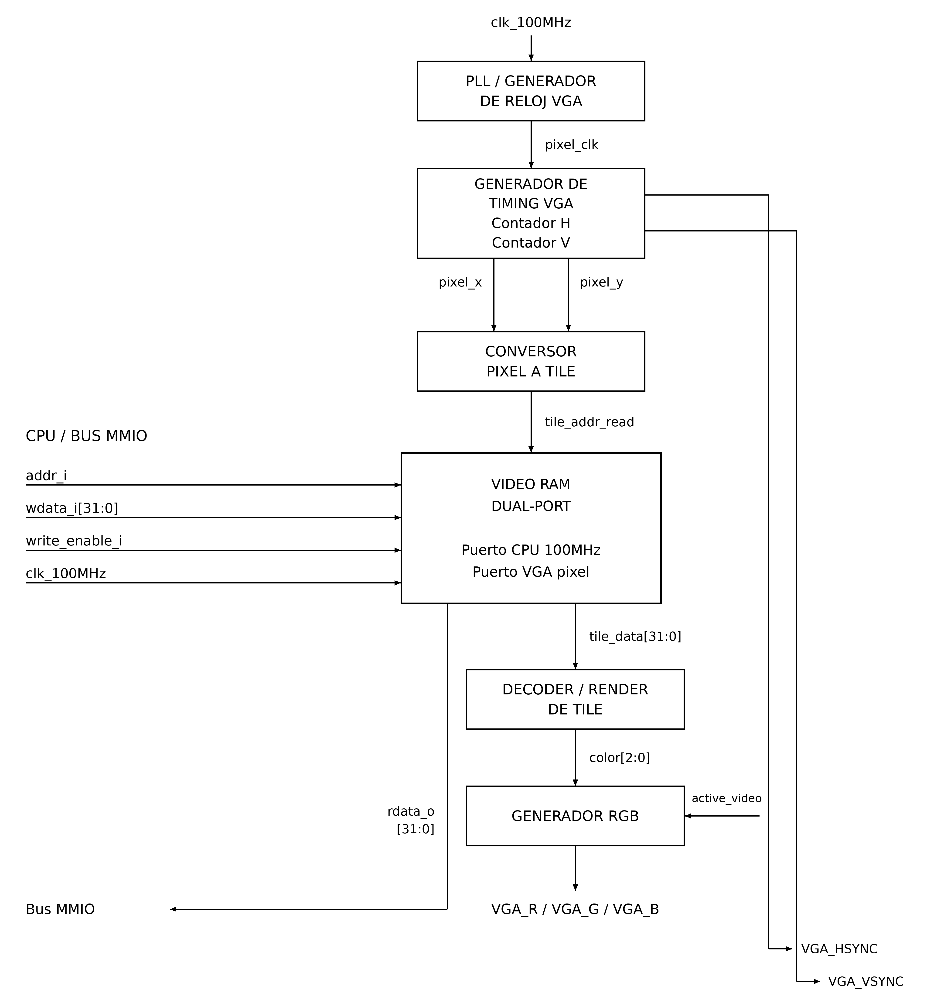
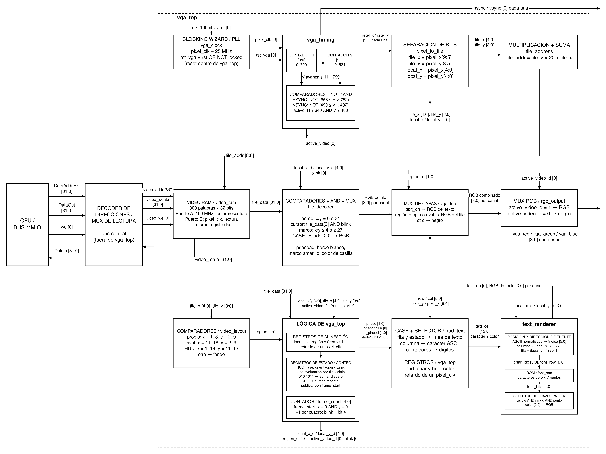
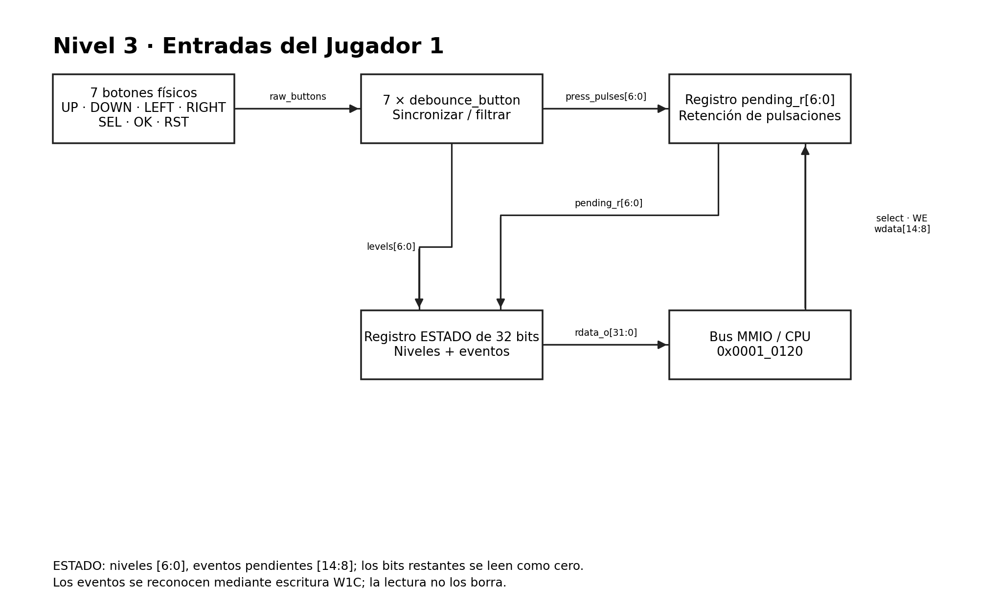
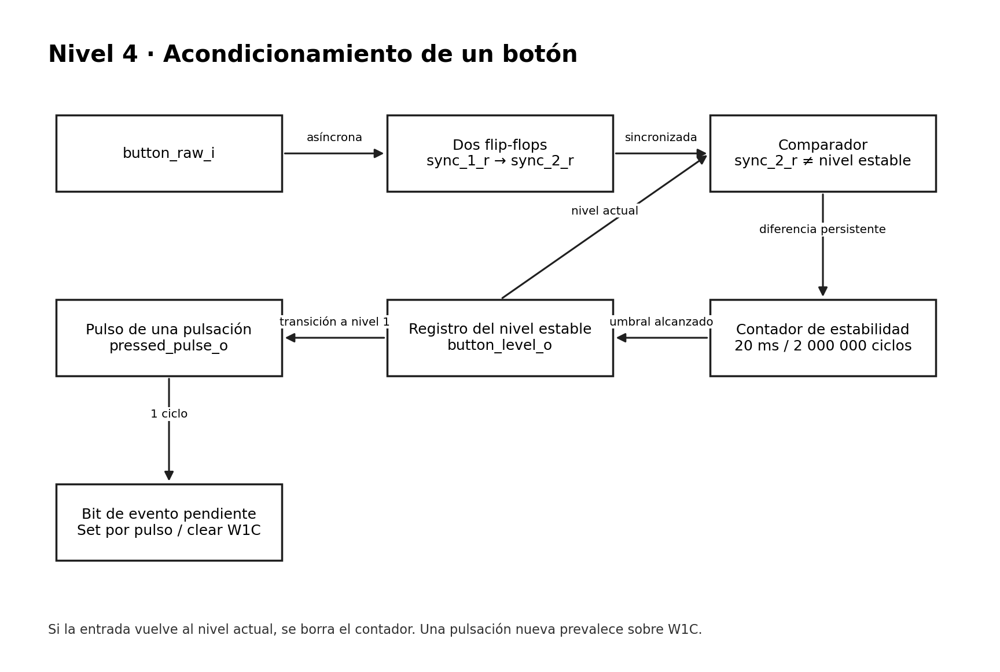
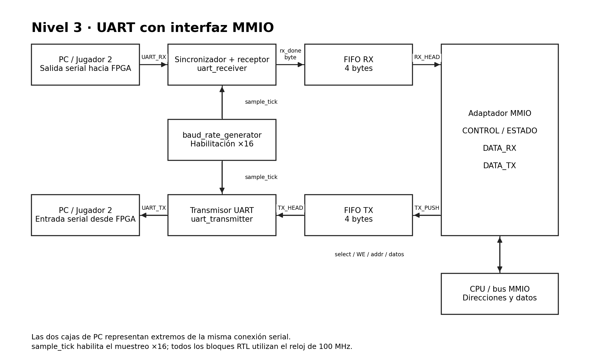
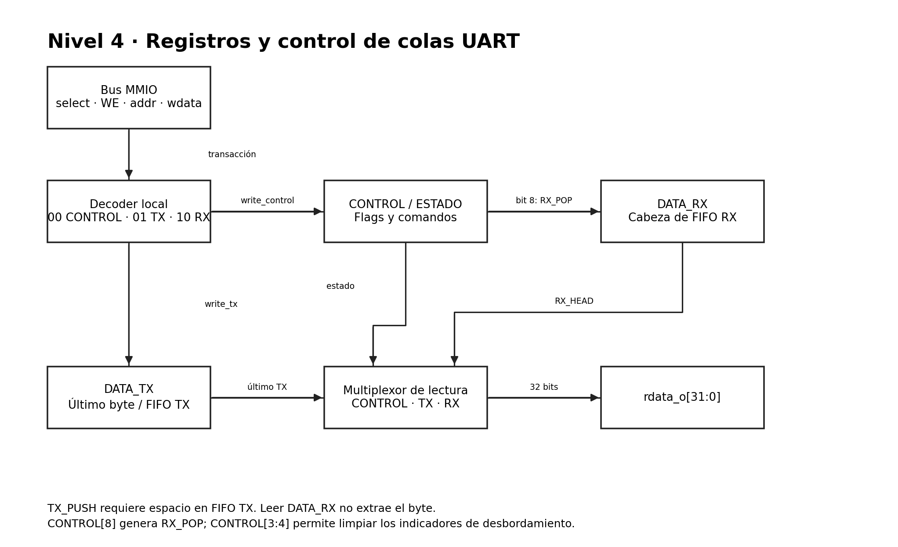

# Documentación del diseño -  Proyecto 3: Batalla Naval sobre RISC-V

---
Este documento presenta el planteamiento de diseño modular del sistema digital del juego Batalla Naval. Se parte de la arquitectura definida en el Avance 1 y se organiza la documentación de acuerdo con los branches del repositorio.

# 1. Objetivo general del diseño

Implementar sobre FPGA una plataforma computacional de 32 bits capaz de ejecutar una partida de Batalla Naval para dos jugadores. La lógica principal del juego se ejecuta mediante un procesador RISC-V RV32I, mientras que las memorias y los periféricos se conectan mediante una interfaz de datos mapeada en memoria (MMIO).

El Jugador 1 interactúa directamente con la FPGA mediante botones, VGA, displays, LED y buzzer. El Jugador 2 utiliza una aplicación de PC comunicada con la FPGA mediante UART.

---

# 2. Diagrama de primer nivel

El primer nivel representa todo el proyecto como un único sistema y muestra únicamente sus entradas y salidas externas.


### Entradas principales

 clk_100MHz: Reloj principal del sistema. 

 BTN_UP, BTN_DOWN, BTN_LEFT, BTN_RIGHT: Movimiento del cursor del Jugador 1. 

 BTN_SEL: Selección o rotación durante la colocación. 

 BTN_OK: Confirmación de una acción. 

 BTN_RST: Solicitud de reinicio de partida. 

 UART_RX: Recepción de información desde la aplicación del Jugador 2. 

### Salidas principales

UART_TX: Transmisión hacia la aplicación del Jugador 2. 

VGA_R/G/B, VGA_HSYNC, VGA_VSYNC: Generación de video para el Jugador 1. 

seg[6:0], an[3:0], dp: Displays de 7 segmentos. 

led_estado: Indicación de la fase de juego. 

buzzer: Retroalimentación sonora. 

---

# 3. Diagrama de segundo nivel

El segundo nivel divide el sistema en sus subsistemas principales. La memoria de programa utiliza un camino independiente, mientras que la RAM y los periféricos comparten el bus de datos MMIO.


### Responsabilidad de los bloques

| Bloque | Responsabilidad principal |
|---|---|
| Procesador RISC-V | Ejecutar la lógica del juego y efectuar accesos a memoria/periféricos. |
| Program ROM | Almacenar las instrucciones del programa. |
| Data RAM | Almacenar variables, tableros y estado de la partida. |
| Bus / Decoder MMIO | Seleccionar el destino de cada acceso de datos. |
| UART | Comunicación serial con el Jugador 2. |
| Entradas Jugador 1 | Filtrar y entregar al CPU los botones físicos. |
| VGA | Generar sincronización, video y representación visual del tablero. |
| Salidas locales | Manejar displays, LED RGB y buzzer. |

---

# 4. Decisiones generales de arquitectura

1. **Diseño modular.** Cada subsistema se desarrolla y valida de forma independiente antes de su integración.
2. **Procesador de 32 bits.** Las direcciones y los datos principales utilizan buses de 32 bits.
3. **Memoria mapeada.** RAM y periféricos se controlan mediante direcciones MMIO, permitiendo que el software acceda a ellos mediante operaciones de carga y almacenamiento.
4. **Separación de programa y datos.** La ROM de instrucciones utiliza un camino separado del bus utilizado por RAM y periféricos.
5. **Lógica del juego en software.** El hardware proporciona CPU, almacenamiento, comunicaciones y E/S; las reglas de Batalla Naval se ejecutan en el programa RISC-V.
6. **Verificación por niveles.** Primero se prueban módulos individuales, luego subsistemas y finalmente la integración sobre el bus y la FPGA.

---

# 5. Organización del diseño por branches

| Branch | Parte del diseño | 
|---|---|
| feature/control-riscv | Unidad de control del procesador |
| feature/datapath-riscv | Ruta de datos del procesador | 
| feature/memorias-bus | ROM, RAM e interconexión MMIO | 
| feature/integracion-top | Integración superior del sistema | 
| feature/nucleo-vga | Núcleo de temporización VGA | 
| feature/render-vga | Renderizado del tablero y colores | 
| feature/entradas-jugador1 | Botones y acondicionamiento de entradas | 
| feature/uart | Comunicación UART |
| feature/aplicacion-python| Interfaz de PC del Jugador 2 
| feature/salidas-locales | Displays, LED, buzzer e interfaz MMIO | 
| develop | Integración de funcionalidades terminadas |
| Avance_1 | Referencia de la arquitectura inicial | 
| docs/planteamiento-diseno`| Documentación técnica del diseño | 
| docs/informe-final | Informe y resultados finales | 

---

# 6. Branch feature/control-riscv

## 6.1 Objetivo

Implementar la Unidad de Control RISC-V RV32I, encargada de decodificar la instrucción y producir las señales que gobiernan el datapath.

La implementación se divide en:

- main_decoder.sv: genera las señales generales de control a partir de opcode.
- alu_decoder.sv: determina la operación de ALU a partir de opcode, funct3 y funct7[5].
- control_unit.sv: integra ambos decodificadores.

## 6.2 Interfaz principal

### Entradas

opcode: Señal de 7 bits que identifica la familia de instrucción.

funct3: Señal de 3 bits que selecciona operaciones dentro de una misma familia.

funct7_5: Señal de 1 bit que distingue principalmente ADD/SUB y SRL/SRA.

### Salidas

reg_write: Señal de 1 bit que habilita la escritura en el Register File.

alu_src_b: Señal de 1 bit que selecciona rs2 o el inmediato como operando B.

alu_ctrl: Señal de 4 bits que selecciona la operación de la ALU.

imm_src: Señal de 3 bits que selecciona el formato de inmediato.

result_src: Señal de 2 bits que selecciona la fuente de write-back.

mem_write: Señal de 1 bit que habilita la escritura hacia memoria/MMIO.

branch: Señal de 1 bit que identifica una instrucción de branch.

jump: Señal de 1 bit que identifica una instrucción jal.

jalr: Señal de 1 bit que identifica una instrucción jalr.

---

## 6.3 Diagrama de tercer nivel — Unidad de Control

Este nivel muestra la división funcional del branch y su conexión con el datapath.


### Justificación del tercer nivel

La separación de main_decoder y alu_decoder evita mezclar la selección de la ruta general de datos con la selección específica de la operación aritmética/lógica. Esto reduce el acoplamiento entre bloques y permite probar ambos decodificadores por separado.

---

## 6.4 Diagrama de cuarto nivel — Decodificación interna


---

## 6.5 Decisiones de diseño

### Codificación del inmediato

| imm_src | Tipo |
|---|---|
| 000 | I |
| 001 | S |
| 010 | B |
| 011 | J |
| 100 | U |

### Selección del resultado

| result_src | Fuente |
|---|---|
| 00 | Resultado de ALU |
| 01 | Dato leído de memoria/MMIO |
| 10 | PC + 4 |
| 11 | PC + inmediato |

### Operaciones de ALU

| alu_ctrl | Operación |
|---|---|
| 0000 | ADD |
| 0001 | SLL |
| 0010 | SLT |
| 0011 | SLTU |
| 0100 | XOR |
| 0101 | SRL |
| 0110 | OR |
| 0111 | AND |
| 1000 | SUB |
| 1101 | SRA |
| 1111 | PASS_B |

---

# 7. Branch feature/salidas-locales

## 7.1 Objetivo

Implementar los periféricos físicos de retroalimentación local del juego:

- cuatro displays de 7 segmentos para los valores de ambos jugadores;
- LED RGB para indicar la fase de la partida;
- buzzer para eventos sonoros;
- registros MMIO que permiten al procesador controlar y consultar estos periféricos.

Los módulos principales son:

- peripherals_mmio.sv
- seven_seg_display.sv
- seven_seg_decoder.sv
- status_led.sv
- buzzer_controller.sv

---

## 7.2 Interfaz principal

### Entradas desde el bus MMIO

bus_wdata_i: Señal de 32 bits que contiene el dato escrito por el procesador.

display_we_i: Señal de 1 bit que genera el pulso de escritura del display.

led_we_i: Señal de 1 bit que genera el pulso de escritura del LED.

buzzer_we_i: Señal de 1 bit que genera el pulso de escritura del buzzer.

clk: Señal de reloj del sistema.

rst: Señal de reinicio del sistema.

### Salidas

display_rdata_o: Señal de 32 bits que permite la lectura del registro de displays.

led_rdata_o: Señal de 1 bit que permite la lectura del estado del LED.

buzzer_rdata_o: Señal de 32 bits que permite la lectura de la selección y del estado busy.

seg: Señal de 7 bits correspondiente a las salidas del display multiplexado.

an: Señal de 4 bits correspondiente a las salidas del display multiplexado.

led_rgb: Señal de 3 bits correspondiente a la salida RGB de estado.

buzzer: Señal digital de salida hacia el buzzer.

---

## 7.3 Diagrama de tercer nivel — Salidas locales


### Justificación del tercer nivel

peripherals_mmio se utiliza como adaptador entre el bus y los módulos físicos. El decoder principal de direcciones pertenece al subsistema de memorias/bus; por ello este branch recibe directamente pulsos de escritura individuales y no vuelve a decodificar la dirección completa.

---

## 7.4 Diagrama de cuarto nivel — Registros y generación de salidas


---

## 7.5 Mapa MMIO

Las direcciones son decodificadas en el branch de memorias/bus. `feature/salidas-locales` recibe las señales `*_we_i` correspondientes.

| Periférico | Dirección | Escritura | 
|---|---|---|
| Displays | 0x0001_0130 | [7:0]=J1, [15:8]=J2 |
| LED | 0x0001_0138 | [1:0]=game_state | 
| Buzzer | 0x0001_0140 | [3:1]=sound_sel, [0]=start | 

### Estados del LED

| game_state | Fase | led_rgb |
|---|---|---|
| 00 | Colocación | 001 |
| 01 | Batalla | 010 |
| 10 | Resultado final | 100 |
| 11 | Inválido / apagado | 000 |

### Códigos del buzzer

| sound_sel | Evento |
|---|---|
| 000 | Sin sonido |
| 001 | Impacto |
| 010 | Fallo |
| 011 | Barco hundido |
| 100 | Colocación inválida |
| 101 | Victoria |

---

## 7.6 Ecuaciones y criterios de implementación

Los valores superiores a `99` se saturan a `99` antes de mostrarse.

Para generar el tono del buzzer mediante una onda cuadrada:

divisor = CLK_FREQ / (2 · f_tono)

El módulo implementa tres divisores aproximados para tonos bajo, medio y alto. El sonido de victoria utiliza una secuencia ascendente de tres etapas.

---

## 7.7 Decisiones de diseño

1. **Un solo adaptador MMIO.** peripherals_mmio centraliza los registros de los tres periféricos.
2. **Decodificación de direcciones fuera del branch.** Se evita duplicar lógica que ya pertenece al bus MMIO.
3. **Saturación del display.** Los valores de cada jugador se limitan al intervalo 00–99.
4. **Start de buzzer de un ciclo.** El bit de inicio no se conserva como nivel; genera un pulso que dispara el sonido seleccionado.
5. **Readback del buzzer.** En escritura el bit 0 representa start; en lectura representa busy, permitiendo al software conocer si el sonido continúa activo.
6. **Independencia de periféricos.** Una escritura a display, LED o buzzer no debe modificar los registros de los otros dos bloques.

---

---

# 8. Branch feature/datapath-riscv

El diagrama de tercer nivel desarrolla internamente el bloque correspondiente al Datapath del procesador RISC-V RV32I. Este subsistema contiene los elementos necesarios para ejecutar las instrucciones soportadas por el procesador, realizar operaciones aritméticas y lógicas, acceder a memoria, actualizar el Register File y determinar la siguiente dirección del Program Counter (PC).

El Datapath recibe las señales de control generadas por la Unidad de Control RISC-V y las utiliza para seleccionar los operandos, determinar la operación de la ALU, seleccionar el formato del inmediato, definir el dato que será escrito en el Register File y determinar la siguiente dirección del Program Counter.

El diseño está orientado a un procesador de 32 bits y debe permitir la ejecución de las instrucciones definidas para el subconjunto RV32I utilizado en el proyecto. El enunciado especifica buses de 32 bits para la dirección de programa, la instrucción, la dirección de datos, el dato de salida y el dato de entrada.

## Objetivo

Diseñar e implementar el Datapath de 32 bits del procesador RISC-V RV32I, proporcionando las rutas de datos necesarias para:

- Mantener y actualizar el Program Counter (PC).
- Leer operandos desde un Register File de 32 registros de 32 bits.
- Garantizar que el registro x0 permanezca permanentemente en cero.
- Generar inmediatos para los formatos de instrucción I, S, B y J.
- Ejecutar operaciones aritméticas y lógicas mediante una ALU de 32 bits.
- Realizar desplazamientos lógicos y aritméticos.
- Realizar comparaciones signed y unsigned.
- Calcular direcciones efectivas para las instrucciones de acceso a memoria.
- Evaluar las condiciones de las instrucciones de branch.
- Calcular las direcciones de destino de jal y jalr.
- Seleccionar el valor que será escrito en el Register File.
- Generar la dirección de acceso a la memoria de datos.
- Integrarse con la Unidad de Control mediante las señales de control correspondientes.

El Datapath debe mantenerse modular y sintetizable en SystemVerilog, de manera que sus submódulos puedan verificarse individualmente antes de realizar la integración completa.

## Entradas

Las principales entradas externas y señales de control del Datapath son:

- clk: reloj principal del procesador.
- rst: señal de reinicio.
- ProgIn[31:0]: instrucción proveniente de la memoria de programa.
- DataIn[31:0]: dato leído desde la memoria de datos o desde un periférico MMIO.
- RegWrite: habilita la escritura en el Register File.
- ALUSrc: selecciona el segundo operando de la ALU entre un registro y un inmediato.
- ALUControl: indica la operación que debe realizar la ALU.
- ImmSrc[1:0]: selecciona el formato del inmediato.
- ResultSrc[1:0]: selecciona el resultado que será escrito en el Register File.
- MemWrite: indica una operación de escritura hacia memoria o periféricos.
- Branch: indica que la instrucción corresponde a un branch.
- BranchType: determina el tipo de comparación utilizado por el branch.
- Jump: indica una instrucción de salto.
- Jalr: identifica el mecanismo de salto utilizado por jalr.

## Salidas

Las principales salidas del Datapath son:

- ProgAddress[31:0]: dirección de la siguiente instrucción hacia la memoria de programa.
- DataAddress[31:0]: dirección generada para acceder a memoria de datos o periféricos.
- DataOut[31:0]: dato que será escrito en memoria.
- we / MemWrite: señal de escritura hacia la interfaz de memoria.
- BranchTaken: resultado de la evaluación de una condición de branch.
- PCPlus4[31:0]: valor de PC + 4.

## Explicación general

El Datapath recibe la instrucción de 32 bits proveniente de la memoria de programa. A partir de esta instrucción se extraen los campos necesarios para acceder al Register File y generar el inmediato correspondiente.

El campo rs1 selecciona el primer registro fuente, rs2 selecciona el segundo registro fuente y rd identifica el registro destino.

El Register File proporciona dos operandos de 32 bits. El primer operando se conecta directamente a la ALU. El segundo pasa por un multiplexor controlado por ALUSrc, que permite seleccionar entre ReadData2 y el inmediato generado.

El generador de inmediatos recibe la instrucción completa y la señal ImmSrc, y genera el inmediato correspondiente a los formatos I, S, B o J.

La ALU realiza las siguientes operaciones:

- ADD
- SUB
- AND
- OR
- XOR
- SLL
- SRL
- SRA
- SLT
- SLTU

Para las instrucciones lw y sw, la dirección efectiva se obtiene mediante:


DataAddress = rs1 + inmediato


Para sw, el dato que será escrito en memoria corresponde al segundo operando del Register File:


DataOut = rs2


Para lw, el dato recibido mediante DataIn se incorpora al camino de write-back.

La actualización del Program Counter puede seguir las siguientes rutas:


PC_nuevo = PC + 4
PC_nuevo = PC + inmediato_B
PC_nuevo = PC + inmediato_J
PC_nuevo = rs1 + inmediato_I


Además, PC + 4 se utiliza como valor de retorno para las instrucciones jal y jalr.


Figura adaptada/basada en: "FIGURE 4.19 The datapath of Figure 4.11 with all necessary multiplexors and all control lines identified", Patterson & Hennessy, Computer Organization and Design: RISC-V Edition.

# Diagramas de Cuarto Nivel

Los siguientes bloques corresponden a la descomposición interna de los principales elementos del Datapath definidos en el tercer nivel.

# Diagrama de Cuarto Nivel - Program Counter

## Objetivo

Diseñar el bloque secuencial encargado de almacenar la dirección actual de ejecución y proporcionar la dirección de la instrucción a la memoria de programa.

## Entradas

- clk
- rst
- PC_next[31:0]

## Salidas

- PC[31:0]
- ProgAddress[31:0]


# Diagrama de Cuarto Nivel - Generación de PC + 4

## Objetivo

Calcular la dirección secuencial de la siguiente instrucción.

## Entrada

- PC[31:0]

## Salida

- PCPlus4[31:0]


# Diagrama de Cuarto Nivel - Register File

## Objetivo

Implementar el banco de registros utilizado para almacenar los operandos y resultados de las instrucciones.

## Entradas

- clk
- rst
- rs1[4:0]
- rs2[4:0]
- rd[4:0]
- WriteData[31:0]
- RegWrite

## Salidas

- ReadData1[31:0]
- ReadData2[31:0]
- 


# Diagrama de Cuarto Nivel - Generador de Inmediatos

## Objetivo

Extraer y reconstruir los campos de inmediato de las instrucciones RISC-V y generar un valor de 32 bits con extensión de signo.

## Entradas

- instruction[31:0]
- ImmSrc[1:0]

## Salida

- ImmExt[31:0]


# Diagrama de Cuarto Nivel - ALU

## Objetivo

Realizar las operaciones aritméticas, lógicas, de desplazamiento y comparación requeridas por el procesador.

## Entradas

-  A[31:0]
- B[31:0]
- ALUControl

## Salidas

-  ALUResult[31:0]
-  Señales de comparación utilizadas por el Datapath.


# Diagrama de Cuarto Nivel - Multiplexor de operandos de ALU

## Objetivo

Seleccionar el segundo operando que será utilizado por la ALU.

## Entradas

-  ReadData2[31:0]
-  ImmExt[31:0]
-  ALUSrc

## Salida

-  ALU_B[31:0]


# Diagrama de Cuarto Nivel - Comparador de Branch

## Objetivo

Evaluar la condición de las instrucciones de branch y generar la señal que determina si debe modificarse el Program Counter.

## Entradas

-  ReadData1[31:0]
- ReadData2[31:0]
- Branch
- BranchType

## Salida

- BranchTaken


# Diagrama de Cuarto Nivel - Interfaz de memoria de datos

## Objetivo

Conectar el Datapath con la memoria de datos para implementar las operaciones de lectura y escritura.

## Entradas

- ALUResult[31:0]
- ReadData2[31:0]
- DataIn[31:0]
- MemWrite

## Salidas

- DataAddress[31:0]
- DataOut[31:0]
- we


# Diagrama de Cuarto Nivel - Multiplexor de Write-Back

## Objetivo

Seleccionar el resultado que será escrito en el registro destino del Register File.

## Entradas

- ALUResult[31:0]
- DataIn[31:0]
- PCPlus4[31:0]
- ResultSrc

## Salida

- WriteData[31:0]


---

# 9. Branch feature/memorias-bus

## 9.1 Objetivo

Implementar la memoria de programa, la memoria de datos y la interconexión MMIO de 32 bits. El subsistema entrega instrucciones al procesador por un puerto independiente y dirige los accesos de datos hacia RAM, constantes de ROM o periféricos.

Los módulos principales son:

- `program_rom.sv`: almacenamiento e inicialización de instrucciones y constantes.
- `data_ram.sv`: almacenamiento de tableros y variables.
- `mmio_interconnect.sv`: selección de destinos, direcciones locales, habilitaciones de escritura y retorno de datos.
- `memory_mmio_system.sv`: integración de ambas memorias y del bus.

## 9.2 Interfaz principal

### Entradas del procesador

`clk_i`: reloj del sistema de 100 MHz.

`ProgAddress_i[31:0]`: dirección de instrucción.

`DataAddress_i[31:0]`: dirección del acceso de datos.

`DataOut_i[31:0]`: dato de escritura.

`we_i`: habilitación de escritura del acceso de datos.

### Salidas y conexión con periféricos

`ProgIn_o[31:0]`: instrucción leída desde ROM.

`DataIn_o[31:0]`: dato de lectura seleccionado hacia el procesador.

`bus_wdata_o[31:0]`: dato distribuido a RAM y periféricos.

`*_sel_o` y `*_we_o`: selección y habilitación individual para cada destino.

`ram_addr[9:0]`, `uart_addr_o[1:0]` y `vga_addr_o[8:0]`: índices locales obtenidos de la dirección de bytes. Los registros individuales de entradas, displays, LED y buzzer se seleccionan mediante su dirección exacta.

`*_rdata_i[31:0]`: datos devueltos por cada periférico al multiplexor central.

## 9.3 Diagrama de tercer nivel — Memorias y bus



### Justificación del tercer nivel

El camino de instrucciones se mantiene separado de los accesos de datos. El bus central reúne la decodificación y evita que cada periférico deba interpretar una dirección absoluta de 32 bits. `memory_mmio_system` permite además leer constantes de ROM mediante instrucciones `lw`.

## 9.4 Diagrama de cuarto nivel — Decoder MMIO



La dirección se comprueba primero por alineación de palabra: `cpu_addr_i[1:0]` debe ser `00`. Los comparadores de rango seleccionan RAM o video; los comparadores de dirección exacta seleccionan los registros restantes. Una sola selección dirige el dato de lectura y habilita la escritura correspondiente.

Para cada destino:

```text
write_enable_destino = cpu_we_i AND select_destino
índice_de_palabra = (dirección_de_bytes - dirección_base) / 4
```

El bus es combinacional; las memorias y registros ejecutan las escrituras en el flanco de reloj correspondiente. La secuencia y latencia de los accesos se coordinan en la integración superior.

## 9.5 Mapa de memoria

| Región o registro | Dirección de bytes | Capacidad / función |
|---|---|---|
| Program ROM | `0x0000_0000`–`0x0000_1FFF` | 2048 palabras de 32 bits; 8 KiB |
| Data RAM | `0x0000_2000`–`0x0000_2FFF` | 1024 palabras de 32 bits; 4 KiB |
| UART CONTROL/ESTADO | `0x0001_0040` | Disponibilidad y comandos |
| UART DATA_TX | `0x0001_0044` | Byte de transmisión |
| UART DATA_RX | `0x0001_0048` | Byte recibido |
| Entradas Jugador 1 | `0x0001_0120` | Niveles y eventos de botones |
| Displays | `0x0001_0130` | Valores de ambos jugadores |
| LED | `0x0001_0138` | Estado de la partida |
| Buzzer | `0x0001_0140` | Selección e inicio de sonido |
| Ventana MMIO de video | `0x0001_1000`–`0x0001_17FF` | Índice local de 9 bits |
| Palabras utilizadas de video | `0x0001_1000`–`0x0001_14AC` | 300 palabras; índices 0–299 |

La ventana de video reserva 512 posiciones direccionables; el almacenamiento del tablero utiliza las primeras 300. El programa limita sus accesos a los índices implementados.

## 9.6 Inicialización y comportamiento de memorias

La ROM se inicializa mediante `$readmemh` y el parámetro `INIT_FILE`, propagado desde `PROGRAM_FILE`. El archivo `batalla_naval.mem` contiene una palabra hexadecimal de 32 bits por línea. Las posiciones sin programa se inicializan con `0x0000_0013`, correspondiente a `addi x0, x0, 0`.

La RAM tiene escritura síncrona y lectura combinacional. Se inicializa en cero al configurar el sistema; el programa administra posteriormente el contenido de cada nueva partida. El reinicio de partida conserva los contadores de victorias mediante la organización y actualización de los datos en software.

Un acceso no alineado o sin destino dentro del decoder MMIO devuelve cero y mantiene desactivadas las selecciones y escrituras. La ROM entrega NOP ante direcciones de instrucción inválidas. Una escritura dirigida a ROM no modifica su contenido.

## 9.7 Estrategia de verificación

Los testbenches autoverificables comprueban instrucciones conocidas y límites de ROM, lectura después de escritura en RAM, direcciones extremas, selección de cada periférico y retorno de su dato. También comprueban que una escritura no active dos destinos simultáneamente y que las direcciones no alineadas o no asignadas no generen escrituras.

---

# 10. Branch feature/aplicacion-python

## 10.1 Objetivo

Implementar la interfaz remota del Jugador 2 mediante Python y UART. La aplicación captura colocaciones y disparos, representa los tableros y muestra los eventos enviados por la FPGA. La validación de traslapes, impactos, hundimientos y victoria corresponde al programa ejecutado en RISC-V.

El archivo principal es `battle_client.py`. Sus bloques funcionales son `LineFramer`, `parse_frame`, `BattleState`, `InputWorker` y las funciones de selección del puerto y ejecución del cliente.

## 10.2 Interfaz principal

### Entradas

Coordenadas introducidas por consola, identificación del puerto serie y bytes recibidos desde la FPGA.

Las filas y columnas se expresan de 0 a 7. La orientación de colocación utiliza `H` o `V`.

### Salidas

Mensajes ASCII hacia la FPGA, tablero propio de 8 × 8, estado conocido del tablero rival, turno activo, resultados de disparo y resumen final.

La comunicación se configura a 115200 baudios, ocho bits de datos, sin paridad y un bit de parada. El cliente utiliza lecturas seriales con timeout de 50 ms y un trabajador de entrada de consola para mantener la recepción activa mientras espera al usuario.

## 10.3 Diagrama de tercer nivel — Aplicación Python



### Justificación del tercer nivel

La captura del usuario se separa de la recepción serial. `BattleState` conserva el estado de presentación y las acciones pendientes; el cliente solicita entradas de acuerdo con la fase y el turno confirmados por la FPGA.

## 10.4 Diagrama de cuarto nivel — Recepción y actualización



`LineFramer` conserva fragmentos hasta recibir LF y entrega líneas completas al parser. `parse_frame` revisa el tipo de mensaje, la cantidad de campos y los valores permitidos. `BattleState` aplica los eventos válidos y actualiza la representación del juego.

Una línea puede llegar repartida entre varias lecturas seriales y una lectura puede contener varias líneas. El límite de trama es de 128 bytes antes de LF. Una trama demasiado larga se descarta hasta el siguiente LF; los datos no ASCII o incompatibles se reportan sin detener el ciclo de recepción.

## 10.5 Protocolo de comunicación

Los campos se separan por comas y cada mensaje termina con LF (`\n`).

| Dirección | Mensaje | Significado |
|---|---|---|
| PC → FPGA | `PLACE,id,fila,columna,H/V` | Solicitar colocación de un barco |
| PC → FPGA | `FIRE,fila,columna` | Solicitar disparo |
| FPGA → PC | `NEW` | Inicializar una nueva partida |
| FPGA → PC | `PLACE,id,OK` | Confirmar colocación |
| FPGA → PC | `PLACE,id,REJECT,motivo` | Rechazar y solicitar otra colocación |
| FPGA → PC | `BATTLE` | Comenzar la fase de batalla |
| FPGA → PC | `TURN,P1` o `TURN,P2` | Confirmar turno activo |
| FPGA → PC | `SHOT,fila,columna,resultado,barco` | Resultado del disparo de J2 |
| FPGA → PC | `INCOMING,fila,columna,resultado,barco` | Disparo recibido en el tablero de J2 |
| FPGA → PC | `SHOT_REJECT,fila,columna,motivo` | Rechazar un disparo |
| FPGA → PC | `END,ganador,disparosP1,disparosP2,hundidosP1,hundidosP2` | Resultado y resumen final |
| FPGA → PC | `ERROR,motivo` | Informar un error de comunicación |

`resultado` utiliza `HIT`, `MISS` o `SUNK`. El campo `barco` contiene el identificador cuando corresponde y `-` cuando no se informa uno.

## 10.6 Decisiones de diseño

1. **Confirmación desde FPGA.** Una colocación se conserva como pendiente hasta recibir aceptación. Un rechazo permite corregirla.
2. **Tableros de presentación.** El tablero propio muestra barcos confirmados y disparos recibidos; el rival muestra únicamente información obtenida por los resultados de disparo.
3. **Turno explícito.** Después de un resultado de disparo se espera `TURN` o `END` antes de habilitar la siguiente acción.
4. **Partidas consecutivas.** `NEW` limpia la presentación y las solicitudes pendientes; la aplicación mantiene abierta la comunicación.
5. **Validación local de formato.** Las coordenadas y orientación se verifican antes de transmitir, mientras la FPGA determina la legalidad de la acción dentro de la partida.

## 10.7 Estrategia de verificación

Las pruebas comprueban fragmentación de mensajes, colocaciones aceptadas y rechazadas, coordenadas inválidas, turnos, actualización de ambos tableros, resultados de disparo, mensajes mal formados y recepción de una nueva partida. La prueba de integración serial comprueba el intercambio bidireccional con el firmware y la presentación del resumen final.

---

# 11. Diseño del sistema VGA

## 11.1 Objetivo

Mostrar los tableros y la información de Batalla Naval en un monitor VGA. El procesador escribe en la memoria de video y el sistema convierte esos datos en colores y señales de sincronización.

El Issue 5 corresponde al núcleo VGA. El Issue 6 sirvió para probarlo antes de la integración final.

---

## 11.2 Interfaz principal

Se usan los nombres de los diagramas y se indica su nombre en vga_top.

### Entradas

clk_100MHz: señal de 1 bit con el reloj de 100 MHz de la tarjeta. Alimenta el puerto del procesador y el PLL. En vga_top se llama clk_100mhz.

rst_i: señal de 1 bit que reinicia los contadores y la lógica de video cuando está en 1. En vga_top se llama rst.

addr_i[8:0]: señal de 9 bits que selecciona la palabra de memoria que el procesador quiere escribir o leer. Las posiciones válidas son de 0 a 299. En vga_top se llama video_addr.

wdata_i[31:0]: señal de 32 bits con el dato que se guarda en la posición seleccionada. En vga_top se llama video_wdata.

write_enable_i: señal de 1 bit que habilita la escritura. Cuando está en 1, la memoria guarda el dato en el flanco de subida de clk_100MHz. En vga_top se llama video_we.

El bus central selecciona el periférico y entrega la dirección como índice de memoria.

### Salidas

rdata_o[31:0]: señal de 32 bits con el dato leído de addr_i. La lectura se registra con el reloj de 100 MHz. En vga_top se llama video_rdata.

VGA_HSYNC: señal de 1 bit, activa en bajo, para la sincronización horizontal del monitor. En vga_top se llama hsync.

VGA_VSYNC: señal de 1 bit, activa en bajo, para la sincronización vertical del monitor. En vga_top se llama vsync.

VGA_R[3:0]: señal de 4 bits con la intensidad del rojo. En vga_top se llama vga_red.

VGA_G[3:0]: señal de 4 bits con la intensidad del verde. En vga_top se llama vga_green.

VGA_B[3:0]: señal de 4 bits con la intensidad del azul. En vga_top se llama vga_blue.

Los tres canales forman un color de 12 bits. Fuera del área visible se envía negro.

---

## 11.3 Diagrama de tercer nivel



Este nivel muestra el recorrido desde la memoria hasta las salidas del monitor.

vga_top: conecta el bus con la memoria y reúne las salidas de video.

vga_clock: recibe el reloj de 100 MHz y entrega pixel_clk de 25 MHz y locked.

vga_timing: entrega pixel_x y pixel_y, de 10 bits cada una, además de active_video, HSYNC y VSYNC, de 1 bit.

pixel_to_tile y tile_address: convierten las coordenadas del píxel en una casilla y una dirección de lectura de 9 bits.

video_ram: recibe las escrituras del procesador por el puerto A y entrega tile_data[31:0] al video por el puerto B.

tile_decoder: interpreta el dato de la casilla y produce el color, el borde y el cursor.

rgb_output: recibe el color y active_video para generar las salidas RGB.

---

## 11.4 Diagrama de cuarto nivel



El contador horizontal recorre las posiciones de 0 a 799. Al terminar una línea, vuelve a cero y hace avanzar el contador vertical, que recorre las líneas de 0 a 524.

Los comparadores generan la sincronización y reconocen el área visible de 640 × 480 píxeles. active_video vale 1 dentro de esa área.

La división por 32 obtiene la fila y la columna de la casilla. Con ellas se calcula la dirección de lectura de video_ram. La memoria entrega el dato un ciclo después; las coordenadas y active_video se retrasan ese mismo ciclo.

El decoder obtiene el color de la casilla y la habilitación de video permite mostrarlo dentro del área visible.

### Correspondencia con la implementación

color[2:0] representa el código de estado en los dibujos. tile_decoder entrega RGB con 4 bits por canal.

En el código final, HSYNC y VSYNC salen directamente de vga_timing. Los registros alinean las coordenadas y el control de video.

El bit 3 activa el cursor. Los mensajes se obtienen de casillas reservadas mediante hud_text, text_renderer y font_rom. Las etiquetas de sincronización alineada y HUD opcional del dibujo corresponden a la propuesta inicial.

---

## 11.5 Organización de la memoria

Cada casilla mide 32 × 32 píxeles. La pantalla contiene 20 columnas y 15 filas, por lo que video_ram almacena 300 palabras de 32 bits.

En los tableros, los bits 2 a 0 indican el estado:

- 000: agua, azul.
- 001: barco, gris.
- 010: fallo, turquesa.
- 011: impacto, rojo.
- 100: selección, amarillo.

El bit 3 habilita el marco amarillo parpadeante del cursor.

---

## 11.6 Ecuaciones de diseño

Columna = parte entera de pixel_x / 32.

Fila = parte entera de pixel_y / 32.

Dirección de casilla = fila × 20 + columna.

La división por 32 se obtiene desplazando 5 bits a la derecha. Para multiplicar por 20 se suman fila × 16 y fila × 4.

Reset de video = rst_i OR NOT locked.

Frecuencia de cuadros = 25 000 000 / (800 × 525) ≈ 59,52 Hz.

---

## 11.7 Decisiones de diseño y pruebas

La memoria tiene dos puertos: uno para el procesador a 100 MHz y otro para el video a 25 MHz. Esto permite actualizar los datos mientras se recorre la pantalla.

El reset de video permanece activo mientras el PLL estabiliza el reloj. active_video permite enviar negro fuera de la imagen.

En el Issue 6, vga_test_top permitió revisar la salida con barras de colores y video_demo_top escribió un patrón conocido. video_mmio_interface y video_peripheral permitieron probar la conexión con el bus.

En la integración final, batalla_naval_top conecta directamente vga_top. video_layout quedó en el núcleo para ubicar los tableros y la zona de mensajes.


# 12. Branch feature/entradas-jugador1

## 12.1 Objetivo

Acondicionar los siete botones del Jugador 1 y presentar sus niveles y eventos al procesador mediante el registro ESTADO en `0x0001_0120`.

Los módulos son `debounce_button.sv` y `j1_inputs_peripheral.sv`. El primero sincroniza y filtra una entrada; el segundo instancia siete filtros y reúne sus salidas en una palabra MMIO de 32 bits.

## 12.2 Interfaz principal

### Entradas

`clk_i` y `rst_i`: reloj de 100 MHz y reset del periférico.

`btn_up_raw_i`, `btn_down_raw_i`, `btn_left_raw_i`, `btn_right_raw_i`, `btn_sel_raw_i`, `btn_ok_raw_i` y `btn_rst_raw_i`: entradas físicas activas en alto.

`select_i`, `write_enable_i` y `wdata_i[31:0]`: selección y reconocimiento de eventos desde el bus.

### Salida

`rdata_o[31:0]`: registro de niveles y eventos pendientes. Cuando el periférico no está seleccionado, devuelve cero.

## 12.3 Diagrama de tercer nivel — Entradas locales



### Justificación del tercer nivel

Cada botón tiene un filtro independiente. Además de los niveles estables, el periférico conserva las pulsaciones en bits pendientes para que el procesador pueda leerlas aunque el pulso original haya durado un solo ciclo.

## 12.4 Diagrama de cuarto nivel — Debounce y eventos



La entrada física pasa por dos flip-flops de sincronización. El filtro compara la entrada sincronizada con el nivel aceptado; si difieren, cuenta ciclos consecutivos antes de actualizar la salida. Si la entrada vuelve al nivel actual, reinicia ese contador.

Una transición filtrada de 0 a 1 produce un pulso de un ciclo. Mantener el botón presionado conserva su nivel, pero no genera pulsos adicionales. El filtrado también se aplica a la liberación del botón.

## 12.5 Registro ESTADO

| Botón | Bit de nivel — RO | Bit de evento — W1C | Acción interpretada por software |
|---|---:|---:|---|
| Arriba | 0 | 8 | Mover cursor arriba |
| Abajo | 1 | 9 | Mover cursor abajo |
| Izquierda | 2 | 10 | Mover cursor izquierda |
| Derecha | 3 | 11 | Mover cursor derecha |
| SEL | 4 | 12 | Selección o rotación |
| OK | 5 | 13 | Confirmar colocación o disparo |
| RST | 6 | 14 | Solicitar nueva partida |

El bit 7 y los bits 31:15 se leen como cero. Escribir 1 en un bit W1C reconoce y borra el evento correspondiente; escribir 0 lo conserva. La lectura no limpia eventos.

```text
pending_next = (pending_actual AND NOT máscara_W1C) OR nuevas_pulsaciones
```

Si una pulsación nueva coincide con el reconocimiento del mismo botón, el evento permanece pendiente. Los bits pendientes almacenan presencia de eventos, no un contador de pulsaciones.

## 12.6 Tiempo de debounce y reset

Con `CLK_FREQ_HZ = 100_000_000` y `DEBOUNCE_MS = 20`:

```text
ciclos de debounce = (100 000 000 / 1000) × 20 = 2 000 000
ancho del contador = ceil(log2(2 000 000)) = 21 bits
```

El reset del periférico limpia niveles, contadores, pulsos y eventos pendientes. El botón RST es una entrada del jugador que el software interpreta como reinicio de partida; el reset global del sistema es una señal independiente. La conservación de victorias al iniciar otra partida corresponde al programa.

## 12.7 Estrategia de verificación

Los testbenches comprueban cada botón, rebotes durante presión y liberación, pulsación mantenida, eventos consecutivos, correspondencia de bits, lectura MMIO y reconocimiento W1C. También comprueban la prioridad de un evento nuevo cuando coincide con una escritura de reconocimiento y el estado después del reset.

---

# 13. Branch feature/uart

## 13.1 Objetivo

Adaptar la UART del proyecto anterior a la interfaz MMIO de 32 bits para comunicar el procesador RISC-V con el Jugador 2. El periférico convierte escrituras y lecturas de registros en operaciones seriales y conserva bytes mediante colas independientes de transmisión y recepción.

Los módulos principales son `uart_mmio_peripheral.sv`, `uart_mmio_fifo.sv`, `uart_receiver.sv`, `uart_transmitter.sv` y `baud_rate_generator.sv`.

## 13.2 Interfaz principal

### Entradas

`clk_i` y `rst_i`: reloj del sistema y reset.

`select_i`: selección del periférico desde el decoder central.

`write_enable_i`: habilitación de escritura.

`addr_i[1:0]`: selección del registro interno.

`wdata_i[31:0]`: dato o comando de escritura.

`uart_rx_i`: entrada serial desde la PC.

### Salidas

`rdata_o[31:0]`: dato del registro seleccionado.

`uart_tx_o`: salida serial hacia la PC.

## 13.3 Diagrama de tercer nivel — UART MMIO



### Justificación del tercer nivel

El receptor y el transmisor trabajan de forma independiente. Las FIFO desacoplan la llegada y salida serial de los accesos del procesador. El adaptador MMIO centraliza comandos, registros de datos e indicadores de disponibilidad.

## 13.4 Diagrama de cuarto nivel — Registros y colas



La dirección local selecciona CONTROL, DATA_TX o DATA_RX. Una escritura en TX inserta el byte en la cola si existe espacio. El transmisor toma la cabeza de la cola y la retira al completar la transmisión. El receptor inserta cada byte terminado en la FIFO RX.

La lectura de DATA_RX devuelve la cabeza sin extraerla. El procesador ordena la extracción mediante el bit 8 de CONTROL. Esto permite leer el mismo byte sin perderlo hasta reconocerlo explícitamente.

## 13.5 Mapa de registros

| Dirección | `addr_i` | Registro | Comportamiento |
|---|---|---|---|
| `0x0001_0040` | `00` | CONTROL/ESTADO | Lectura de flags y escritura de comandos |
| `0x0001_0044` | `01` | DATA_TX | Escritura del byte [7:0]; lectura del último byte aceptado |
| `0x0001_0048` | `10` | DATA_RX | Lectura del byte [7:0] en la cabeza de RX |

Los bits superiores de los registros de datos se leen como cero. DATA_RX es de solo lectura.

### CONTROL/ESTADO

| Bit | Lectura | Escritura |
|---|---|---|
| 0 | `RX_VALID`: existe un byte disponible | Sin acción |
| 1 | `TX_READY`: hay espacio en FIFO TX | Sin acción |
| 2 | `RX_FULL`: FIFO RX llena | Sin acción |
| 3 | `RX_OVERRUN`: desbordamiento de recepción | W1C: limpiar indicador |
| 4 | `TX_OVERRUN`: escritura a TX sin espacio | W1C: limpiar indicador |
| 8 | Cero | W1P: extraer un byte de RX si existe |
| Restantes | Cero | Sin acción |

`TX_READY` indica espacio en la cola; puede estar en 1 mientras el transmisor todavía envía otro byte. El software consulta este indicador antes de escribir. Ambas FIFO tienen cuatro bytes con `FIFO_BITS = 2`.

## 13.6 Temporización y secuencia de uso

La UART utiliza ocho bits, sin paridad y un bit de parada, con muestreo ×16. El generador produce pulsos de habilitación sin crear otro reloj físico.

```text
baudios = 100 000 000 / (54 × 16) ≈ 115 740,74
error respecto de 115 200 ≈ +0,47 %
```

La PC se configura a 115200 baudios. La recepción física pasa por dos registros de sincronización antes del receptor.

Para transmitir, el CPU consulta `TX_READY` y escribe el byte en DATA_TX. Para recibir, consulta `RX_VALID`, lee DATA_RX y escribe `0x0000_0100` en CONTROL para retirar ese byte. Los indicadores de desbordamiento permanecen visibles hasta su reconocimiento W1C.

## 13.7 Estrategia de verificación

Los testbenches verifican el orden de bytes, start y stop, transmisión y recepción consecutivas, direcciones MMIO, disponibilidad y extracción de RX. También comprueban la capacidad de las colas, los indicadores de desbordamiento y su limpieza. La prueba con la aplicación de PC comprueba mensajes ASCII completos y comunicación en ambas direcciones.

---

# 14. Estrategia general de implementación


1. Módulos RTL individuales    
2. Testbenches unitarios        
3. Integración por subsistema
4. Integración mediante bus MMIO
5. Integración en top-level
6. Síntesis e implementación
7. Prueba física completa

La metodología permite localizar errores antes de integrar el sistema completo y mantiene independencia entre los branches.

---


