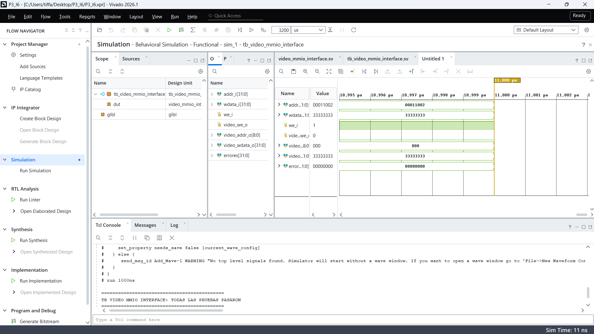
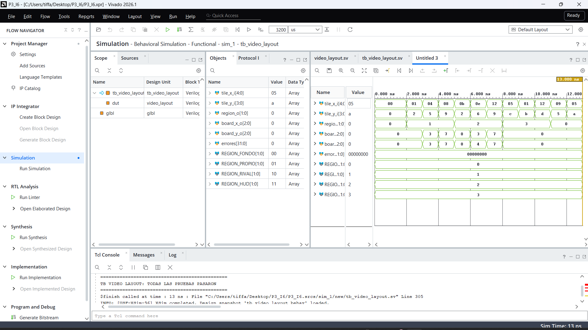
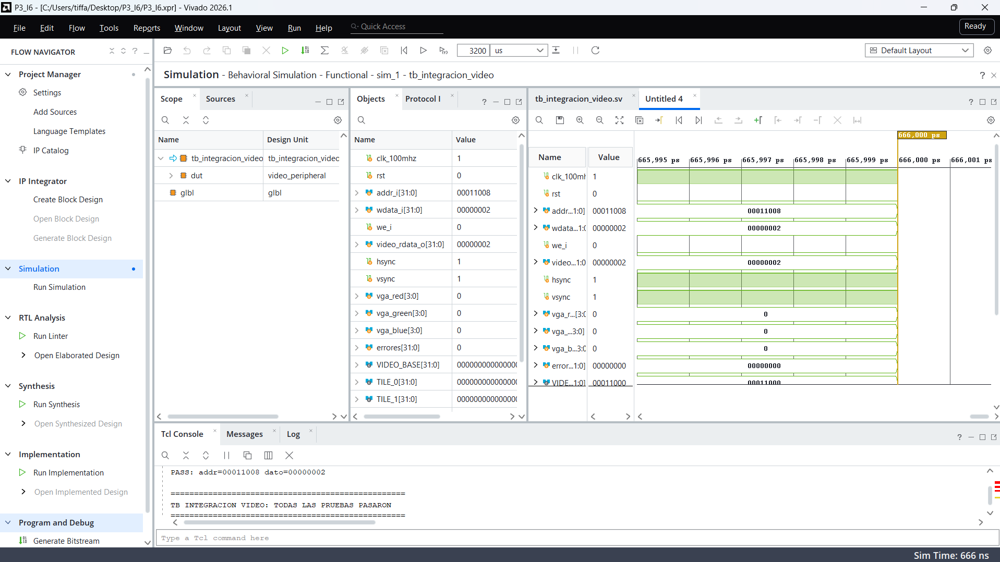
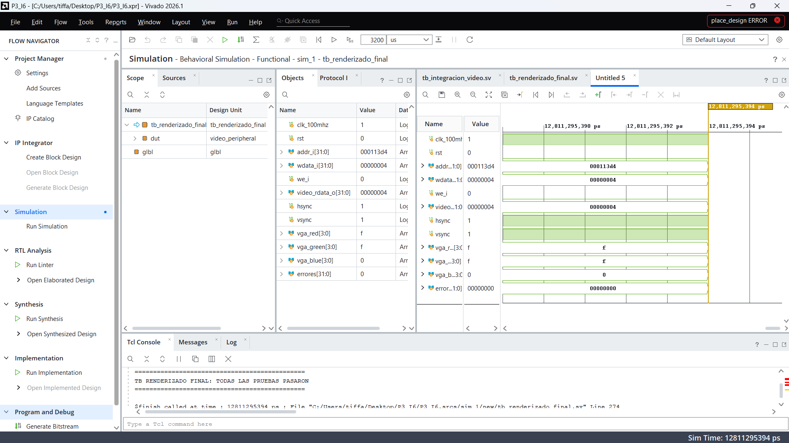

# Issue 6 - Video RAM, tiles y renderizado VGA

## Objetivo

Diseñar e implementar la memoria de video y el sistema de renderizado basado en tiles para el periférico VGA del proyecto **Batalla Naval**.

El sistema permite que el procesador RISC-V modifique el contenido mostrado en pantalla mediante escrituras mapeadas en memoria. Paralelamente, el dominio VGA consulta continuamente la memoria de video y convierte su contenido en las señales RGB correspondientes.

El diseño utiliza como base el núcleo VGA desarrollado en el **Issue 5**, agregando la interfaz MMIO, la organización lógica de la pantalla y la integración entre el procesador, la Video RAM y el sistema de renderizado.

---

# 1. Documentación de diseño

## 1.1 Arquitectura general

El sistema de video se divide conceptualmente en dos dominios.

El **dominio del procesador** trabaja con el reloj principal del sistema y permite modificar la Video RAM mediante operaciones de escritura mapeadas en memoria.

El **dominio VGA** utiliza el reloj de píxel generado por el Clocking Wizard y consulta continuamente la Video RAM para determinar el color correspondiente al píxel que se está mostrando.

El flujo general de información implementado es:

<pre>
                  DOMINIO DEL PROCESADOR

     addr_i ───────────────┐
     wdata_i ──────────────┼──> video_mmio_interface
     we_i ─────────────────┘              │
                                          │
                              dirección + dato + WE
                                          │
                                          v
                                    Video RAM
                                          │
                                          │ lectura
                                          v
                  DOMINIO VGA        vga_top
                                          │
                      ┌───────────────────┼───────────────────┐
                      │                   │                   │
                      v                   v                   v
                 VGA Timing        Pixel → Tile        Tile Decoder
                      │                   │                   │
                      │                   v                   │
                      │             Tile Address              │
                      │                   │                   │
                      └───────────────────┴───────────────────┘
                                          │
                                          v
                                     RGB Output
                                          │
                                          v
                              VGA Red / Green / Blue
</pre>

El módulo `video_peripheral.sv` constituye el nivel de integración entre ambos dominios.

---

## 1.2 Organización de la pantalla

La salida VGA utilizada corresponde a una resolución de:

- **640 × 480 píxeles**.
- Cuadrícula de **20 × 15 tiles**.
- Cada tile tiene un tamaño de **32 × 32 píxeles**.
- La pantalla contiene un total de **300 tiles**.

Por lo tanto:

```text
20 × 32 = 640 píxeles

15 × 32 = 480 píxeles

20 × 15 = 300 tiles
```

Cada posición de la pantalla puede identificarse mediante:

```text
tile_x = pixel_x / 32
tile_y = pixel_y / 32
```

La dirección lineal correspondiente dentro de la Video RAM se calcula mediante:

```text
tile_addr = tile_y × 20 + tile_x
```

De esta forma, el sistema puede determinar qué palabra de la memoria corresponde al píxel que está siendo mostrado.

---

## 1.3 Distribución lógica de la pantalla

El módulo `video_layout.sv` permite dividir la pantalla en regiones lógicas utilizadas por el juego.

Se definieron cuatro tipos de región:

| Código | Región |
|---|---|
| `00` | Fondo |
| `01` | Tablero propio |
| `10` | Tablero rival |
| `11` | HUD |

Los dos tableros corresponden a matrices de **8 × 8 casillas**.

Cuando una posición pertenece a uno de los tableros, el módulo también genera las coordenadas locales:

```text
board_x
board_y
```

Estas coordenadas permiten identificar una casilla específica del tablero independientemente de su posición absoluta dentro de la pantalla.

El espacio restante puede utilizarse para información del HUD, como estado de la partida, turno, victorias u otros indicadores.

---

## 1.4 Organización de la Video RAM

La memoria de video almacena una palabra de **32 bits por tile**.

El espacio de memoria asignado al periférico VGA es:

```text
0x0001_1000 - 0x0001_17FF
```

La dirección de una posición puede obtenerse mediante:

```text
dirección = VGA_BASE + (fila × NUM_COLUMNAS + columna) × 4
```

donde:

```text
VGA_BASE = 0x0001_1000
NUM_COLUMNAS = 20
```

Cada palabra tiene la siguiente organización general:

| Bits | Función |
|---|---|
| `[2:0]` | Código utilizado para determinar el estado/color del tile |
| `[7:3]` | Reservados para información gráfica adicional |
| `[31:8]` | Reservados para futuras extensiones |

Esta organización permite modificar una casilla completa mediante una única escritura de 32 bits realizada por el procesador.

---

## 1.5 Codificación de tiles

El sistema de renderizado utiliza los tres bits menos significativos de cada palabra de Video RAM para seleccionar el estado gráfico del tile.

| `tile_data[2:0]` | Estado | RGB |
|---|---|---|
| `000` | Agua | `0,4,F` |
| `001` | Barco | `8,8,8` |
| `010` | Fallo | `0,F,F` |
| `011` | Impacto | `F,0,0` |
| `100` | Selección / resaltado | `F,F,0` |
| `101-111` | Reservado | `0,0,0` |

Cada componente RGB utiliza 4 bits.

Por ejemplo:

```text
F = 1111
8 = 1000
4 = 0100
0 = 0000
```

También se generan bordes blancos alrededor de los tiles para facilitar la identificación visual de cada casilla.

El borde se genera cuando la coordenada local del píxel corresponde a alguno de los extremos del tile.

---

# 2. Módulos utilizados

El desarrollo del Issue 6 reutiliza parte de la arquitectura implementada previamente en el Issue 5 y agrega nuevos módulos destinados a la integración con el procesador y la organización del juego.

---

## 2.1 Módulos reutilizados del Issue 5

### `vga_clock`

IP generada mediante **Clocking Wizard**.

Su función es convertir el reloj principal de:

```text
100 MHz
```

en el reloj de píxel utilizado por el sistema VGA:

```text
25 MHz
```

Este reloj alimenta el dominio encargado del barrido y renderizado de la pantalla.

---

### `vga_timing.sv`

Genera la temporización necesaria para VGA.

Entre sus funciones se encuentran:

- Contador horizontal.
- Contador vertical.
- Generación de `HSYNC`.
- Generación de `VSYNC`.
- Determinación del área visible.
- Generación de las coordenadas actuales `pixel_x` y `pixel_y`.

Este módulo determina qué píxel de la pantalla debe generarse en cada instante.

---

### `pixel_to_tile.sv`

Convierte las coordenadas de píxel generadas por `vga_timing` en coordenadas de tile.

A partir de:

```text
pixel_x
pixel_y
```

se obtienen:

```text
tile_x
tile_y
local_x
local_y
```

`tile_x` y `tile_y` identifican el tile actual.

`local_x` y `local_y` indican la posición del píxel dentro de ese tile.

---

### `tile_address.sv`

Calcula la dirección lineal utilizada para acceder a la Video RAM.

La operación principal es:

```text
tile_addr = tile_y × 20 + tile_x
```

El resultado permite seleccionar una de las 300 posiciones correspondientes a la cuadrícula de video.

---

### `video_ram.sv`

Implementa la memoria utilizada para almacenar el contenido gráfico.

La memoria permite que el procesador modifique el contenido mientras el sistema VGA realiza lecturas para generar continuamente la imagen.

Esta separación es necesaria porque ambos bloques trabajan con funciones y dominios de reloj diferentes.

---

### `tile_decoder.sv`

Interpreta los bits:

```text
tile_data[2:0]
```

y determina el color correspondiente al estado de cada casilla.

Entre los estados definidos se encuentran:

```text
Agua
Barco
Fallo
Impacto
Selección
```

---

### `rgb_output.sv`

Genera las señales finales:

```text
vga_red
vga_green
vga_blue
```

El módulo combina el color generado por `tile_decoder` con la información del píxel actual.

También permite representar los bordes de las casillas y fuerza la salida a negro cuando el píxel se encuentra fuera del área de video activo.

---

### `vga_top.sv`

Integra los módulos que forman el núcleo VGA.

Su función es conectar:

```text
vga_clock
    ↓
vga_timing
    ↓
pixel_to_tile
    ↓
tile_address
    ↓
video_ram
    ↓
tile_decoder
    ↓
rgb_output
```

El módulo recibe los datos que deben almacenarse en la Video RAM y produce las señales VGA finales.

---

# 3. Módulos desarrollados para el Issue 6

## 3.1 `video_mmio_interface.sv`

### Objetivo

Implementar la interfaz entre el bus de memoria del procesador y la Video RAM.

El procesador utiliza direcciones de 32 bits, mientras que la Video RAM necesita una dirección correspondiente a una posición interna de memoria.

El módulo verifica si la dirección recibida pertenece al rango:

```text
0x0001_1000 - 0x0001_17FF
```

Cuando se realiza una escritura válida dentro de este rango, la interfaz genera:

```text
video_addr_o
video_wdata_o
video_we_o
```

La dirección interna se obtiene tomando el desplazamiento respecto a la dirección base y convirtiéndolo de dirección de byte a dirección de palabra.

Conceptualmente:

```text
offset = addr_i - 0x0001_1000

video_addr = offset / 4
```

De esta manera, una escritura del procesador puede modificar directamente una posición de la memoria de video.

Si la dirección se encuentra fuera del rango VGA, la escritura hacia la Video RAM permanece deshabilitada.

---

## 3.2 `video_peripheral.sv`

### Objetivo

Integrar la interfaz MMIO con el núcleo VGA.

Este módulo representa el periférico de video desde el punto de vista del sistema completo.

El flujo de una escritura es:

```text
CPU
 ↓
addr_i + wdata_i + we_i
 ↓
video_mmio_interface
 ↓
video_addr + video_wdata + video_we
 ↓
vga_top
 ↓
Video RAM
 ↓
Renderizado
 ↓
RGB
```

El módulo conecta dos partes principales:

```text
video_mmio_interface
vga_top
```

Por lo tanto, permite que una operación de memoria realizada por el procesador termine modificando el contenido visual de la pantalla.

También entrega al exterior:

```text
hsync
vsync
vga_red
vga_green
vga_blue
```

---

## 3.3 `video_layout.sv`

### Objetivo

Definir la organización lógica de los elementos gráficos de la pantalla.

El módulo recibe:

```text
tile_x
tile_y
```

y determina a qué región pertenece esa posición.

Las regiones disponibles son:

```text
REGION_FONDO
REGION_PROPIO
REGION_RIVAL
REGION_HUD
```

Cuando la posición corresponde a uno de los tableros, también se generan:

```text
board_x
board_y
```

Estas señales convierten las coordenadas generales de la pantalla en coordenadas locales de una matriz de 8 × 8.

Este módulo permite separar la organización gráfica del juego de la lógica encargada de generar las señales VGA.

---

# 4. Funcionamiento completo

Cuando el procesador desea modificar una casilla de la pantalla, realiza una escritura en el espacio de memoria reservado para VGA.

Por ejemplo, conceptualmente:

```text
CPU realiza SW
       ↓
Dirección dentro de 0x0001_1000 - 0x0001_17FF
       ↓
video_mmio_interface
       ↓
Conversión a dirección de Video RAM
       ↓
Escritura de palabra de 32 bits
       ↓
Video RAM actualizada
```

Mientras esto ocurre, el sistema VGA realiza continuamente:

```text
pixel_x / pixel_y
       ↓
pixel_to_tile
       ↓
tile_x / tile_y
       ↓
tile_address
       ↓
Video RAM
       ↓
tile_data
       ↓
tile_decoder
       ↓
RGB
```

De esta manera, el procesador no necesita generar directamente los píxeles.

El procesador únicamente modifica el estado de los tiles y el hardware VGA se encarga de convertir automáticamente esos estados en la imagen mostrada.

---

# 5. Documentación técnica

## 5.1 Parámetros principales

| Parámetro | Valor |
|---|---|
| Resolución | 640 × 480 |
| Reloj principal | 100 MHz |
| Reloj de píxel | 25 MHz |
| Tamaño del tile | 32 × 32 píxeles |
| Tiles horizontales | 20 |
| Tiles verticales | 15 |
| Total de tiles | 300 |
| Tamaño de palabra | 32 bits |
| Dirección base VGA | `0x0001_1000` |
| Dirección final VGA | `0x0001_17FF` |
| Componentes RGB | 4 bits por canal |
| Tamaño de tablero | 8 × 8 |

---

## 5.2 Acceso desde el procesador

La interfaz VGA se comporta como un periférico mapeado en memoria.

Esto permite que el procesador pueda utilizar operaciones normales de acceso a memoria para actualizar la pantalla.

Una dirección de tile puede calcularse mediante:

```text
addr = 0x0001_1000 + (fila × 20 + columna) × 4
```

Por ejemplo, una escritura de un nuevo código de tile modifica únicamente la palabra correspondiente a esa posición.

El hardware VGA detectará posteriormente el nuevo valor durante el barrido de pantalla y generará automáticamente el color correspondiente.

---

## 5.3 Separación de dominios de reloj

El sistema posee dos dominios principales:

```text
CPU / sistema → 100 MHz
VGA           → 25 MHz
```

El procesador realiza las escrituras utilizando el dominio principal.

El sistema VGA realiza las lecturas utilizando el reloj de píxel.

La Video RAM actúa como punto de comunicación entre ambos dominios.

Esta arquitectura permite que el procesador actualice la información del juego sin detener el proceso continuo de generación de video.

---

# 6. Pruebas y validación

Para verificar el funcionamiento del Issue 6 se desarrollaron testbenches individuales y pruebas de integración.

Los testbenches fueron diseñados para reportar automáticamente si las pruebas realizadas terminaban correctamente.

---

## 6.1 Prueba de la interfaz MMIO

### `tb_video_mmio_interface.sv`

Esta prueba verifica el funcionamiento de `video_mmio_interface.sv`.

Se comprueba que:

- Las direcciones dentro del rango VGA sean reconocidas.
- Las direcciones externas al rango no produzcan escrituras.
- La dirección del procesador se convierta correctamente en una dirección interna de Video RAM.
- `wdata_i` sea transferido correctamente hacia `video_wdata_o`.
- `video_we_o` solamente se active durante una escritura válida.

La simulación finalizó sin errores.



**Resultado:** PASS.

---

## 6.2 Prueba del periférico de video

### `tb_video_peripheral.sv`

Esta prueba verifica la integración entre:

```text
video_mmio_interface
        +
vga_top
```

Se realizan escrituras desde la interfaz correspondiente al procesador y posteriormente se comprueba que el dato haya llegado correctamente a la memoria de video.

La prueba permite verificar el recorrido:

```text
CPU → MMIO → Video RAM
```

También se mantiene activo el núcleo VGA durante la prueba para comprobar que ambas partes puedan operar dentro del mismo periférico.

La consola de simulación reportó:

```text
TB VIDEO PERIPHERAL: TODAS LAS PRUEBAS PASARON
```


**Resultado:** PASS.

---

## 6.3 Prueba de distribución de pantalla

### `tb_video_layout.sv`

Esta prueba verifica el módulo encargado de organizar las diferentes regiones de la pantalla.

Se probaron distintas combinaciones de:

```text
tile_x
tile_y
```

para comprobar la identificación correcta de:

```text
Fondo
Tablero propio
Tablero rival
HUD
```

También se verificó el cálculo de:

```text
board_x
board_y
```

para las posiciones pertenecientes a los tableros de 8 × 8.

El contador de errores permaneció en:

```text
00000000
```

y la consola indicó:

```text
TB VIDEO LAYOUT: TODAS LAS PRUEBAS PASARON
```



**Resultado:** PASS.

---

## 6.4 Prueba de integración de Video RAM

### `tb_integracion_video.sv`

Después de comprobar los módulos individualmente se realizó una prueba de integración.

El objetivo fue verificar el recorrido completo de una escritura:

```text
Dirección MMIO
      ↓
video_mmio_interface
      ↓
video_peripheral
      ↓
Video RAM
      ↓
Lectura del dato almacenado
```

Durante la prueba se escribieron distintos códigos de tile en diferentes posiciones de memoria y posteriormente se comprobó el contenido almacenado.

La simulación mostró operaciones correctas como:

```text
PASS: addr=00011008 dato=00000002
```

Finalmente, la consola reportó:

```text
TB INTEGRACION VIDEO: TODAS LAS PRUEBAS PASARON
```



**Resultado:** PASS.

---

## 6.5 Prueba final de renderizado

### `tb_renderizado_final.sv`

La última prueba verifica el recorrido completo desde una escritura realizada por el procesador hasta la generación del color VGA correspondiente.

La prueba sigue el flujo:

```text
Escritura MMIO
      ↓
Video RAM
      ↓
Barrido VGA
      ↓
Dirección del tile
      ↓
Lectura de tile_data
      ↓
Decodificación
      ↓
RGB
```

Se escribieron diferentes estados de tiles en posiciones utilizadas por la pantalla y se permitió que el barrido VGA llegara físicamente hasta dichas posiciones.

Posteriormente se verificó que las señales:

```text
vga_red
vga_green
vga_blue
```

correspondieran al estado almacenado.

Por ejemplo, para el código:

```text
tile_data = 00000004
```

se obtuvo:

```text
vga_red   = F
vga_green = F
vga_blue  = 0
```

correspondiente al color amarillo definido para el estado de selección.

Al finalizar la prueba:

```text
errores = 00000000
```

y la consola reportó:

```text
TB RENDERIZADO FINAL: TODAS LAS PRUEBAS PASARON
```



**Resultado:** PASS.

---

# 7. Resumen de validación

| Prueba | Módulo o función verificada | Resultado |
|---|---|---|
| `tb_video_mmio_interface` | Decodificación MMIO y escritura | PASS |
| `tb_video_peripheral` | Integración MMIO + núcleo VGA | PASS |
| `tb_video_layout` | Distribución de tablero propio, rival y HUD | PASS |
| `tb_integracion_video` | Escritura y lectura de Video RAM | PASS |
| `tb_renderizado_final` | Flujo completo desde CPU hasta RGB | PASS |

Las pruebas realizadas permiten verificar de forma progresiva el sistema, comenzando por la interfaz de escritura y terminando con el renderizado final de los datos almacenados.

El testbench final comprueba que una escritura realizada desde la interfaz del procesador puede propagarse hasta la Video RAM y posteriormente convertirse en el color RGB correspondiente durante el barrido VGA.

---

# 8. Resultado final

El Issue 6 permite conectar el contenido generado por el procesador RISC-V con el sistema VGA desarrollado en el Issue 5.

La arquitectura implementada permite:

- Escribir tiles mediante direcciones mapeadas en memoria.
- Mantener una Video RAM accesible por el procesador y el dominio VGA.
- Organizar la pantalla en una cuadrícula de 20 × 15 tiles.
- Representar los tableros de 8 × 8 utilizados por Batalla Naval.
- Reservar una región para información de HUD.
- Representar agua, barcos, impactos, fallos y selección mediante diferentes colores.
- Convertir automáticamente el contenido de la Video RAM en señales RGB.
- Mantener el barrido VGA de forma independiente de las escrituras realizadas por el procesador.

Las pruebas individuales y de integración finalizaron correctamente, incluyendo una prueba final que verifica el recorrido completo:

```text
CPU
 ↓
MMIO
 ↓
Video RAM
 ↓
Tile
 ↓
Decoder
 ↓
RGB
 ↓
VGA
```

Con esto queda validada mediante simulación la arquitectura de memoria de video, tiles y renderizado correspondiente al **Issue 6**.
