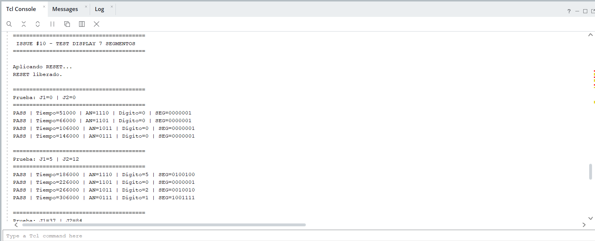
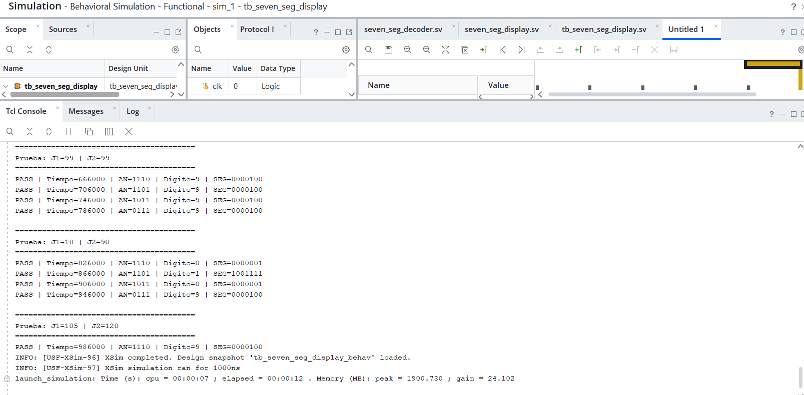
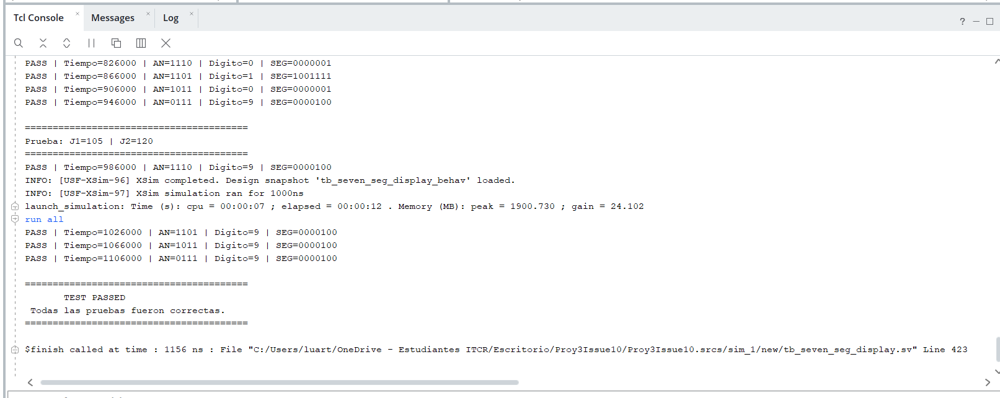
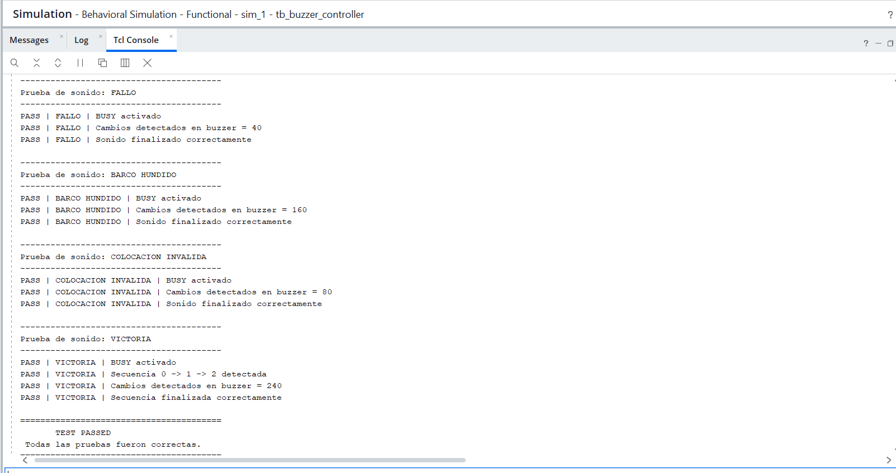
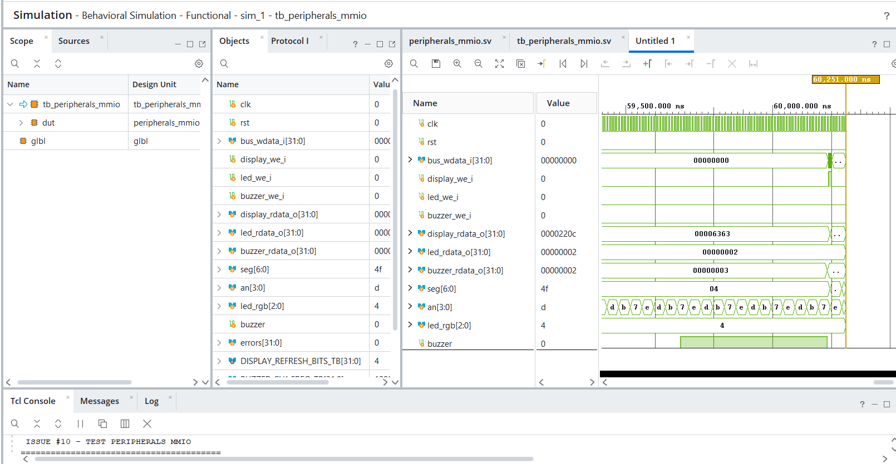
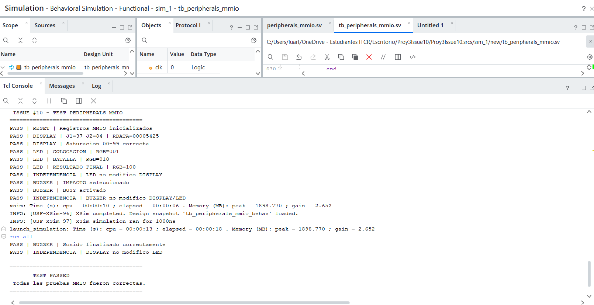
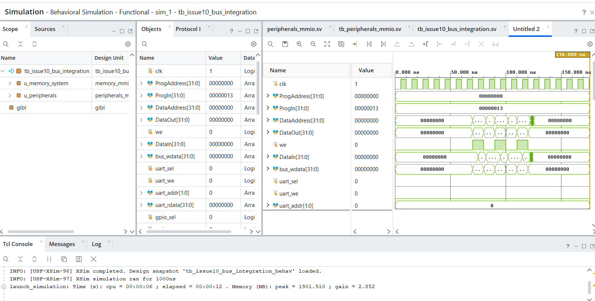

# Issue #10 – Displays de 7 segmentos, LED de estado y buzzer

## Descripción

Este módulo implementa los periféricos de salida local utilizados por el sistema de Batalla Naval.

Los periféricos desarrollados son:

- Display de 7 segmentos de 4 dígitos.
- LED RGB para indicar el estado de la partida.
- Buzzer para generar diferentes efectos sonoros.

Los tres periféricos fueron adaptados a una interfaz MMIO de 32 bits para permitir su control desde el procesador RISC-V.

La integración fue verificada utilizando el bus de memoria/MMIO desarrollado en el Issue #4.

---

## Estructura de archivos

### Módulos RTL

| Archivo | Descripción |
|---|---|
| `seven_seg_decoder.sv` | Decodificación de dígitos decimales a 7 segmentos. |
| `seven_seg_display.sv` | Control de los cuatro dígitos y multiplexado del display. |
| `status_led.sv` | Control del LED RGB según el estado de la partida. |
| `buzzer_controller.sv` | Generación de los diferentes efectos sonoros. |
| `peripherals_mmio.sv` | Adaptación de los tres periféricos a la interfaz MMIO de 32 bits. |

### Testbenches

| Archivo | Descripción |
|---|---|
| `tb_seven_seg_display.sv` | Testbench autoverificable del display. |
| `tb_status_led.sv` | Testbench autoverificable del LED de estado. |
| `tb_buzzer_controller.sv` | Testbench autoverificable del buzzer. |
| `tb_peripherals_mmio.sv` | Verificación de los registros y accesos MMIO de los periféricos. |
| `tb_issue10_bus_integration.sv` | Verificación final de integración entre el Issue #10 y el bus del Issue #4. |

---

# 1. Display de 7 segmentos

El sistema utiliza cuatro dígitos del display para mostrar simultáneamente el contador acumulado de victorias de ambos jugadores.

La distribución es:

```text
┌─────────┬─────────┬─────────┬─────────┐
│ J2 dec. │ J2 uni. │ J1 dec. │ J1 uni. │
└─────────┴─────────┴─────────┴─────────┘
```

Cada jugador puede almacenar valores entre:

```text
00 – 99
```

Si se intenta escribir un valor superior a `99`, el periférico limita el valor mostrado a `99`.

## Multiplexado

Los cuatro dígitos comparten las líneas de segmentos.

El módulo `seven_seg_display.sv` selecciona periódicamente cada dígito mediante las señales de ánodo:

```text
1110
1101
1011
0111
```

Esto permite visualizar los cuatro valores utilizando un único conjunto de líneas de segmentos.

## Decodificación

El módulo:

```text
seven_seg_decoder.sv
```

convierte cada dígito decimal en su correspondiente patrón de 7 segmentos.

---

## Prueba del display

El testbench:

```text
tb_seven_seg_display.sv
```

comprueba:

- Visualización de ambos jugadores.
- Valores entre `00` y `99`.
- Multiplexado de los cuatro dígitos.
- Decodificación correcta.
- Casos límite.

La prueba es autoverificable y reporta `PASS` o `FAIL`.

### Evidencia


```text
TEST PASSED
Todas las pruebas fueron correctas.
```








---

# 2. LED de estado

El módulo:

```text
status_led.sv
```

utiliza un LED RGB para representar visualmente la fase actual de la partida.

## Estados

| `game_state` | Estado | `led_rgb` |
|---|---|---|
| `00` | Colocación | `001` |
| `01` | Batalla | `010` |
| `10` | Resultado final | `100` |
| `11` | Estado inválido / apagado | `000` |

De esta manera se dispone de una indicación visual diferente para cada fase principal del juego.

---

## Prueba del LED

El testbench:

```text
tb_status_led.sv
```

comprueba automáticamente las cuatro combinaciones posibles de `game_state`.

Resultado obtenido:

```text
PASS | Estado=COLOCACION      | game_state=00 | LED=001
PASS | Estado=BATALLA         | game_state=01 | LED=010
PASS | Estado=RESULTADO FINAL | game_state=10 | LED=100
PASS | Estado=INVALIDO        | game_state=11 | LED=000

TEST PASSED
Todas las pruebas fueron correctas.
```

### Evidencia


---

# 3. Buzzer

El módulo:

```text
buzzer_controller.sv
```

genera diferentes efectos sonoros dependiendo del evento ocurrido durante la partida.

## Códigos de sonido

| `sound_sel` | Evento |
|---|---|
| `000` | Sin sonido |
| `001` | Disparo con impacto |
| `010` | Disparo con fallo |
| `011` | Barco hundido |
| `100` | Colocación inválida |
| `101` | Victoria |

El controlador recibe además una señal:

```text
start
```

que inicia la reproducción del sonido seleccionado.

La salida:

```text
busy
```

indica que el controlador se encuentra reproduciendo un efecto sonoro.

---

## Secuencia de victoria

El sonido de victoria utiliza una secuencia de varias etapas.

Durante la simulación se comprueba que el controlador recorra correctamente:

```text
sequence_step = 0
        ↓
sequence_step = 1
        ↓
sequence_step = 2
        ↓
      FIN
```

---

## Prueba del buzzer

El testbench:

```text
tb_buzzer_controller.sv
```

verifica:

- Sonido de impacto.
- Sonido de fallo.
- Sonido de barco hundido.
- Sonido de colocación inválida.
- Secuencia sonora de victoria.
- Activación de `busy`.
- Generación de actividad en la salida del buzzer.
- Finalización correcta de cada sonido.

### Evidencia

**AGREGAR AQUÍ CAPTURA DEL TCL CONSOLE DEL TEST DEL BUZZER**

```text
TEST PASSED
Todas las pruebas fueron correctas.
```




---

# 4. Interfaz MMIO

Para permitir el control de los periféricos desde el procesador RISC-V se implementó:

```text
peripherals_mmio.sv
```

Este módulo recibe el bus de datos de 32 bits y las señales de escritura generadas por el interconector MMIO.

---

## Mapa de memoria

| Dirección | Periférico |
|---|---|
| `0x0001_0130` | Display de 7 segmentos |
| `0x0001_0138` | LED de estado |
| `0x0001_0140` | Buzzer |

---

# 5. Registro del display

Dirección:

```text
0x0001_0130
```

Formato:

```text
31                    16 15        8 7         0
┌───────────────────────┬───────────┬───────────┐
│       Reservado       │ Jugador 2 │ Jugador 1 │
└───────────────────────┴───────────┴───────────┘
```

Por ejemplo:

```text
Jugador 1 = 37 = 0x25
Jugador 2 = 84 = 0x54
```

produce:

```text
0x00005425
```

---

# 6. Registro del LED

Dirección:

```text
0x0001_0138
```

Los bits:

```text
[1:0]
```

contienen el estado de la partida:

```text
00 → Colocación
01 → Batalla
10 → Resultado final
11 → Inválido
```

---

# 7. Registro del buzzer

Dirección:

```text
0x0001_0140
```

Formato:

```text
[3:1] → sound_sel
[0]   → start / busy
```

Para iniciar el sonido de impacto:

```text
sound_sel = 001
start     = 1
```

la escritura realizada es:

```text
0x00000003
```

En lectura, el bit `0` permite conocer el estado `busy` del controlador.

---

# 8. Verificación de la interfaz MMIO

El testbench:

```text
tb_peripherals_mmio.sv
```

verifica el funcionamiento del adaptador MMIO antes de conectarlo al bus completo.

Las pruebas realizadas incluyen:

- Reset de registros.
- Escritura y lectura del display.
- Saturación de valores mayores a `99`.
- Escritura y lectura del LED.
- Selección del buzzer.
- Activación de `busy`.
- Independencia entre los tres periféricos.
- Funcionamiento de la interfaz de datos de 32 bits.

Resultado:

```text
PASS | RESET | Registros MMIO inicializados
PASS | DISPLAY | J1=37 J2=84 | RDATA=00005425
PASS | DISPLAY | Saturacion 00-99 correcta
PASS | LED | COLOCACION | RGB=001
PASS | LED | BATALLA | RGB=010
PASS | LED | RESULTADO FINAL | RGB=100
PASS | INDEPENDENCIA | LED no modifico DISPLAY
PASS | BUZZER | IMPACTO seleccionado
PASS | BUZZER | BUSY activado
PASS | INDEPENDENCIA | BUZZER no modifico DISPLAY/LED
PASS | BUZZER | Sonido finalizado correctamente
PASS | INDEPENDENCIA | DISPLAY no modifico LED

TEST PASSED
Todas las pruebas MMIO fueron correctas.
```

### Evidencia





---

# 9. Integración con el bus del Issue #4

Finalmente se realizó una prueba utilizando el bus MMIO desarrollado en el Issue #4.

La arquitectura probada fue:

```text
                Procesador / Testbench
                         │
                         │
                         ▼
               memory_mmio_system
                    Issue #4
                         │
                         ▼
                mmio_interconnect
                         │
            ┌────────────┼────────────┐
            │            │            │
            ▼            ▼            ▼
       display_we      led_we     buzzer_we
            │            │            │
            └────────────┼────────────┘
                         │
                         ▼
                peripherals_mmio
                    Issue #10
                         │
             ┌───────────┼───────────┐
             │           │           │
             ▼           ▼           ▼
          Display       LED        Buzzer
```

El testbench utilizado es:

```text
tb_issue10_bus_integration.sv
```

---

## Pruebas de integración

Se realizaron accesos MMIO utilizando las direcciones reales.

### Display

```text
WRITE/READ → 0x0001_0130
```

Resultado:

```text
PASS | DISPLAY | Direccion decodificada correctamente
PASS | DISPLAY | LW correcto | RDATA=00005425
```

### LED

```text
WRITE/READ → 0x0001_0138
```

Resultado:

```text
PASS | LED | Direccion decodificada correctamente
PASS | LED | LW correcto | Estado=RESULTADO | RGB=100
```

### Buzzer

```text
WRITE/READ → 0x0001_0140
```

Se comprobó:

- Decodificación de la dirección.
- Selección del sonido.
- Activación de `busy`.
- Finalización del sonido.

También se verificó que una dirección MMIO no asignada no active ninguno de los tres periféricos.

---

# 10. Resultado de integración

La simulación final produjo:

```text
========================================
       TEST PASSED
 INTEGRACION ISSUE #4 + ISSUE #10 OK

 DISPLAY @ 0x0001_0130 : PASS
 LED     @ 0x0001_0138 : PASS
 BUZZER  @ 0x0001_0140 : PASS
 BUS MMIO 32 bits       : PASS
========================================
```

Esto confirma el funcionamiento de los tres periféricos mediante el bus MMIO de 32 bits.

### Evidencia final




Esta captura debe mostrar:

```text
TEST PASSED
INTEGRACION ISSUE #4 + ISSUE #10 OK
DISPLAY @ 0x0001_0130 : PASS
LED     @ 0x0001_0138 : PASS
BUZZER  @ 0x0001_0140 : PASS
BUS MMIO 32 bits       : PASS
```

---

# 11. Resumen de validación

| Requisito | Estado |
|---|---|
| Display de 4 dígitos | PASS |
| Contador Jugador 1 | PASS |
| Contador Jugador 2 | PASS |
| Rango 00–99 | PASS |
| Multiplexado | PASS |
| Decodificación a 7 segmentos | PASS |
| Display MMIO `0x0001_0130` | PASS |
| LED de colocación | PASS |
| LED de batalla | PASS |
| LED de resultado final | PASS |
| LED MMIO `0x0001_0138` | PASS |
| Sonido de impacto | PASS |
| Sonido de fallo | PASS |
| Sonido de barco hundido | PASS |
| Sonido de colocación inválida | PASS |
| Secuencia de victoria | PASS |
| Buzzer MMIO `0x0001_0140` | PASS |
| Interfaz MMIO de 32 bits | PASS |
| Integración con Issue #4 | PASS |
| Testbenches autoverificables | PASS |

---
